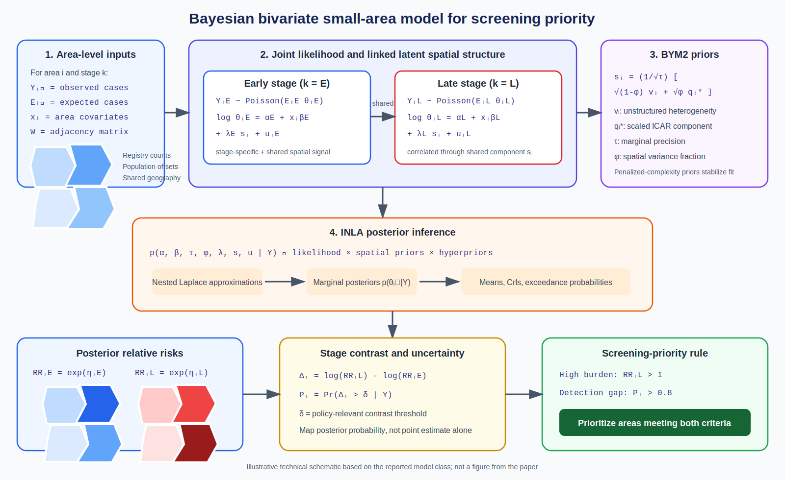
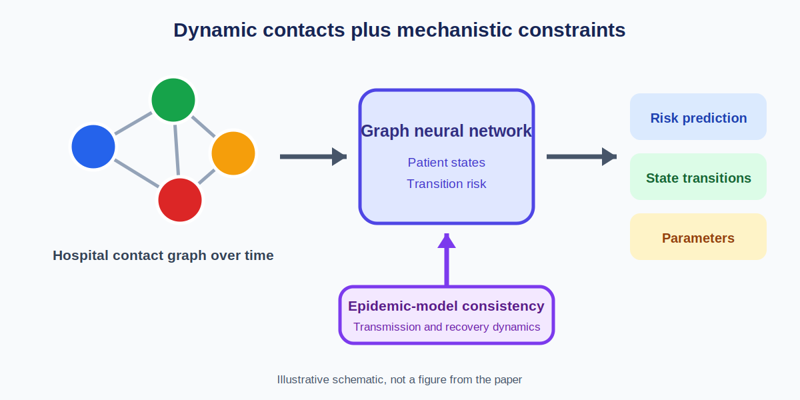
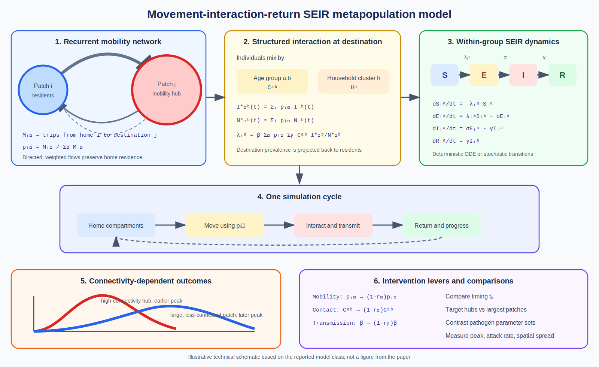

# Spatial Epidemiology Research Update

**Date:** June 6, 2026

This first update highlights three recent papers spanning small-area disease
mapping, dynamic contact-network modeling, and spatial metapopulation models.

## 1. Bayesian bivariate mapping of stage-specific cancer incidence

**Paper:** Qinyun Lin, Carl Bonander, and Ulf Stromberg. "A Bayesian bivariate
spatial modeling framework for stage-specific cancer incidence and targeting
of screening efforts." *American Journal of Epidemiology*, published online
May 19, 2026.

**Source:** [DOI: 10.1093/aje/kwag106](https://doi.org/10.1093/aje/kwag106) |
[PubMed](https://pubmed.ncbi.nlm.nih.gov/42154523/)

**Modeling approach:** A Bayesian bivariate spatial model jointly estimates
early- and late-stage cancer incidence at small-area resolution. The authors
compare univariate and multivariate spatial formulations using Integrated
Nested Laplace Approximation (INLA), with BYM2-style spatial effects.

**Key finding:** Jointly mapping late-stage incidence and the difference
between late- and early-stage incidence can distinguish areas with high disease
burden from areas where diagnostic activity may be insufficient relative to
that burden. The demonstration uses Swedish prostate cancer registry data.

**Why it matters:** Screening priorities based only on late-stage incidence can
conflate underlying risk with gaps in early detection. The bivariate framework
provides a more targeted small-area indicator for allocating screening effort.

*Technical schematic created for this update. It shows the linked Poisson
likelihoods, shared and outcome-specific BYM2 effects, INLA inference, posterior
stage contrast, and a possible screening-priority rule. It is not an original
figure from the paper; notation is explanatory and may differ from the paper.*

## 2. Epidemiology-informed graph neural networks for hospital infections

**Paper:** Yamil E. Vindas Yassine, Alban Bornet, Mohamed Abbas, Damien
Geissbuehler, Jose F. Rodrigues-Jr, and Douglas Teodoro. "Epidemiology-Informed
Graph Neural Networks for Predicting and Interpreting Transmissible
Hospital-Acquired Infections: A Retrospective Cohort and Simulation Study."
medRxiv preprint, posted May 12, 2026.

**Source:** [DOI: 10.64898/2026.05.08.26352740](https://doi.org/10.64898/2026.05.08.26352740) |
[medRxiv](https://www.medrxiv.org/content/10.64898/2026.05.08.26352740v1)

**Modeling approach:** The EIGNN framework combines graph neural networks over
time-varying hospital contact networks with mechanistic epidemiological
constraints. It predicts patient-level states and transitions while estimating
parameters such as transmission and recovery rates.

**Key finding:** Across a real hospital-onset COVID-19 cohort and two simulated
viral or bacterial hospital-infection datasets, the framework reported
AUC-ROC values as high as 98.46%, while producing mechanistically interpretable
estimates.

**Why it matters:** Adding epidemiological structure to a dynamic graph model
may improve both predictive performance and clinical interpretability. This is
a preprint and has not yet been peer reviewed.

*Technical schematic created for this update. It shows temporal patient graphs,
message passing, recurrent state encoding, prediction heads, a graph-based
force of infection, and the composite learning objective. It is not an original
figure from the paper; notation is explanatory and may differ from the paper.*

## 3. Spatial metapopulation modeling with recurrent mobility and clustering

**Paper:** Michael Lazarus Smah, Anna Seale, and Kat Rock. "Informing Epidemic
Control Strategies: A Spatial Metapopulation Model Incorporating Recurrent
Mobility, Clustering, and Group-Structured Interactions." medRxiv preprint,
posted April 9, 2026.

**Source:** [DOI: 10.64898/2026.04.08.26350398](https://doi.org/10.64898/2026.04.08.26350398) |
[medRxiv](https://www.medrxiv.org/content/10.64898/2026.04.08.26350398v1)

**Modeling approach:** A deterministic and stochastic SEIR metapopulation
model extends a movement-interaction-return framework with household
structure, age-stratified contacts, and mobility among locations. Simulations
use UK demographic, mobility, and social-contact data and contrast
COVID-19-like and Ebola-like infections.

**Key finding:** Highly connected locations generated faster spread and
earlier epidemic peaks than larger but less connected locations. Intervention
effectiveness depended on timing, network position, and pathogen
characteristics.

**Why it matters:** Population size alone is a weak proxy for epidemic
importance. Mobility connectivity and structured mixing can identify locations
where surveillance and early intervention may have disproportionate value.
This is a preprint and has not yet been peer reviewed.

*Technical schematic created for this update. It shows recurrent mobility,
age- and household-structured mixing, a mobility-weighted force of infection,
SEIR transitions, the simulation cycle, and intervention levers. It is not an
original figure from the paper; notation is explanatory and may differ from the
paper.*

## Notes

- Items are selected for methodological relevance, recency, and source
  verifiability.
- Reported results summarize the authors' abstracts and records; they are not
  independent validation.
- Future updates should avoid repeating these DOI identifiers.
