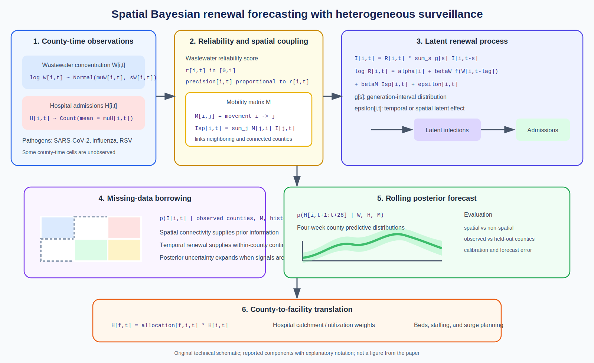
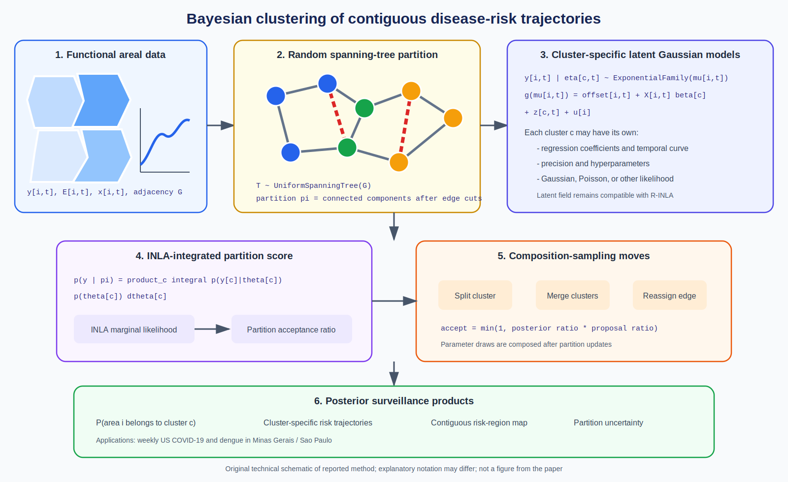
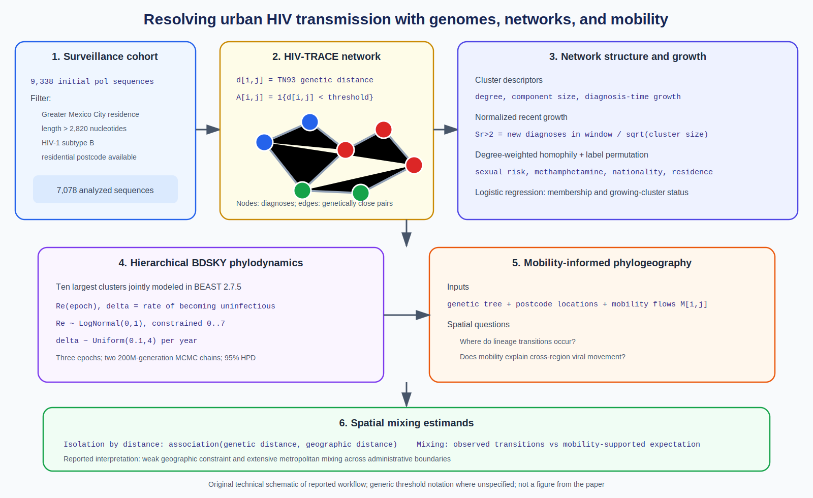

# Spatial Epidemiology Research Update

**Date:** June 7, 2026

No qualifying paper in the sources searched was posted specifically on June 7.
This update therefore highlights three recent items indexed before today's
search and not included in the June 6 report.

## 1. Spatial wastewater and EHR forecasting under missing data

**Paper:** Lu Zhong, Amanda Bleichrodt, Aakash Pandey, Deborah Kunkel, and Lior
Rennert. "A spatial EHR and wastewater-informed modeling framework for
respiratory virus prediction under sparse and missing data conditions."
medRxiv preprint, posted May 21, 2026.

**Source:** [DOI: 10.64898/2026.05.18.26353485](https://doi.org/10.64898/2026.05.18.26353485) |
[medRxiv](https://www.medrxiv.org/content/10.64898/2026.05.18.26353485v1)

**Modeling approach:** A spatial Bayesian renewal framework combines
county-level hospital admissions with reliability-weighted wastewater signals
and mobility-informed interactions among South Carolina counties. It produces
rolling four-week forecasts for SARS-CoV-2, influenza, and RSV and translates
county forecasts into facility-level demand.

**Key finding:** The spatial model reportedly outperformed non-spatial
alternatives and remained useful where wastewater or hospitalization
observations were absent.

**Why it matters:** Spatial borrowing and explicit data-reliability weighting
address two recurring surveillance problems at once: uneven monitoring quality
and missing local observations. This is a preprint and has not been peer
reviewed.

*Original technical schematic created for this update. Solid labels summarize
reported components; equations use explanatory notation because the abstract
does not expose the complete model specification. It is not a figure from the
paper, and notation may differ from the authors' implementation.*

## 2. Bayesian spatial functional clustering for disease surveillance

**Paper:** Ruiman Zhong, Erick A. Chacon-Montalvan, and Paula Moraga. "Bayesian
Spatial Functional Data Clustering: Applications in Disease Surveillance."
*Statistics in Medicine* 45(10-12), e70597, May 2026.

**Source:** [DOI: 10.1002/sim.70597](https://doi.org/10.1002/sim.70597) |
[PubMed](https://pubmed.ncbi.nlm.nih.gov/42136052/) |
[sfclust software](https://github.com/ErickChacon/sfclust)

**Modeling approach:** The model partitions neighboring areas into spatially
contiguous clusters with random spanning trees. Each cluster receives its own
latent Gaussian model, including support for non-Gaussian outcomes through
INLA. Composition sampling and INLA-based marginal likelihoods avoid direct
reversible-jump MCMC over parameters of changing dimension.

**Key finding:** Simulations and applications to weekly US COVID-19 incidence
and dengue risk in Brazil show that the method can recover neighboring regions
with similar temporal disease-risk shapes while allowing cluster-specific
parameters.

**Why it matters:** Many disease maps estimate smooth risk surfaces but do not
identify contiguous regions sharing an entire temporal trajectory. This method
targets that clustering estimand directly and is available in an R package.

*Original technical schematic created for this update. It illustrates the
reported spanning-tree partition, cluster-specific latent Gaussian models, and
INLA-assisted Bayesian search. It is not a figure from the paper; notation is
explanatory and may differ from the published notation.*

## 3. Dense spatial mixing in Greater Mexico City HIV transmission

**Paper:** Marina Escalera-Zamudio, Eduardo Lopez Ortiz, Claudia Garcia
Morales, Erika Cruz-Bonilla, Shaday Guerrero Flores, Steven Weaver, and
colleagues. "HIV Transmission Dynamics in Greater Mexico City are Shaped by
Dense Spatial Mixing." medRxiv preprint, posted May 27, 2026.

**Source:** [DOI: 10.64898/2026.05.26.26354122](https://doi.org/10.64898/2026.05.26.26354122) |
[medRxiv](https://www.medrxiv.org/content/10.64898/2026.05.26.26354122v1.full)

**Modeling approach:** The study analyzes 7,078 HIV-1 subtype B pol sequences
from newly diagnosed cases in Greater Mexico City. HIV-TRACE constructs links
from TN93 genetic distances; network clustering, permutation-based homophily,
cluster-growth metrics, logistic regression, and a hierarchical BDSKY model
characterize transmission. A phylogeographic analysis integrates genetic and
high-resolution mobility data.

**Key finding:** Ten large transmission clusters continued growing through the
latest sampling period. Geographic distance only weakly constrained genetic
distance, consistent with extensive metropolitan mixing supported by mobility.

**Why it matters:** Administrative boundaries may poorly represent the
transmission neighborhoods of a densely connected city. Genomic surveillance
combined with mobility can reveal intervention scales that case residence
alone may miss. This is a preprint and has not been peer reviewed.

*Original technical schematic created for this update. Threshold notation is
generic unless stated in the paper text; the diagram emphasizes the reported
analysis sequence and estimands. It is not a figure from the paper.*

## Notes

- This report adds DOI identifiers `10.64898/2026.05.18.26353485`,
  `10.1002/sim.70597`, and `10.64898/2026.05.26.26354122` to the repository's
  covered set.
- Preprint findings should be treated as provisional.
- Technical diagrams distinguish reported components from explanatory
  notation and do not reproduce publication artwork.
