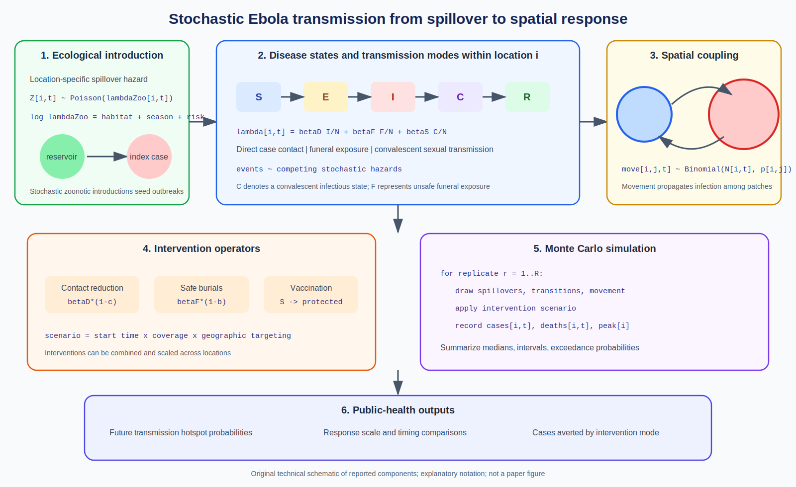

# Spatial Epidemiology Research Update

**Update date:** June 8, 2026  
**PubMed indexing date used for selection:** June 8, 2026

## Stochastic Ebola metapopulation modeling for response planning

**Paper:** Thibaut Jombart, Sarah Kada, Debapriyo Chakraborty, David W.
Redding, and Jessica Abbate. "A stochastic meta-population model of Ebola
virus disease transmission for informing public health decisions."
*Epidemics*, published online June 4, 2026.

**Source:** [DOI: 10.1016/j.epidem.2026.100922](https://doi.org/10.1016/j.epidem.2026.100922) |
[PubMed](https://pubmed.ncbi.nlm.nih.gov/42258949/)

**Modeling approach:** A stochastic compartmental metapopulation model links
ecologically driven zoonotic introductions, person-to-person transmission, and
spatial spread. It separates direct contact with infectious cases, funeral
exposure, and sexual transmission from convalescent individuals. Intervention
modules represent broad contact reduction, safe and dignified burials, and
vaccination.

**Key finding:** Simulations for an area at high risk of zoonotic introduction
in the Democratic Republic of the Congo demonstrate how the model can identify
potential transmission hotspots and compare the scale of prospective response
strategies.

**Why it matters:** Ebola response models often begin after human transmission
is established. Connecting spillover, multiple transmission routes, movement,
and intervention mechanisms supports planning across the full outbreak chain.
The authors provide computationally efficient open-source software.

*Original technical schematic created for this update from the reported model
components. Equations use explanatory notation and may differ from the
software implementation. It is not a figure from the paper.*

## Notes

- Added DOI: `10.1016/j.epidem.2026.100922`.
- The June 8 assignment refers to PubMed indexing, not the June 4 publication
  date.
