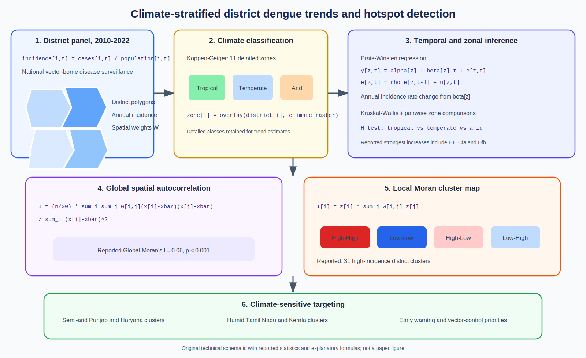

# Spatial Epidemiology Research Update

**Update date:** June 9, 2026  
**PubMed indexing date used for selection:** June 9, 2026

## District dengue risk across Indian climate zones

**Paper:** Meenu Mariya James, Karuppusamy Balasubramani, Praveen Balabaskaran
Nina, Natarajan Gopalan, and Sujit Kumar Behera. "Spatial distribution and
risk assessment of dengue incidence at district level across major climatic
zones in India." *PLOS ONE*, 2026.

**Source:** [DOI: 10.1371/journal.pone.0350325](https://doi.org/10.1371/journal.pone.0350325) |
[PubMed](https://pubmed.ncbi.nlm.nih.gov/42263103/)

**Modeling approach:** District dengue incidence from 2010-2022 is stratified
using Koppen-Geiger climate zones. Prais-Winsten regression estimates temporal
trends while accounting for serial autocorrelation; Kruskal-Wallis tests
compare climate-zone incidence. Global Moran's I assesses overall spatial
autocorrelation, and Anselin local Moran's I identifies district clusters and
hotspots.

**Key finding:** The study reports significant geographic heterogeneity and
increasing incidence in several cooler climate classes. Global Moran's I was
0.06 (`p < 0.001`), with 31 high-incidence clusters concentrated primarily in
semi-arid Punjab and Haryana and humid Tamil Nadu and Kerala.

**Why it matters:** The analysis combines trend, climate-stratified comparison,
and local cluster detection. The finding that dengue is intensifying outside
traditional tropical settings argues for climate-sensitive surveillance and
geographically targeted vector control.

*Original technical schematic created for this update. It reproduces reported
analysis components and selected published statistics, but not publication
artwork. Generic formulas are explanatory.*

## Notes

- Added DOI: `10.1371/journal.pone.0350325`.
- PubMed lists the publication year as 2026 without a more specific date in
  the retrieved citation record.
