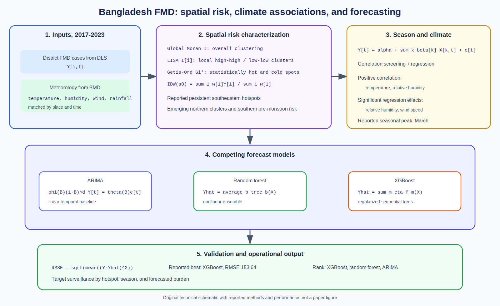

# Spatial Epidemiology Research Update

**Update date:** June 10, 2026  
**Publication date:** June 10, 2026

## Spatiotemporal FMD risk and machine-learning forecasts in Bangladesh

**Paper:** Md Jisan Ahmed, Kazi Estieque Alam, Faisol Talukder, Prajwal
Bhandari, Md Ismile Hossain Bhuiyan, and colleagues. "Spatiotemporal trends of
foot and mouth disease (FMD) in Bangladesh from 2017 to 2023 and their
associations with climatic factors and machine learning (ML) based prediction."
*Scientific Reports*, June 10, 2026.

**Source:** [DOI: 10.1038/s41598-026-57440-2](https://doi.org/10.1038/s41598-026-57440-2) |
[PubMed](https://pubmed.ncbi.nlm.nih.gov/42271042/)

**Modeling approach:** FMD surveillance and meteorological records are analyzed
with Moran's I, local indicators of spatial association, Getis-Ord Gi*, and
inverse-distance weighting. Correlation and regression quantify climatic
associations. ARIMA, random forest, and XGBoost models are compared for
forecasting.

**Key finding:** FMD incidence peaked in March, with persistent southeastern
hotspots and emerging northern clusters. Temperature and relative humidity
were positively correlated with occurrence; relative humidity and wind speed
were significant regression predictors. XGBoost had the lowest reported
forecast error (`RMSE = 153.64`), followed by random forest and ARIMA.

**Why it matters:** The work connects spatial hotspot detection, seasonal and
climate associations, and operational prediction in one pipeline. The outputs
can guide pre-monsoon surveillance and geographically targeted livestock
control.

*Original technical schematic created for this update. Reported methods and
performance values are separated from generic explanatory equations. It is not
a figure from the paper.*

## Notes

- Added DOI: `10.1038/s41598-026-57440-2`.
