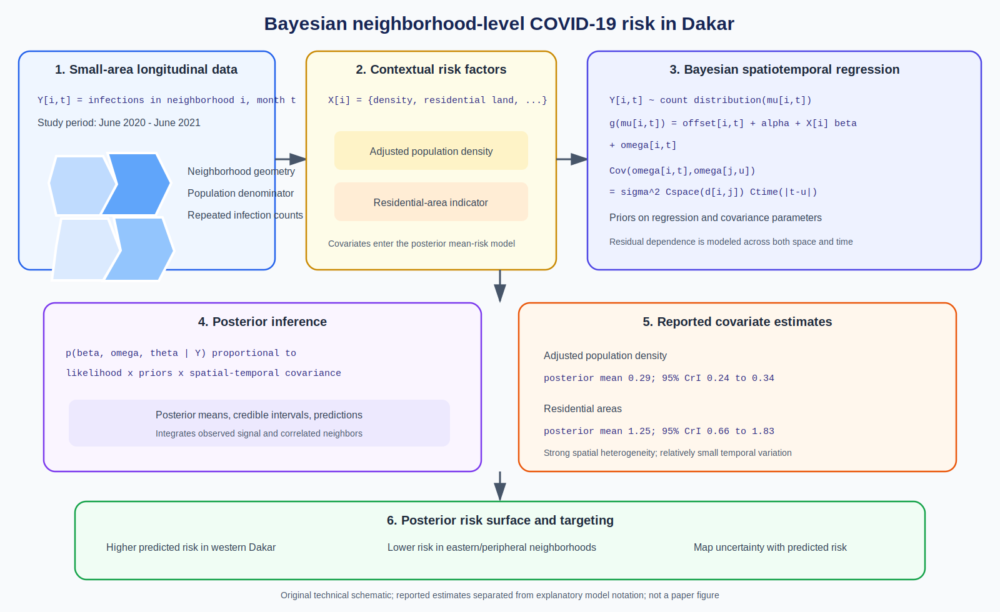

# Spatial Epidemiology Research Update

**Update date:** June 11, 2026  
**PubMed indexing date used for selection:** June 11, 2026

## Bayesian neighborhood-level COVID-19 mapping in Dakar

**Paper:** Assane Niang Gadiaga, Mame Wodji Tine, Aminata Niang Diene,
Catherine Linard, Niko Speybroeck, and colleagues. "Spatio-temporal modelling
of COVID-19 infection and associated risk factors in Dakar, Senegal."
*PLOS Global Public Health*, 2026.

**Source:** [DOI: 10.1371/journal.pgph.0004945](https://doi.org/10.1371/journal.pgph.0004945) |
[PubMed](https://pubmed.ncbi.nlm.nih.gov/42275303/)

**Modeling approach:** Neighborhood infection data from June 2020 through June
2021 are analyzed with a Bayesian geostatistical regression model. Covariates
enter the mean structure while a spatiotemporally autocorrelated random effect
captures residual dependence and supports neighborhood-level prediction.

**Key finding:** The model found strong spatial heterogeneity but relatively
small temporal variation. Adjusted population density had a positive posterior
association (`mean 0.29`, `95% credible interval 0.24-0.34`), as did residential
areas (`mean 1.25`, `95% credible interval 0.66-1.83`). Higher predicted risk
was concentrated in western Dakar relative to eastern and less densely
populated peripheral neighborhoods.

**Why it matters:** The study demonstrates small-area Bayesian mapping where
spatially disaggregated longitudinal surveillance is limited. Posterior risk
surfaces and covariate uncertainty can support targeted interventions without
treating neighborhood observations as independent.

*Original technical schematic created for this update. The latent-effect
equation is explanatory; reported posterior estimates are identified
separately. It is not a figure from the paper.*

## Notes

- Added DOI: `10.1371/journal.pgph.0004945`.
- PubMed lists the publication year as 2026; June 11 is the indexing date used
  for this daily update.
