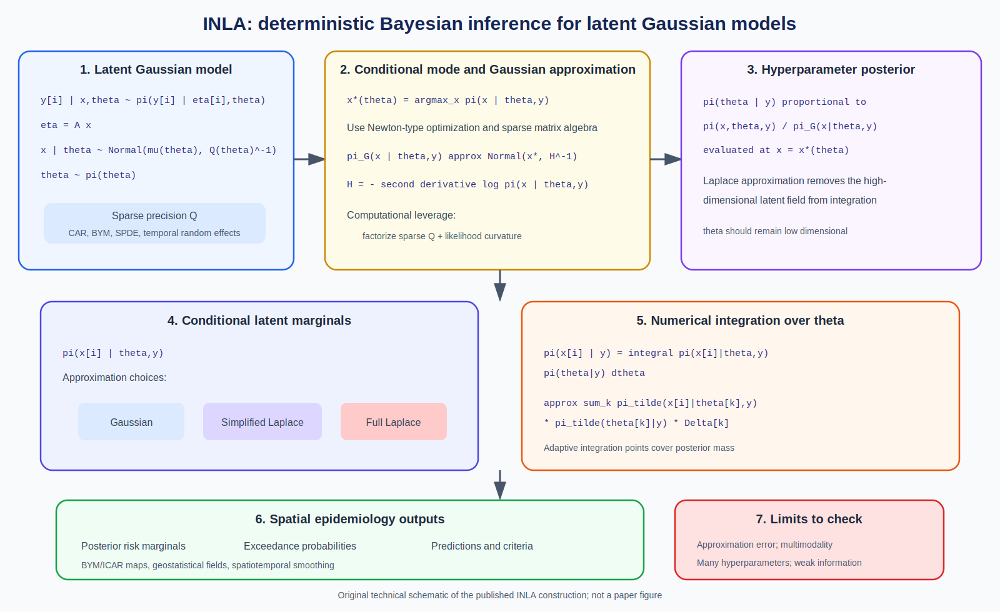

# Spatial Epidemiology Research Update

**Date:** June 12, 2026

No strong newly indexed paper on June 12 met the repository's modeling focus.
Today's update therefore covers two foundational methods that remain central
to modern spatial epidemiology.

## 1. The BYM model for Bayesian disease mapping

**Category:** Foundational

**Paper:** Julian Besag, Jeremy York, and Annie Mollié. "Bayesian image
restoration, with two applications in spatial statistics." *Annals of the
Institute of Statistical Mathematics* 43, 1-20, 1991.

**Source:** [DOI: 10.1007/BF00116466](https://doi.org/10.1007/BF00116466)

**Modeling contribution:** The paper introduced the model now commonly called
the Besag-York-Mollie or BYM model. For areal disease counts, a Poisson
likelihood with an expected-count offset is paired with two latent components:
an intrinsic conditional autoregressive effect that smooths across adjacent
areas and an independent effect that captures unstructured heterogeneity.

**Why it remains important:** BYM established a durable template for small-area
disease mapping: estimate relative risk while borrowing information from
neighbors and retaining non-spatial overdispersion. It underlies many later
developments, including reparameterized BYM2 models, penalized-complexity
priors, and routine INLA implementations.

**Important limitations:** The original structured and unstructured variance
components can be weakly identifiable and depend on graph scaling. The
intrinsic CAR prior is improper before constraints are imposed. Results may be
sensitive to the neighborhood graph, and smoothing can obscure genuine
discontinuities. Modern applications often prefer scaled BYM2
parameterizations with explicit priors on total variance and the spatial
variance fraction.

*Original technical schematic created for this update. It presents the
standard disease-mapping form associated with the BYM model and is not a
reproduction of publication artwork.*

## 2. Integrated nested Laplace approximations for latent Gaussian models

**Category:** Important Method

**Paper:** Håvard Rue, Sara Martino, and Nicolas Chopin. "Approximate Bayesian
inference for latent Gaussian models by using integrated nested Laplace
approximations." *Journal of the Royal Statistical Society: Series B* 71(2),
319-392, 2009.

**Source:** [DOI: 10.1111/j.1467-9868.2008.00700.x](https://doi.org/10.1111/j.1467-9868.2008.00700.x)

**Modeling contribution:** INLA is a deterministic approximation framework for
posterior marginals in latent Gaussian models. It exploits sparse precision
matrices, Laplace approximations, conditional Gaussian structure, and
low-dimensional numerical integration over hyperparameters. The method avoids
long Markov chain Monte Carlo runs for many spatial and spatiotemporal models.

**Why it remains important:** INLA made complex Bayesian disease mapping,
geostatistical regression, temporal smoothing, and joint spatial models fast
enough for routine applied work. Its software ecosystem supports ICAR/BYM
effects, spatial Gaussian fields, survival models, multiple likelihoods,
prediction, and model diagnostics.

**Important limitations:** INLA targets latent Gaussian models and works best
with a modest number of hyperparameters. It returns approximations rather than
Monte Carlo samples from the exact joint posterior. Accuracy can degrade for
some highly non-Gaussian, weakly informed, multimodal, or poorly parameterized
models, so sensitivity checks and simulation-based validation remain
important.

*Original technical schematic created for this update. Equations summarize
the published INLA construction; notation is explanatory and may differ from
the paper.*

## Notes

- Added DOI identifiers `10.1007/BF00116466` and
  `10.1111/j.1467-9868.2008.00700.x`.
- These papers are included for methodological importance rather than recency.
