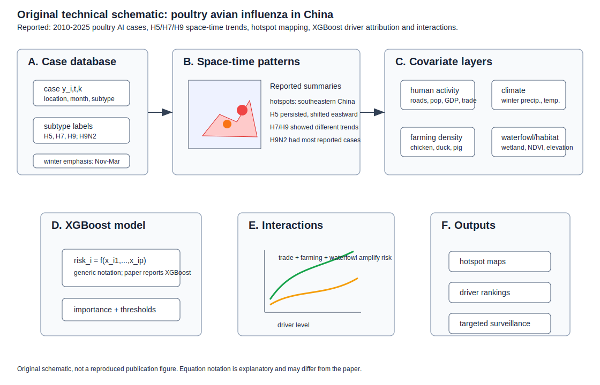
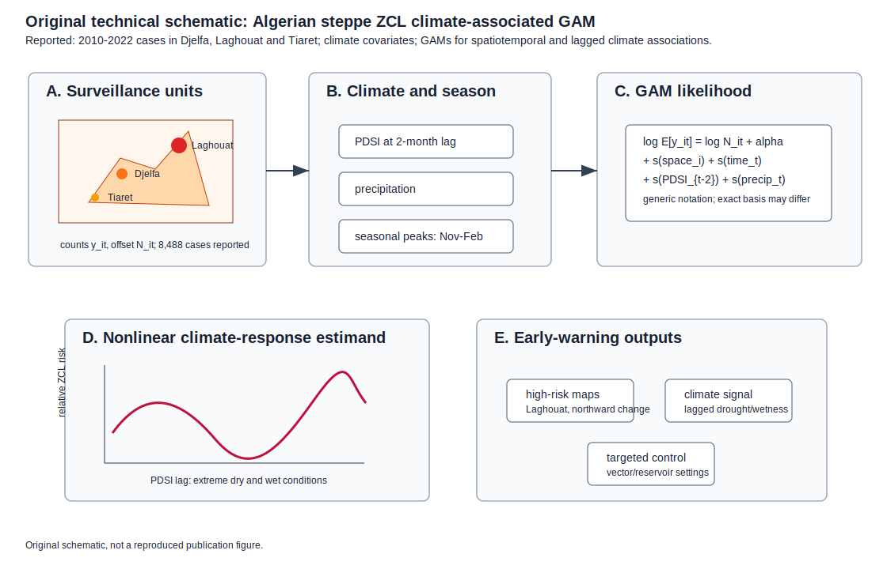
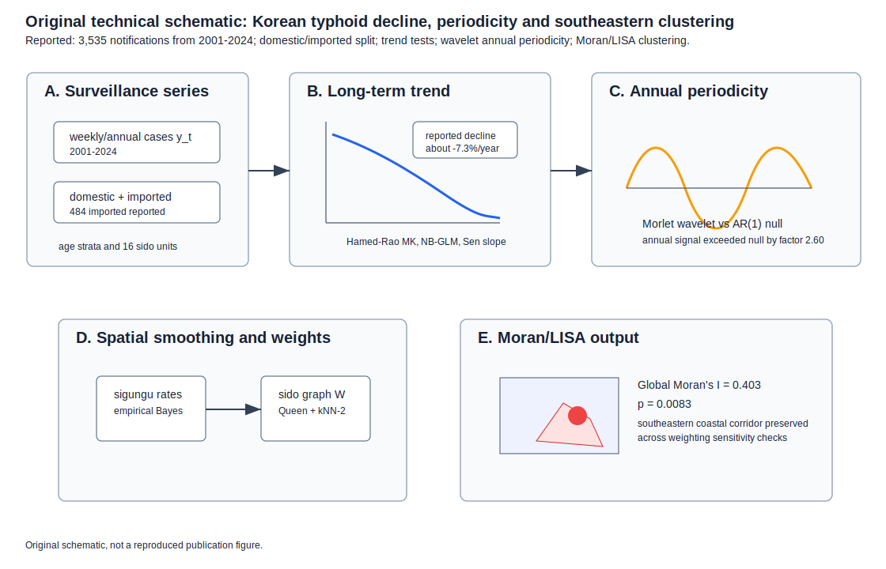
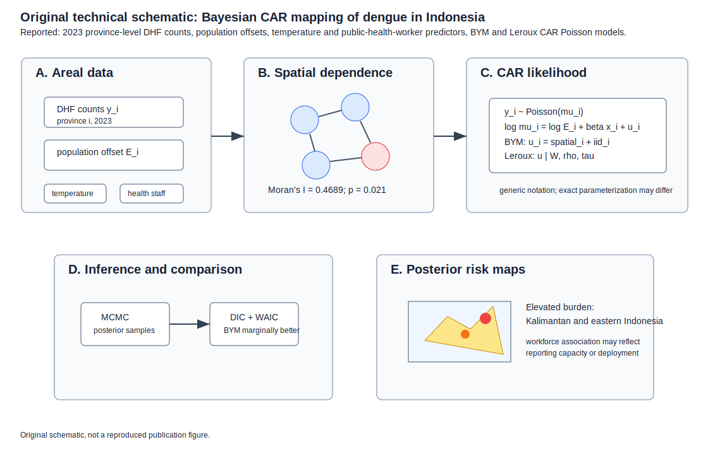
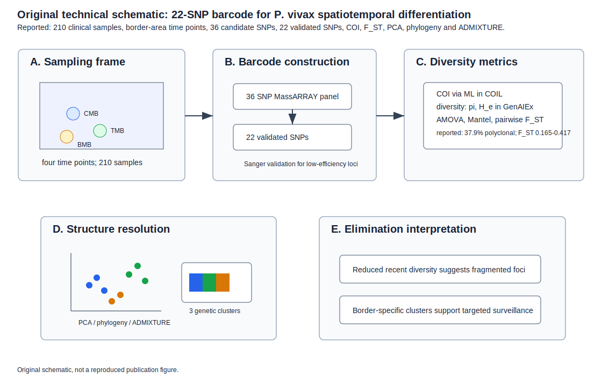
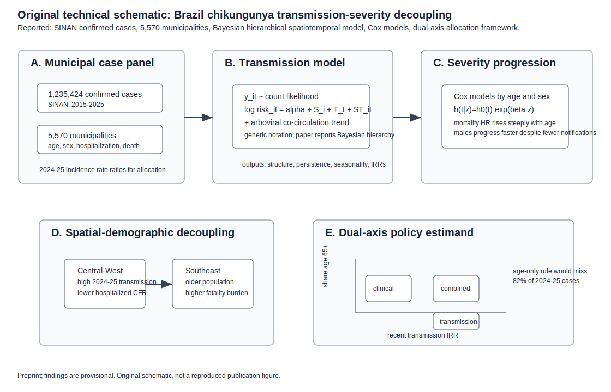
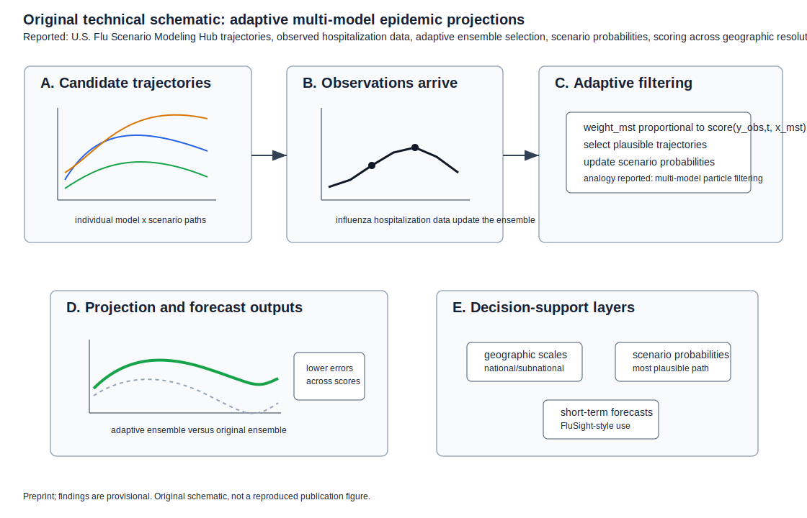

# Spatial Epidemiology Research Update

**Update date:** June 30, 2026  
**Search window:** Since the previous automation run on June 29, 2026 at
12:00:36 UTC

## Search Result

Seven newly published or newly indexed items passed the inclusion screen for
this run. Five are peer-reviewed journal articles newly published, newly
entered in PubMed, or newly indexed in Crossref after the previous run. Two are
same-window medRxiv preprints with explicit spatial, spatiotemporal, or
forecasting model contributions.

Figures below are original technical schematics created for this report. They
are not reproduced from the cited publications. Equation notation is
explanatory when the abstract or metadata does not expose the paper's exact
parameterization.

## Spatiotemporal poultry avian influenza risk in China

**Authors:** Feifei Li, Linsheng Yang, Hairong Li, Li Wang, Lijuan Gu, Svetlana
Malkhazova.  
**Publication date:** Published June 13, 2026 in *One Health*; newly entered in
PubMed on June 30, 2026.  
**Source:** [doi:10.1016/j.onehlt.2026.101483](https://doi.org/10.1016/j.onehlt.2026.101483);
[PubMed PMID: 42376211](https://pubmed.ncbi.nlm.nih.gov/42376211/);
[PMC full text](https://pmc.ncbi.nlm.nih.gov/articles/PMC13311913/).

**Modeling approach:** The paper builds a 2010-2025 spatiotemporal database of
poultry avian influenza cases in China, maps temporal and hotspot patterns for
major H5, H7, and H9 subtypes, and uses an XGBoost model to attribute outbreak
risk to environmental, livestock, waterfowl, trade, road, population, and GDP
covariates. Reported interaction analysis evaluates coupled effects among
livestock/poultry farming, waterfowl density, and trade connectivity.

**Key finding:** Poultry avian influenza was concentrated from November to
March with hotspots in southeastern China. H5 persisted and shifted eastward,
H9N2 accounted for the largest number of reported cases, and human
activity-related variables contributed most to modeled outbreak risk, with
climate second and livestock/poultry systems and waterfowl acting as important
modifiers.

**Why it matters:** The study links One Health surveillance to actionable
interfaces where poultry production, wild birds, and trade networks can jointly
amplify risk.

**Alt text:** A six-panel SVG schematic shows poultry avian influenza case data
indexed by location, month, and subtype; a hotspot map and subtype-center
schematic; environmental and socioeconomic driver layers; an XGBoost risk model;
nonlinear interaction curves; and surveillance outputs for hotspot maps, driver
rankings, and targeted interfaces.

**Caption:** Original technical schematic. Panel A shows the case/subtype/time
inputs. Panel B summarizes reported spatial hotspots and subtype dynamics. Panel
C organizes driver layers used for XGBoost attribution. Panel D gives generic
explanatory notation for the predictive risk model. Panel E visualizes reported
nonlinear and interaction effects. Panel F links outputs to One Health
surveillance decisions.

## Zoonotic cutaneous leishmaniasis in the Algerian steppe

**Authors:** Karim Ouachek, Bachir Medrouh, Rabah Zebsa, Ilham Ferdes, Amel
Tahtah, Fatma Seddas, Karim Souttou, Kamal Eddine Benallal, Ahcene Hakem,
Ismail Lafri.  
**Publication date:** Published online June 26, 2026 in *Epidemics*; PubMed
record created June 29, 2026 and entered PubMed June 30, 2026.  
**Source:** [doi:10.1016/j.epidem.2026.100930](https://doi.org/10.1016/j.epidem.2026.100930);
[PubMed PMID: 42372630](https://pubmed.ncbi.nlm.nih.gov/42372630/).

**Modeling approach:** The study analyzes epidemiological and climatic data from
Djelfa, Laghouat, and Tiaret Wilayas from 2010-2022 using generalized additive
models to assess spatiotemporal patterns and climate associations for zoonotic
cutaneous leishmaniasis.

**Key finding:** The authors report 8,488 cases, highest burden in Laghouat, a
declining northward gradient with increasing incidence in northern areas over
time, seasonal peaks from November to February, and a strong nonlinear
association between incidence and the Palmer Drought Severity Index at a
two-month lag. Extreme drought and wet conditions were associated with higher
risk, while moderate drought was associated with lower transmission.

**Why it matters:** The lagged climate signal supports climate-informed early
warning and targeted vector/reservoir interventions in arid and semi-arid
settings.

**Alt text:** A five-panel SVG schematic shows three Algerian steppe wilayas
with higher burden in Laghouat, climate inputs including two-month lagged PDSI,
a generalized additive model with spatial and temporal smooths, a U-shaped
nonlinear drought-risk curve, and outputs for high-risk maps, climate warning,
and targeted vector control.

**Caption:** Original technical schematic. Panel A shows the surveillance units
and burden gradient. Panel B lists the climate and seasonal inputs reported in
the abstract. Panel C gives generic GAM notation for counts with population
offsets, spatial/time smooths, and climate smooths. Panel D depicts the reported
nonlinear PDSI lag response. Panel E connects risk maps and climate lags to
early-warning action.

## Typhoid fever decline and coastal spatial clustering in Korea

**Authors:** G. Lee and S. Kim.  
**Publication date:** Published June 30, 2026 in *Foodborne Pathogens and
Disease*.  
**Source:** [doi:10.1177/15353141261465221](https://doi.org/10.1177/15353141261465221);
[PubMed PMID: 42374913](https://pubmed.ncbi.nlm.nih.gov/42374913/).

**Modeling approach:** The authors analyze 3,535 Korea Disease Control and
Prevention Agency typhoid notifications from 2001-2024 using a Hamed-Rao
modified Mann-Kendall trend test, negative-binomial GLM, Sen slope,
parametric-bootstrap breakpoint analysis, Morlet wavelet analysis against an
AR(1) red-noise null, age standardization, empirical-Bayes-smoothed sigungu
rates, and Moran/LISA spatial clustering over 16 sido using Queen plus k-nearest
neighbor weights and sensitivity schemes.

**Key finding:** Typhoid declined substantially, with a reported Sen slope of
-7.3% per year and significant age-stratum declines. A residual annual
periodicity remained, and spatial analysis detected a southeastern coastal
cluster along the Gyeongnam-Busan-Ulsan-Gyeongbuk axis.

**Why it matters:** Even during long-term decline, residual spatial clustering
and imported resistant strains can guide travel counseling, post-travel
vigilance, and targeted surveillance.

**Alt text:** A five-panel SVG schematic shows Korean typhoid surveillance
series, trend modeling with a declining curve, wavelet annual periodicity,
empirical Bayes spatial smoothing and Queen plus k-nearest-neighbor weights, and
a southeastern coastal cluster map with Moran and LISA outputs.

**Caption:** Original technical schematic. Panel A shows the surveillance
series and domestic/imported split. Panel B represents the long-term decline
modeling. Panel C shows annual periodicity testing. Panel D shows spatial
smoothing and alternative weight structures. Panel E shows Moran/LISA cluster
outputs for the southeastern corridor.

## Bayesian CAR mapping of dengue in Indonesia

**Authors:** Ferra Yanuar, Yudiantri Asdi, Aidinil Zetra, Sofiana Wudlu, Fenni
Kurnia Mutiya, Rahmawita Rahmawita.  
**Publication date:** Published June 18, 2026 in *Geospatial Health*; newly
indexed in Crossref on June 29, 2026 at 15:45 UTC.  
**Source:** [doi:10.4081/gh.2026.1443](https://doi.org/10.4081/gh.2026.1443);
[journal page](https://www.geospatialhealth.net/index.php/gh/article/view/1443).

**Modeling approach:** The paper models 2023 Indonesian province-level dengue
hemorrhagic fever counts with Bayesian spatial conditional autoregressive
Poisson models and population offsets. Predictors include average annual
temperature and province-level public health worker counts. Spatial dependence
is assessed with Moran's I, and BYM and Leroux priors are fit by MCMC and
compared using DIC and WAIC.

**Key finding:** Spatial dependence was supported by Moran's I = 0.4689
(p = 0.021). BYM and Leroux models gave similar estimates, with BYM marginally
better by model fit. Mapped risk was elevated in parts of Kalimantan and eastern
Indonesia; the positive workforce association was interpreted cautiously as it
may reflect reporting capacity or reactive deployment.

**Why it matters:** The paper is a compact, current example of Bayesian areal
disease mapping for dengue control, including sensitivity to alternative CAR
priors and explicit uncertainty intervals for relative risks.

**Alt text:** A five-panel SVG schematic shows Indonesian province-level dengue
counts with population offsets and covariates, an adjacency graph with Moran's I,
Poisson BYM and Leroux model notation, MCMC plus DIC/WAIC comparison, and a
posterior risk map highlighting Kalimantan and eastern Indonesia.

**Caption:** Original technical schematic. Panel A shows areal counts, offsets,
and covariates. Panel B shows the adjacency matrix basis for spatial dependence.
Panel C summarizes the Poisson CAR likelihood and BYM/Leroux priors with generic
notation. Panel D shows posterior computation and model comparison. Panel E
shows posterior risk interpretation and cautions about the workforce predictor.

## Plasmodium vivax spatiotemporal differentiation in the western Greater Mekong

**Authors:** Zhaoqing Wu, Wenjie Zeng, Anne M. Brashear, Yuhua Wu, Li Wang, Soe
M. Thein, and coauthors.  
**Publication date:** Published June 29, 2026 in *PLOS Neglected Tropical
Diseases*; PubMed entered June 29, 2026.  
**Source:** [doi:10.1371/journal.pntd.0014472](https://doi.org/10.1371/journal.pntd.0014472);
[PubMed PMID: 42371949](https://pubmed.ncbi.nlm.nih.gov/42371949/).

**Modeling approach:** The study develops and validates a SNP barcode for
tracking *P. vivax* populations across China-Myanmar, Thailand-Myanmar, and
Bangladesh-Myanmar border areas. It genotypes 210 clinical samples at 36 SNPs,
validates 22 SNPs, estimates complexity of infection using COIL, computes
diversity in GenAIEx, and assesses differentiation with AMOVA, Mantel tests,
pairwise F_ST, PCA, phylogenetic analysis, and ADMIXTURE.

**Key finding:** Of 198 successfully genotyped samples, 37.9% were polyclonal.
Recent western GMS populations had reduced genetic diversity relative to earlier
time points, pairwise F_ST values indicated moderate to high differentiation for
most population pairs, and structure analyses resolved three clusters
corresponding to the three border populations.

**Why it matters:** The validated 22-SNP barcode can help distinguish imported,
residual, and border-focused transmission as malaria programs approach
elimination.

**Alt text:** A five-panel SVG schematic shows clinical samples from three
western Greater Mekong border areas, a 36-SNP MassARRAY panel reduced to 22
validated SNPs, COI and diversity metrics, PCA and ADMIXTURE clusters, and
interpretation as fragmented transmission foci for border surveillance.

**Caption:** Original technical schematic. Panel A shows the border sampling
frame. Panel B shows SNP barcode construction and validation. Panel C lists
infection complexity and genetic differentiation metrics. Panel D visualizes
PCA/phylogeny/ADMIXTURE-style structure outputs. Panel E connects population
fragmentation to targeted elimination surveillance.

## Chikungunya transmission-severity decoupling in Brazil

**Authors:** Q. Zhang, F. Souza Campos, F. Vieira Santos de Abreu, W. M. de
Souza, S. Chen, A. I. Bento.  
**Publication date:** Posted June 29, 2026 on medRxiv; Crossref indexed it June
30, 2026.  
**Source:** [doi:10.64898/2026.06.26.26356655](https://doi.org/10.64898/2026.06.26.26356655).

**Modeling approach:** The preprint analyzes 1,235,424 confirmed chikungunya
cases from SINAN across 5,570 Brazilian municipalities from 2015-2025. It uses a
Bayesian hierarchical spatiotemporal model to quantify spatial structure and
transmission persistence while controlling for national arboviral co-circulation
trends, Cox models stratified by age and sex for progression, and a dual-axis
municipality allocation framework based on recent transmission and share age
65+.

**Key finding:** The 2024-2025 expansion shifted toward the Central-West, but
regions driving transmission were not the same as those bearing the highest
case fatality. The authors report that an age-only vaccination allocation rule
would leave 82% of 2024-2025 cases in municipalities it would not prioritize.

**Why it matters:** The work turns spatial epidemic modeling into a vaccine and
preparedness allocation estimand, separating transmission-control needs from
clinical-preparedness needs.

**Alt text:** A five-panel SVG schematic shows municipal chikungunya case
inputs, a generic Bayesian hierarchical spatiotemporal risk model, Cox severity
progression equations, decoupling between Central-West transmission and
Southeast fatality burden, and a dual-axis priority grid using recent
transmission and older population share.

**Caption:** Original technical schematic. Panel A shows the municipal SINAN
case panel. Panel B gives generic notation for the reported Bayesian
spatiotemporal model. Panel C shows severity progression modeling. Panel D
visualizes reported spatial-demographic decoupling. Panel E shows the
dual-axis policy estimand for transmission-control, clinical-preparedness, and
combined-priority municipalities.

## Adaptive multi-model ensembles for epidemic projections

**Authors:** S. Fiandrino, D. Paolotti, C. Bay, M. Chinazzi, J. T. Davis, S. J.
Bents, A. C. Perofsky, J. A. Turtle, P. Riley, M. Ben-Nun, S. M. Moore, and
many coauthors.  
**Publication date:** Posted June 29, 2026 on medRxiv; Crossref indexed it June
30, 2026.  
**Source:** [doi:10.64898/2026.06.26.26356648](https://doi.org/10.64898/2026.06.26.26356648).

**Modeling approach:** The preprint defines an adaptive ensemble approach,
analogous to a multi-model particle filter, that dynamically selects plausible
individual model trajectories as observed data arrive during a projection
period. It evaluates the method using U.S. Flu Scenario Modeling Hub influenza
hospitalization projections for the 2023-2024 and 2024-2025 seasons, with
scoring rules and geographic resolutions, scenario posterior probabilities, and
short-term forecasting applications.

**Key finding:** The adaptive ensemble improved retrospective predictive
accuracy relative to the original SMH ensemble, assigned evolving posterior
probabilities to epidemic scenarios, identified likely influenza scenarios early
in the season, and outperformed a baseline short-term forecasting model across
multiple horizons and scoring rules.

**Why it matters:** Scenario hubs are expensive to rerun; adaptive filtering of
already-generated trajectories could give public-health teams a lower-resource
way to update projections and decision support as surveillance data accumulate.

**Alt text:** A five-panel SVG schematic shows candidate model and scenario
trajectories, observed hospitalization data, an adaptive filtering and resampling
step with trajectory weights, improved ensemble projection outputs, and decision
support layers for geographic scoring, scenario probabilities, and short-term
forecasting.

**Caption:** Original technical schematic. Panel A shows individual model
scenario trajectories. Panel B shows observed hospitalization data arriving
during the projection period. Panel C gives generic particle-filter-like
selection notation. Panel D shows adaptive projection and forecast outputs.
Panel E shows decision-support products across geographic scale, scenario
probability, and short-term forecasting use cases.

## Sources Checked

- PubMed `edat` searches for June 29-30, 2026 using spatial, spatiotemporal,
  geospatial, geostatistical, disease-mapping, mobility, metapopulation,
  outbreak, transmission, malaria, dengue, and infection terms. Newly indexed
  records were screened by title, abstract, DOI metadata, and PubMed history.
- PMC full text for the poultry avian influenza paper and PubMed-format records
  for the leishmaniasis and COVID-19 forecasting candidates.
- medRxiv API records for June 29-30, 2026, including title/abstract screening
  for spatial, spatiotemporal, forecasting, mobility, and exposure-response
  terms.
- bioRxiv API records for June 29-30, 2026. Same-window hits were mainly basic
  biology, ecology, neuroscience, spatial transcriptomics, or non-population
  disease work and were excluded.
- Europe PMC REST searches with `FIRST_PDATE:[2026-06-29 TO 2026-06-30]`; broad
  spatial disease-model terms returned no qualifying Europe PMC records in the
  initial query.
- Crossref indexed-date searches from June 29-30, 2026 for spatial
  epidemiology, spatiotemporal disease mapping, Bayesian disease mapping,
  geospatial outbreak forecasting, environmental exposure-response modeling,
  epidemic forecasting ensembles, and chikungunya spatial Brazil.
- OpenAlex date-filtered searches were attempted but returned rate-limit
  responses during this run.

## Duplicate And Exclusion Notes

- Repository updates through June 29, 2026 were checked. None of the seven
  selected DOI identifiers appeared in earlier reports.
- The medRxiv mixed-frequency distributed lag nonlinear model for short-term
  environmental exposure-response modeling was credible and newly posted, but
  was not expanded here because this run prioritized spatial disease mapping,
  spatiotemporal transmission, and outbreak-forecasting items with clearer
  population-spatial structure.
- The PLOS One N-BEATS COVID-19 mobility forecasting article was screened as a
  newly published forecasting paper. It was not expanded because the geographic
  structure was country-level comparison with mobility covariates rather than an
  explicit spatial or spatiotemporal disease model.
- Same-window bioRxiv hits using "spatial" for tissue biology, spatial
  transcriptomics, neuroanatomy, animal movement, or ecology without population
  disease modeling were excluded.

## Repository Delivery Note

This report and seven SVG figure assets were written into the local repository
checkout. The default shell PATH did not include `git`, so the GitHub Desktop
bundled Git executable was used for repository operations. The local README had
pre-existing unstaged changes from earlier runs; it was intentionally left
unstaged to avoid committing unrelated edits.
