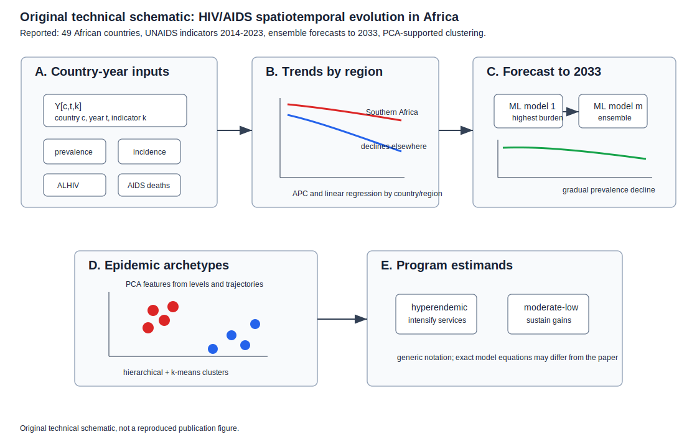
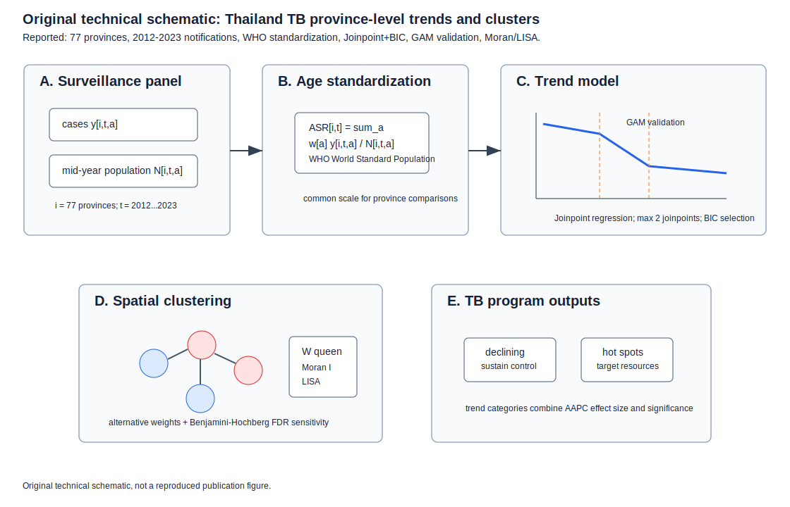
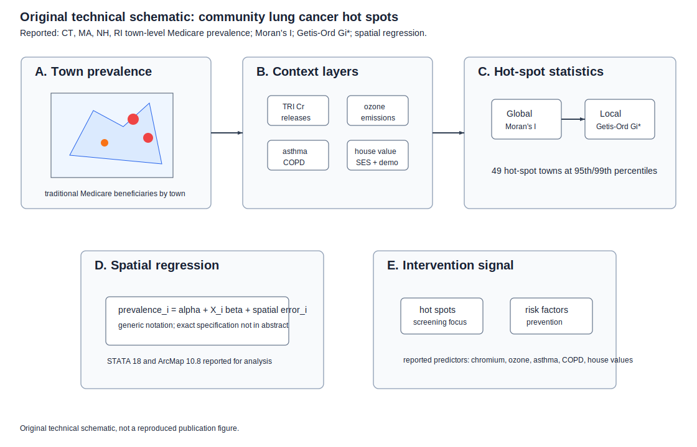
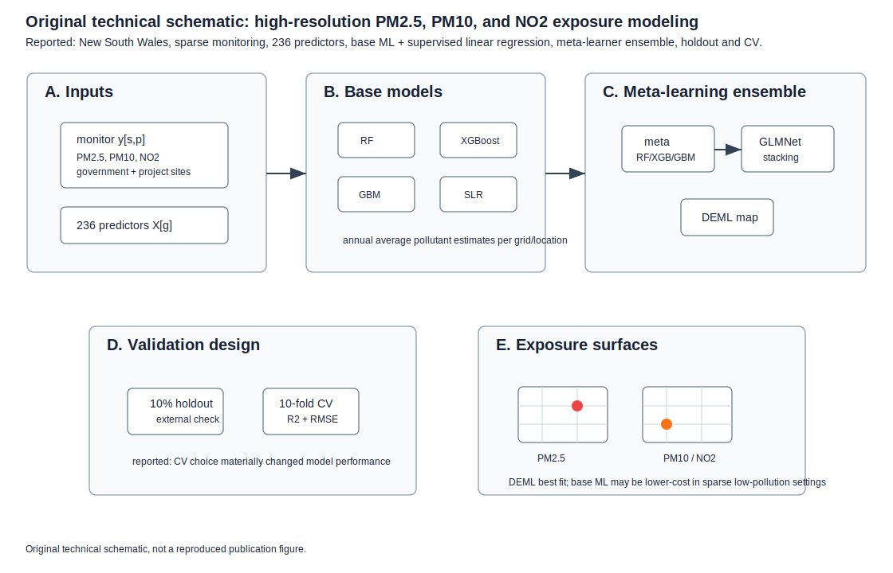
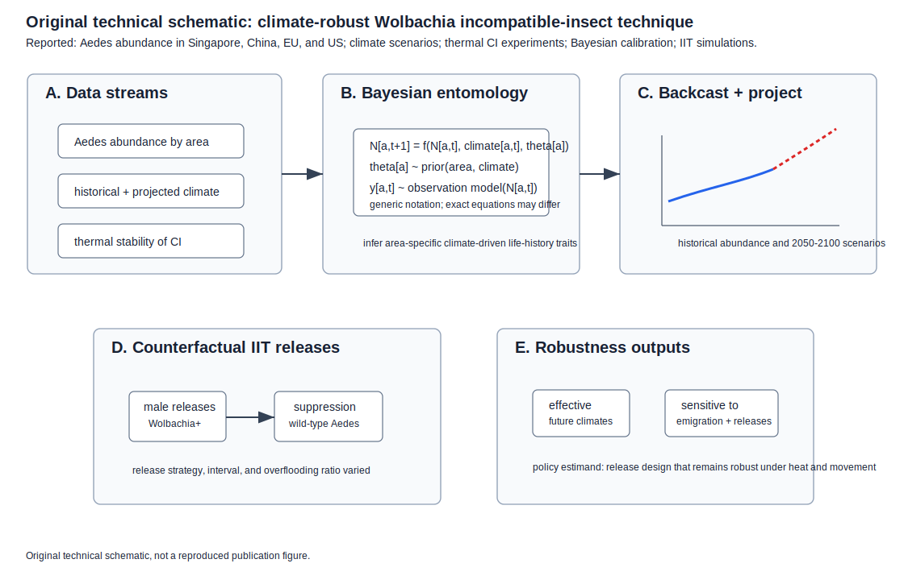

# Spatial Epidemiology Research Update

**Update date:** July 1, 2026
**Search window:** Since the previous automation run on June 30, 2026 at
12:00:44 UTC

## Search Result

Five newly published or newly indexed items passed the inclusion screen for
this run. Four are peer-reviewed journal articles newly entered in PubMed or
indexed after the previous run cutoff. One is a same-window medRxiv preprint
with explicit Bayesian spatial/vector-population modeling.

Figures below are original technical schematics created for this report. They
are not reproduced from the cited publications. Equation notation is
explanatory when abstracts or metadata do not expose the paper's exact
parameterization; the notation may differ from the paper.

## Spatiotemporal HIV/AIDS evolution and forecasting in Africa

**Authors:** Francesco Branda, Olalekan John Okesanya, Mohamed Mustaf Ahmed,
Fabio Scarpa, Antonello Maruotti, Bonaventure Michael Ukoaka, Tolutope Adebimpe
Oso, Precious Miracle Wagwula, Zhinya Kawa Othman, Jerico Bautista Ogaya, Edgar
G. Cue, Victor C. Canezo, Massimo Ciccozzi, Don Eliseo Lucero Prisno, Giancarlo
Ceccarelli.
**Publication date:** Published in the 2026 volume of *Infectious Disease
Modelling*; newly entered in PubMed on July 1, 2026.
**Source:** [doi:10.1016/j.idm.2026.05.003](https://doi.org/10.1016/j.idm.2026.05.003);
[PubMed PMID: 42383074](https://pubmed.ncbi.nlm.nih.gov/42383074/).

**Modeling approach:** The study analyzes UNAIDS annual estimates for adults
aged 15-49 years across 49 African countries from 2014-2023. It maps
spatiotemporal patterns in prevalence, incidence, adults living with HIV, and
AIDS-related deaths; estimates trends using annual percentage change and linear
regression; forecasts prevalence to 2033 for the ten highest-burden countries
with an ensemble of machine-learning models; and uses hierarchical clustering,
k-means clustering, and principal component analysis to identify epidemic
archetypes.

**Key finding:** Southern Africa remained the epidemic epicenter, with mean
adult prevalence near 20%, while prevalence and incidence declined in all
regions. Forecasts indicate gradual prevalence decline among highest-burden
countries. Cluster analysis separated a hyperendemic group of six Southern
African countries from a larger moderate-to-low prevalence group.

**Why it matters:** The work turns continental surveillance into differentiated
forecast and cluster outputs, helping distinguish where programs should
intensify prevention and treatment from where sustained monitoring may be more
appropriate.

**Alt text:** A five-panel SVG schematic shows UNAIDS country-year HIV inputs
for 49 African countries, regional trend estimation, ensemble machine-learning
forecasts to 2033 for high-burden countries, PCA plus hierarchical and k-means
clustering, and outputs distinguishing a Southern Africa hyperendemic archetype
from moderate-to-low prevalence trajectories.

**Caption:** Original technical schematic. Panel A shows the country-year
surveillance matrix. Panel B summarizes annual percentage change and regression
trend estimation. Panel C depicts ensemble forecasting for the ten
highest-burden countries. Panel D shows PCA-supported clustering of epidemic
trajectories. Panel E links archetypes to differentiated HIV program strategy.

## Province-level tuberculosis trends in Thailand

**Authors:** Kittipong Sornlorm, Roshan Kumar Mahato, Sarayu Muntaphan, Kanit
Hnuploy, Rajitra Nawawonganun.
**Publication date:** Published July 1, 2026 in *Infectious Diseases of
Poverty*.
**Source:** [doi:10.1186/s40249-026-01473-2](https://doi.org/10.1186/s40249-026-01473-2);
[PubMed PMID: 42380947](https://pubmed.ncbi.nlm.nih.gov/42380947/).

**Modeling approach:** The paper uses Thailand National Disease Surveillance
System TB notifications for all 77 provinces from 2012-2023. Age-standardized
incidence rates are calculated using the WHO World Standard Population
(2000-2025). Temporal trends are modeled with Joinpoint regression using BIC
model selection, allowing up to two joinpoints, and validated with generalized
additive models. Spatial clustering is assessed with Global Moran's I and LISA
under queen contiguity, with sensitivity analyses using alternative weights and
Benjamini-Hochberg false-discovery-rate correction.

**Key finding:** Thailand achieved substantial national TB incidence reductions,
but regional and provincial heterogeneity persisted. Five health regions had
the strongest long-term reductions, while other regions showed stabilization or
mid-period increases before post-2019 reductions.

**Why it matters:** The paper provides a current province-level template for TB
elimination monitoring in which trend breaks, spatial hot spots, and COVID-era
disruption can be handled together for geographically targeted resource
allocation.

**Alt text:** A five-panel SVG schematic shows Thai provincial TB notifications
and populations, WHO age standardization, Joinpoint regression and GAM
validation, queen-contiguity Moran and LISA spatial clustering with
false-discovery-rate correction, and policy outputs for hot-spot monitoring and
resource allocation.

**Caption:** Original technical schematic. Panel A shows province-year TB case
and population inputs. Panel B shows age-standardized incidence construction.
Panel C gives generic Joinpoint and GAM trend notation. Panel D shows spatial
weights, Moran's I, and LISA with sensitivity and FDR checks. Panel E translates
trend categories and hot spots into TB program monitoring.

## Town-level lung cancer hot spots in New England

**Authors:** Taylor Jansen, Qian Song, Kristie Long Foley, Elizabeth Dugan.
**Publication date:** Published June 30, 2026 in *Cancer Causes & Control*;
newly entered in PubMed on July 1, 2026.
**Source:** [doi:10.1007/s10552-026-02202-8](https://doi.org/10.1007/s10552-026-02202-8);
[PubMed PMID: 42380543](https://pubmed.ncbi.nlm.nih.gov/42380543/).

**Modeling approach:** The study uses town-level lung cancer prevalence among
traditional Medicare beneficiaries in Connecticut, Massachusetts, New
Hampshire, and Rhode Island. It applies spatial analyses including Moran's I
and Getis-Ord Gi* hot-spot statistics, then estimates associations between
town-level contextual predictors and lung cancer prevalence using spatial
regression models. Predictors include environmental emissions, lung disease
prevalence, demographics, and socioeconomic indicators.

**Key finding:** The authors identified 49 towns as lung cancer hot spots at
the 95th and 99th percentiles. Historic chromium releases from TRI facilities,
ozone emissions, asthma and COPD prevalence, and median house values
significantly predicted higher lung cancer prevalence.

**Why it matters:** The analysis shows how small-area cancer surveillance can
move beyond mapping prevalence by linking hot spots to environmental,
respiratory-health, and socioeconomic context for earlier place-based
intervention.

**Alt text:** A five-panel SVG schematic shows Medicare town-level lung cancer
prevalence across four New England states, environmental and socioeconomic
covariate layers, Moran's I and Getis-Ord Gi* hot-spot detection, spatial
regression linking contextual predictors to prevalence, and outputs for
place-based intervention priorities.

**Caption:** Original technical schematic. Panel A shows town-level prevalence
inputs. Panel B shows contextual exposure, health, demographic, and
socioeconomic predictors. Panel C depicts global and local hot-spot statistics.
Panel D gives generic spatial regression notation. Panel E summarizes the
reported 49 hot-spot towns and associated contextual factors.

## High-resolution air pollution exposure modeling in New South Wales

**Authors:** Christine T. Cowie, Ivan C. Hanigan, Wenhua Yu, Cassandra Yuen,
Karthik Gopi, Geoffrey G. Morgan, Nicolas Borchers-Arriagada, Jane Heyworth,
Martin Cope, Lidia Morawska, Bin Jalaludin, Guy B. Marks, Yuming Guo, Luke D.
Knibbs.
**Publication date:** Published June 30, 2026 in *Environmental Science &
Technology*; PubMed entry timestamp June 30, 2026 at 12:22 UTC.
**Source:** [doi:10.1021/acs.est.6c02076](https://doi.org/10.1021/acs.est.6c02076);
[PubMed PMID: 42378067](https://pubmed.ncbi.nlm.nih.gov/42378067/).

**Modeling approach:** The paper compares high-spatial-resolution annual
average PM2.5, PM10, and NO2 estimates in New South Wales, Australia, a
sparsely monitored, low-pollution, large-area setting. It combines government
and project monitors with 236 predictors spanning land use, population,
traffic, and satellite observations. A three-stage deep ensemble machine
learning framework fits base models (random forest, XGBoost, gradient boosting)
and supervised linear regression, evaluates meta-learners (random forest,
XGBoost, gradient boosting, GLMNet), and builds an ensemble. Validation uses a
10% holdout and 10-fold cross-validation with R2 and RMSE.

**Key finding:** Deep ensemble models fit best for all pollutants, but
improvements over base machine-learning models were modest. The authors report
that lower-cost base models may be valuable in low-pollution settings with
heterogeneous monitoring density, and that cross-validation design materially
affects performance assessment.

**Why it matters:** High-resolution exposure surfaces are a core input to
environmental epidemiology; the paper clarifies when sophisticated ensembles
add enough value to justify complexity in sparse monitoring networks.

**Alt text:** A five-panel SVG schematic shows pollutant monitor observations
and 236 predictor layers for New South Wales, base random forest, XGBoost,
gradient boosting, and linear regression models, a meta-learner ensemble,
holdout and cross-validation evaluation with R2 and RMSE, and final
high-resolution PM2.5, PM10, and NO2 exposure surfaces.

**Caption:** Original technical schematic. Panel A shows monitoring and
predictor inputs. Panel B shows base-model fitting. Panel C shows the
meta-learning ensemble. Panel D summarizes holdout and cross-validation
metrics. Panel E links exposure surfaces to downstream environmental
epidemiology and cost-complexity decisions.

## Climate-robust Wolbachia incompatible-insect technique modeling

**Authors:** L. Geng, P. S. Ross, Y. Cai, T. Huang, J. Chow, Z. Wang, E. L. W.
Choo, C.-C. Chang, L. Couper, X. Gu, A. Hoffmann, J. T. Lim.
**Publication date:** Posted June 30, 2026 on medRxiv.
**Source:** [doi:10.64898/2026.06.26.26356650](https://doi.org/10.64898/2026.06.26.26356650);
[medRxiv record](https://www.medrxiv.org/content/10.64898/2026.06.26.26356650v1).

**Modeling approach:** The preprint evaluates male Wolbachia-infected mosquito
releases for suppression of wild-type *Aedes aegypti* and *Aedes albopictus*
under future climate scenarios across Singapore, China, the European Union, and
the United States. It combines public Aedes abundance datasets, historical and
projected climate data, and experiments on thermal stability of cytoplasmic
incompatibility. A climate-driven entomological model is calibrated with a
Bayesian approach to infer area-specific climate-driven mosquito life-history
parameters, back-infer historical abundance, project abundance for 2050-2100,
and simulate counterfactual IIT release strategies.

**Key finding:** Aedes populations are projected to increase in most regions
across climate scenarios without intervention. IIT can suppress wild-type
populations across future scenarios, including high-heat conditions, but
effectiveness depends strongly on emigration rates, overflooding ratios,
release intervals, and release strategies.

**Why it matters:** The paper connects climate change, vector population
dynamics, and operational release design, turning a biological-control tool into
a spatially explicit robustness and policy optimization problem.

**Alt text:** A five-panel SVG schematic shows regional Aedes abundance,
climate projections, and thermal-stability experiments feeding a Bayesian
climate-driven entomological model; historical back-inference and 2050-2100
projections; counterfactual Wolbachia IIT release simulations; and outputs for
suppression robustness across emigration, overflooding ratio, release interval,
and release strategy.

**Caption:** Original technical schematic. Panel A shows observed abundance,
climate, and cytoplasmic-incompatibility experiment inputs. Panel B gives
generic Bayesian entomological state-transition notation. Panel C shows
historical back-inference and future climate projection. Panel D depicts
counterfactual male-release simulations. Panel E identifies policy-sensitive
parameters controlling suppression robustness.

## Sources Checked

- PubMed `edat` searches for June 30-July 1, 2026 using spatial,
  spatiotemporal, geostatistical, disease-mapping, hot-spot, cluster,
  environmental exposure, outbreak, malaria, dengue, tuberculosis, HIV, cancer,
  and related disease-modeling terms.
- PubMed XML records and Crossref work metadata for selected peer-reviewed
  items, including DOI, author, journal, PubMed history, abstract, and
  publication-date fields.
- medRxiv API records for June 30-July 1, 2026, screened for spatial,
  spatiotemporal, Bayesian, climate, vector, outbreak, forecasting, wastewater,
  mobility, and exposure-modeling terms.
- bioRxiv API records for June 30-July 1, 2026. Same-window hits were mainly
  basic biology, neuroscience, ecology, spatial transcriptomics, or non-human
  population-disease work and were excluded.
- Crossref indexed-date searches for June 30-July 1, 2026. Broad searches
  returned many reindexed historical records, so selected Crossref hits were
  checked against PubMed or preprint-source metadata before inclusion.

## Duplicate And Exclusion Notes

- The June 30 automation memory and repository updates through June 30, 2026
  were checked. The five selected DOI identifiers were not present in earlier
  reports.
- The July 1 PubMed result set also included the Korea typhoid spatial-cluster
  paper previously covered on June 30, and it was excluded as a duplicate.
- Environmental Epidemiology's FeNO seasonality/exposure paper was screened as
  a spatial exposure-linked health study, but was not expanded because the air
  pollution deep-ensemble paper contributed a more direct reusable exposure
  modeling method.
- Several same-window records used "spatial" for tumor microenvironment,
  spatial transcriptomics, imaging, or within-tissue biology rather than
  population spatial epidemiology and were excluded.

## Repository Delivery Note

This report and five SVG figure assets were written into the local repository
checkout. The default shell PATH did not include `git`, so the GitHub Desktop
bundled Git executable was used for repository operations. Pre-existing
unstaged README and older untracked update/figure files were intentionally left
unstaged to avoid committing unrelated edits.
