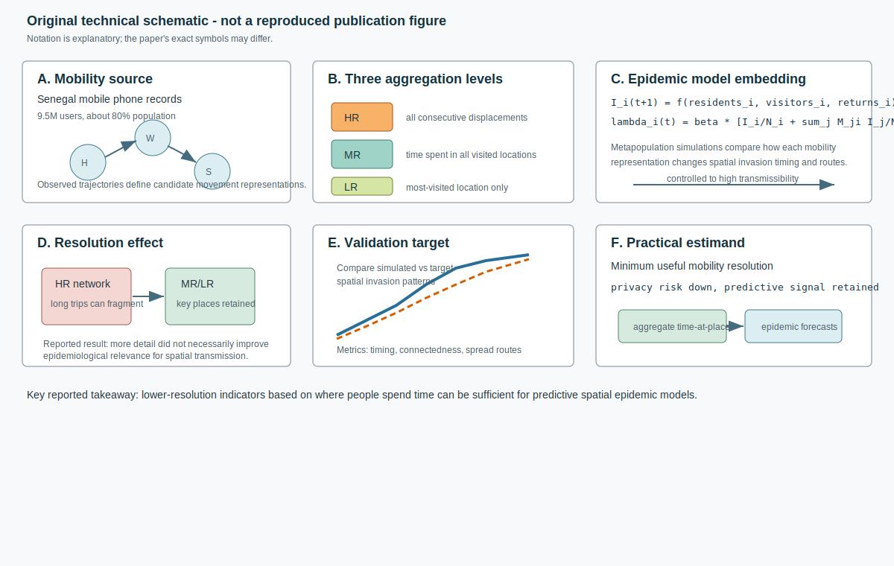
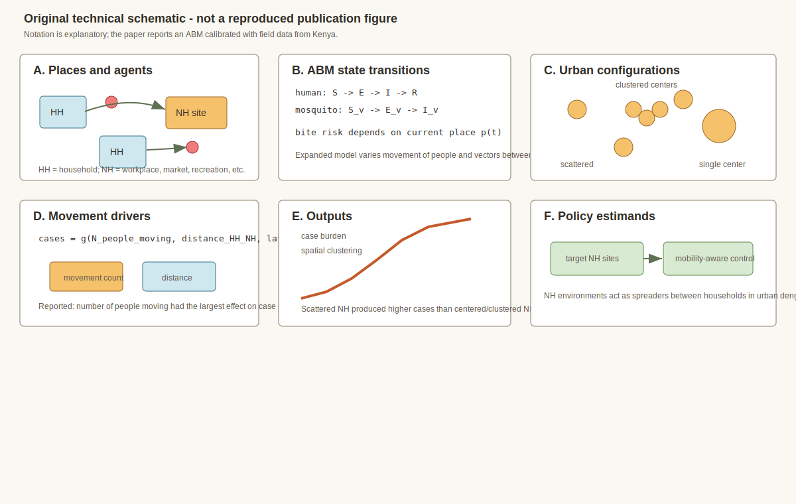
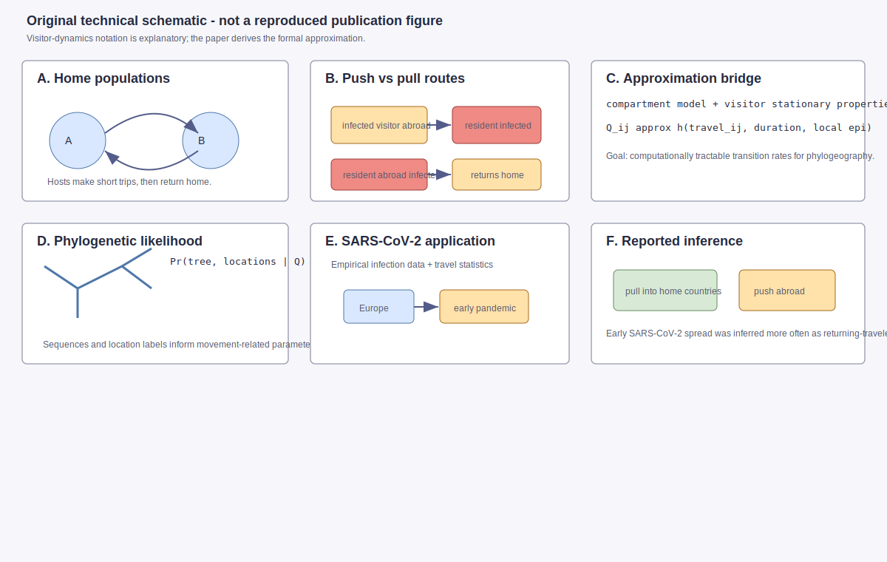
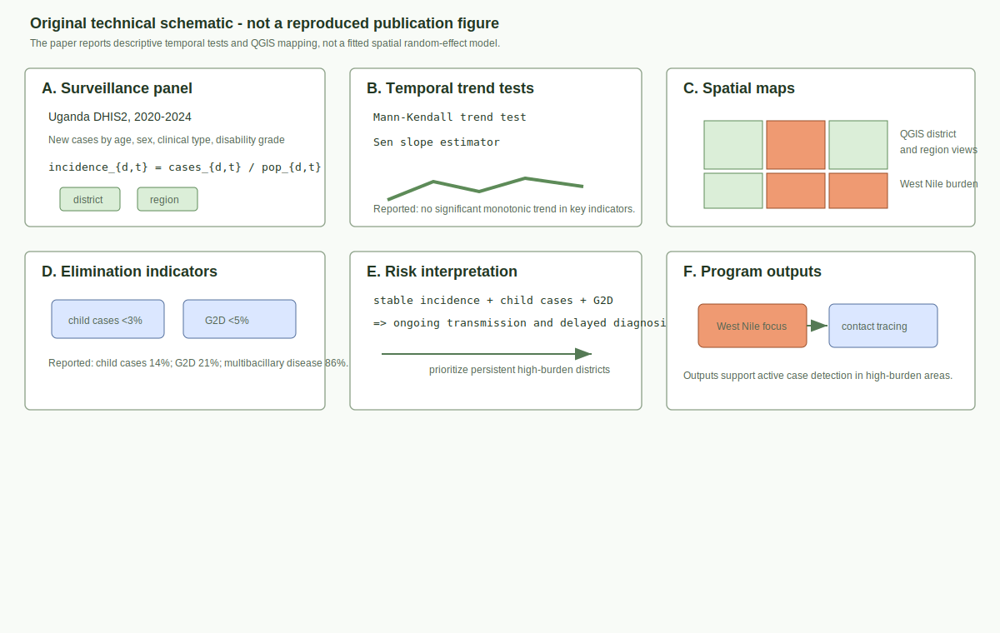
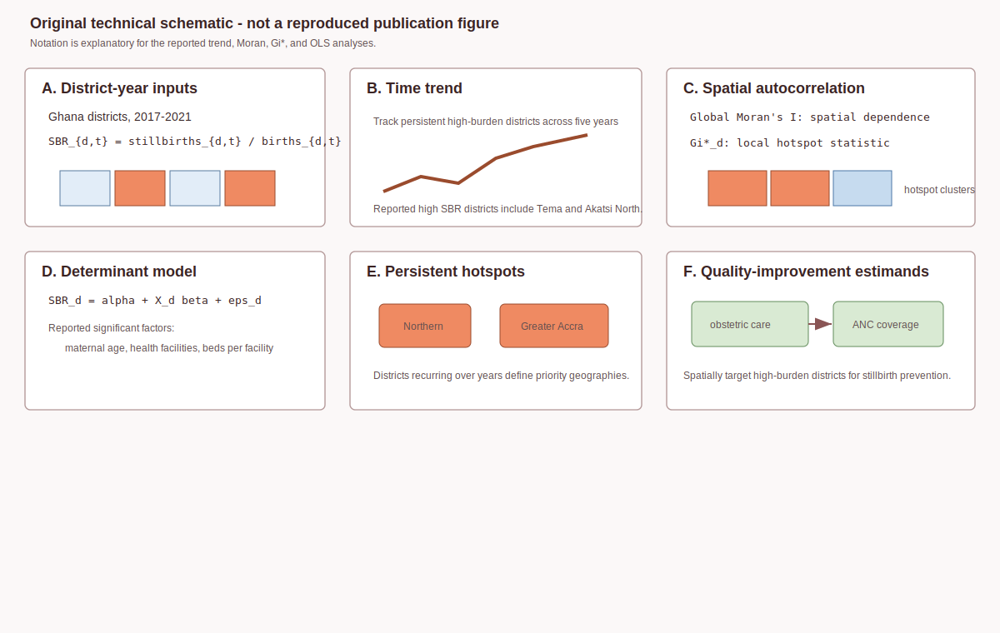
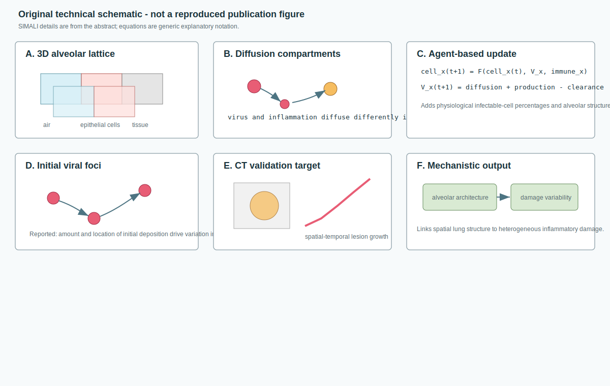

# Spatial Epidemiology Research Update

**Update date:** July 3, 2026  
**Search window:** Since the previous automation run on July 2, 2026 at
12:00:26 UTC

## Search Result

Six newly published or newly indexed items passed the inclusion screen for this
run. Five are peer-reviewed journal articles entered in PubMed after the
previous run cutoff, and one is a Research Square methods preprint newly indexed
in PubMed on July 3. The June 2026 Kinshasa dengue/chikungunya medRxiv preprint
was excluded as a duplicate because the same DOI was already covered in this
repository on June 23.

Figures below are original technical schematics created for this report. They
are not reproduced from the cited publications. Equation notation is
explanatory where abstracts do not expose the exact parameterization; notation
may differ from the paper.

## Mobility data resolution for spatial epidemic spread models

**Authors:** Giulia Pullano, Shweta Bansal, Stefania Rubrichi, Vittoria Colizza.  
**Publication date:** Published July 2026 in *PLOS Computational Biology*;
entered PubMed July 2, 2026 at 13:35 UTC.  
**Source:** [doi:10.1371/journal.pcbi.1014427](https://doi.org/10.1371/journal.pcbi.1014427);
[PubMed PMID: 42391180](https://pubmed.ncbi.nlm.nih.gov/42391180/).

**Modeling approach:** The paper compares three mobile-phone mobility
aggregation schemes for epidemic modeling in Senegal: high-resolution
consecutive displacements, medium-resolution time spent in all visited
locations, and low-resolution most-visited-location indicators. Each
representation is embedded in a metapopulation epidemic model that separates
transmission from residents, visitors, and returning travelers, then tests
spatial invasion dynamics under multiple transmissibility regimes.

**Key finding:** Preserving every observed displacement did not necessarily
improve spatial epidemic predictions. Networks based on time spent at key
locations better reproduced spatial invasion patterns, while extra daily
activity detail added little epidemiological information.

**Why it matters:** This is a practical data-governance result: epidemic
modelers may be able to use lower-resolution, more privacy-preserving mobility
summaries without losing the core signal needed for spatial spread prediction.

**Alt text:** Six-panel SVG schematic showing Senegal mobile phone trajectories,
three aggregation resolutions, a visitor-resident metapopulation epidemic
model, simulated transmissibility regimes, invasion-pattern validation, and
privacy-preserving mobility outputs.

**Caption:** Original technical schematic. Panel A shows mobile-phone trajectory
inputs. Panel B contrasts high-, medium-, and low-resolution mobility
representations. Panel C gives generic metapopulation force-of-infection
notation. Panel D summarizes the reported resolution effect. Panel E represents
validation against spatial invasion patterns. Panel F links lower-resolution
time-at-place summaries to privacy-conscious epidemic forecasting.

## Mobility and non-household dengue transmission environments

**Authors:** Victor Hugo Pena-Garcia, Bryson A. Ndenga, Francis M. Mutuku,
Donal Bisanzio, A. Desiree LaBeaud, Erin A. Mordecai.  
**Publication date:** Published July 2, 2026 in *PLOS Neglected Tropical
Diseases*; entered PubMed July 2, 2026 at 13:44 UTC.  
**Source:** [doi:10.1371/journal.pntd.0014487](https://doi.org/10.1371/journal.pntd.0014487);
[PubMed PMID: 42391249](https://pubmed.ncbi.nlm.nih.gov/42391249/).

**Modeling approach:** The authors expand an agent-based dengue model calibrated
with field data from Kenya to study human and vector movement between
household and non-household environments such as workplaces, markets, and
recreational sites. They compare urban configurations in which non-household
sites are scattered, concentrated in one center, or clustered in multiple
centers.

**Key finding:** The number of people moving between households and
non-household places was the strongest driver of dengue case counts. Scattered
non-household sites generated more cases than centered or clustered
configurations. Travel distance had little effect on burden but changed spatial
clustering.

**Why it matters:** Dengue control models and interventions that focus only on
households can miss important transmission sites. The paper makes urban layout
and daily mobility explicit estimands for vector-control planning.

**Alt text:** Six-panel SVG schematic showing household and non-household
places, a Kenya-calibrated agent-based dengue model, scattered versus centered
versus clustered non-household urban layouts, movement drivers, burden and
clustering outputs, and mobility-aware intervention targets.

**Caption:** Original technical schematic. Panel A identifies household and
non-household environments. Panel B gives generic ABM infection-state notation.
Panel C shows the three spatial configurations. Panel D highlights movement
count and distance drivers. Panel E summarizes burden and clustering outputs.
Panel F links non-household spreader sites to mobility-aware dengue control.

## Infectious phylogeography with visitor dynamics

**Authors:** Albert C. Soewongsono, Ammon Thompson, Michael J. Landis.  
**Publication date:** Published July 7, 2026 in *PNAS*; entered PubMed July 2,
2026 at 14:13 UTC.  
**Source:** [doi:10.1073/pnas.2535042123](https://doi.org/10.1073/pnas.2535042123);
[PubMed PMID: 42391403](https://pubmed.ncbi.nlm.nih.gov/42391403/).

**Modeling approach:** The paper introduces a phylogeographic model in which
pathogens spread through visitor dynamics: hosts make short trips to other
populations, can transmit while visiting, and return home. The authors use
stationary properties of an epidemiological compartment model to derive a
computationally tractable approximation for phylogenetic inference, then apply
it to European SARS-CoV-2 infection data and travel statistics.

**Key finding:** For early European SARS-CoV-2, inference under the visitor
model suggested infections were more often pulled into home countries by
returning travelers than pushed into foreign countries by infected visitors
from abroad. The visitor model also indicated that indefinite-trip migration
models may underestimate visitor-caused outbreak magnitude.

**Why it matters:** Spatial phylodynamic models often simplify movement. This
paper gives a way to distinguish short-trip visitor transmission from permanent
or indefinite migration, improving interpretation of cross-border outbreak
seeding.

**Alt text:** Six-panel SVG schematic showing home populations, short trips,
visitor-resident transmission routes, an epidemiological compartment-model
approximation, phylogenetic likelihood, European SARS-CoV-2 application, and
pull-versus-push movement inference.

**Caption:** Original technical schematic. Panel A shows home populations and
short trips. Panel B contrasts push and pull transmission routes. Panel C
summarizes the compartment-to-phylogeography approximation. Panel D shows the
phylogenetic likelihood layer. Panel E identifies the European SARS-CoV-2
application. Panel F highlights the reported returning-traveler pull signal.

## Temporal and spatial leprosy patterns in Uganda

**Authors:** Gertrude Abbo, Richard Migisha, Emmanuel Mfitundinda, Lilian
Bulage, Geofrey Amanya, Alex Mulindwa, Rose Kengonzi, Stavia Turyahabwe, Henry
Luzze, Benon Kwesiga, Alex Riolexus Ario.  
**Publication date:** Published July 2, 2026 in *PLOS Neglected Tropical
Diseases*; entered PubMed July 2, 2026 at 13:54 UTC.  
**Source:** [doi:10.1371/journal.pntd.0014450](https://doi.org/10.1371/journal.pntd.0014450);
[PubMed PMID: 42391308](https://pubmed.ncbi.nlm.nih.gov/42391308/).

**Modeling approach:** The study analyzes Uganda DHIS2 national leprosy
surveillance data from 2020-2024. It calculates incidence using mid-year
population estimates, assesses temporal trends with Mann-Kendall tests and Sen
slope estimators, and maps incidence, child cases, and Grade 2 Disability
proportions in QGIS at regional and district levels.

**Key finding:** Uganda reported 1,935 new cases and an overall incidence of
8.8 per million. Incidence was relatively stable, but multibacillary disease,
child cases, and Grade 2 Disability remained high. High incidence persisted in
the West Nile region, with 9 of 13 districts carrying the highest burden.

**Why it matters:** Even without a complex spatial random-effect model, the
paper turns surveillance data into actionable spatial targets for contact
tracing and active case detection in areas showing ongoing transmission and
delayed diagnosis.

**Alt text:** Six-panel SVG schematic showing Uganda DHIS2 case inputs,
district incidence calculation, Mann-Kendall and Sen slope trend testing,
regional and district QGIS maps, elimination target indicators, and targeted
contact-tracing outputs.

**Caption:** Original technical schematic. Panel A shows district-year
surveillance inputs. Panel B represents temporal trend testing. Panel C shows
regional and district mapping. Panel D lists elimination indicators. Panel E
links stable incidence with child cases and Grade 2 Disability to ongoing
transmission and delayed diagnosis. Panel F translates high-burden maps into
program action.

## Ghana district stillbirth hotspots

**Authors:** Charllote Boateng, Michael Arthur Ofori, Shadrach Mintah, Emmanuel
Abayie Acheampong, Brandy Bonnah Swati, Isaac Duah Boateng, Aliyu Mohammed.  
**Publication date:** Published July 2026 in *Health Science Reports*; entered
PubMed July 3, 2026 at 05:15 UTC.  
**Source:** [doi:10.1002/hsr2.72742](https://doi.org/10.1002/hsr2.72742);
[PubMed PMID: 42394744](https://pubmed.ncbi.nlm.nih.gov/42394744/).

**Modeling approach:** This ecological district-level study analyzes Ghana
stillbirth prevalence from 2017-2021. The main analyses include temporal trend
analysis, Global Moran's I for spatial autocorrelation, Getis-Ord Gi* for
hotspots, clusters, and outliers, and ordinary least squares regression to
relate stillbirth rates to district risk factors.

**Key finding:** High stillbirth rates persisted in several districts,
including Tema and Akatsi North, with recurring hotspots in the Northern and
Greater Accra regions. The regression analysis identified maternal age, number
of district health facilities, and beds per facility as significant risk
factors.

**Why it matters:** The paper provides a current disease-mapping style template
for maternal and perinatal outcomes, connecting district-level hotspot
detection to quality-improvement priorities for emergency obstetric care,
skilled birth attendance, and antenatal care.

**Alt text:** Six-panel SVG schematic showing Ghana district stillbirth inputs,
stillbirth-rate construction for 2017-2021, temporal trend analysis, Moran's I
and Getis-Ord Gi* hotspot detection, ordinary least squares determinant
modeling, and district-level quality-improvement targets.

**Caption:** Original technical schematic. Panel A shows district-year
stillbirth-rate inputs. Panel B represents temporal persistence. Panel C shows
Global Moran's I and Gi* hotspot statistics. Panel D gives generic OLS notation
for district determinants. Panel E identifies persistent hotspot regions. Panel
F translates hotspots into quality-improvement estimands.

## SIMALI spatial immune model of alveolar lung infection

**Authors:** Humayra Tasnim, Stephanie Forrest, Steven Hofmeyr, Alan Friedman,
Ronak Etemadpour, Akil Andrews, Judy Cannon, Melanie Moses, Hossein
Mehdikhani.  
**Publication date:** Posted June 24, 2026 on Research Square; entered PubMed
July 3, 2026 at 05:32 UTC.  
**Source:** [doi:10.21203/rs.3.rs-9986593/v1](https://doi.org/10.21203/rs.3.rs-9986593/v1);
[PubMed PMID: 42396494](https://pubmed.ncbi.nlm.nih.gov/42396494/).

**Modeling approach:** SIMALI represents alveolar space as a structured 3D
lattice of air and epithelial cells surrounded by lung tissue, with virus and
inflammation diffusing through the compartments. The model extends a prior
agent-based model by adding lung structural components, physiological
percentages of infectable cells, differential diffusion through air and tissue,
and validation against spatial-temporal lung-lesion growth from SARS-CoV-2 CT
scans.

**Key finding:** The model reproduced typical lung-inflammation growth observed
in CT scans and suggested that alveolar architecture, infectable-cell
distribution, immune-response variation, and the amount and location of initial
viral deposition contribute to heterogeneous lung damage.

**Why it matters:** Although this is within-host rather than population-scale
spatial epidemiology, it is a spatial infectious-disease modeling methods paper
with explicit geometry, diffusion, simulation, and imaging validation that may
inform multiscale respiratory infection models.

**Alt text:** Six-panel SVG schematic showing a 3D alveolar lattice, air,
epithelial, and tissue compartments, viral and inflammatory diffusion,
agent-based infection and immune updates, CT lesion-growth validation, and
sensitivity to initial viral foci.

**Caption:** Original technical schematic. Panel A shows the structured
alveolar lattice. Panel B shows compartment-specific diffusion. Panel C gives
generic agent-based update notation. Panel D highlights initial viral foci.
Panel E shows validation against spatial-temporal CT lesion growth. Panel F
connects alveolar architecture to heterogeneous inflammatory damage.

## Sources Checked

- PubMed E-utilities searches using `edat` for July 2-3, 2026, then PubMed
  history filtering to retain records first entered after July 2, 2026 at
  12:00:26 UTC.
- PubMed XML records for selected items, including DOI, author lists, journal
  metadata, abstracts, and entry timestamps.
- medRxiv and bioRxiv API records for July 2-3, 2026, screened for spatial,
  spatiotemporal, Bayesian, mobility, outbreak, transmission, environmental
  exposure, and forecasting terms.
- Crossref indexed-date searches for July 2-3, 2026, including newly indexed
  Spatial and Spatio-temporal Epidemiology records.
- Existing repository reports were searched for DOI/title duplicates before
  selection.

## Duplicate And Exclusion Notes

- `10.64898/2026.06.11.26355423`, the Kinshasa dengue/chikungunya Bayesian
  catalytic modeling preprint, was newly indexed in PubMed during this window
  but already appeared in `updates/2026-06-23.md`, so it was excluded.
- Several post-cutoff records used "spatial" for imaging, spatial
  transcriptomics, neuroanatomy, tissue biology, or ecology without
  population-level disease modeling and were excluded.
- The Crossref-indexed article "Global mobility flows and COVID-19 spread in
  Europe during the emergency phase" in *Spatial and Spatio-temporal
  Epidemiology* was noted as relevant, but the accessible metadata did not
  expose enough abstract or results detail during this run to summarize it
  without over-inference.

## Repository Delivery Note

This report and six SVG figure assets were written into the local repository
checkout. The default shell PATH did not include `git`, so the GitHub Desktop
bundled Git executable was used for repository operations. Pre-existing local
changes to `README.md` and older untracked 2026-06-26/27 update assets were left
untouched and unstaged.
