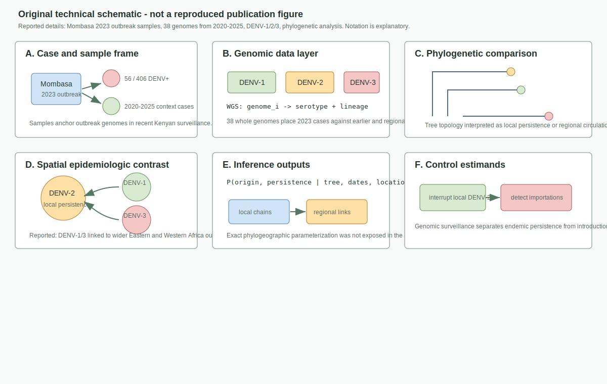
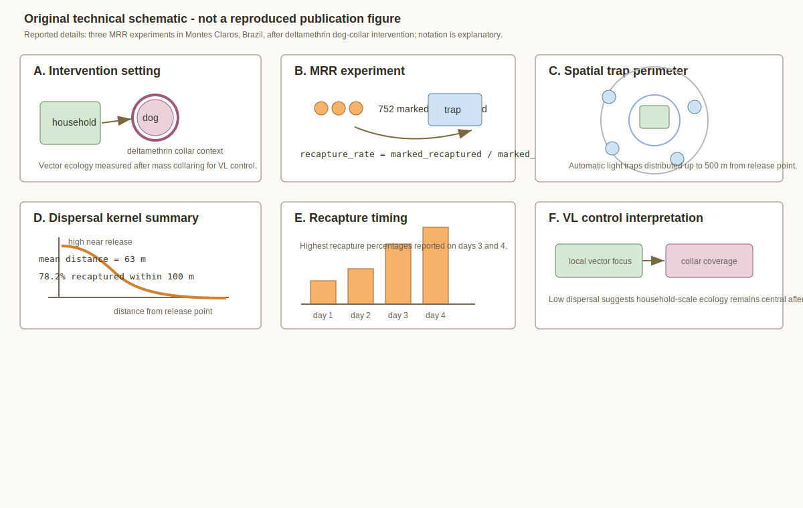
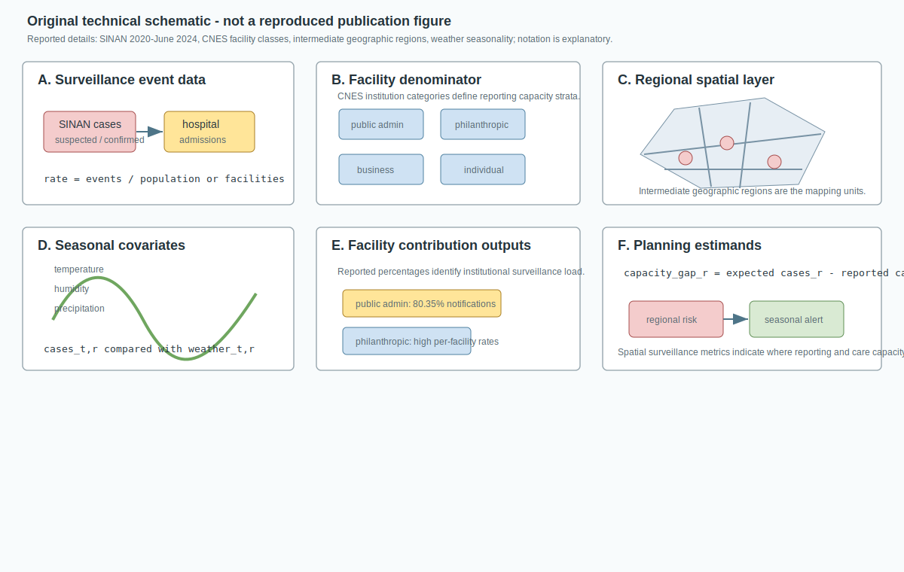
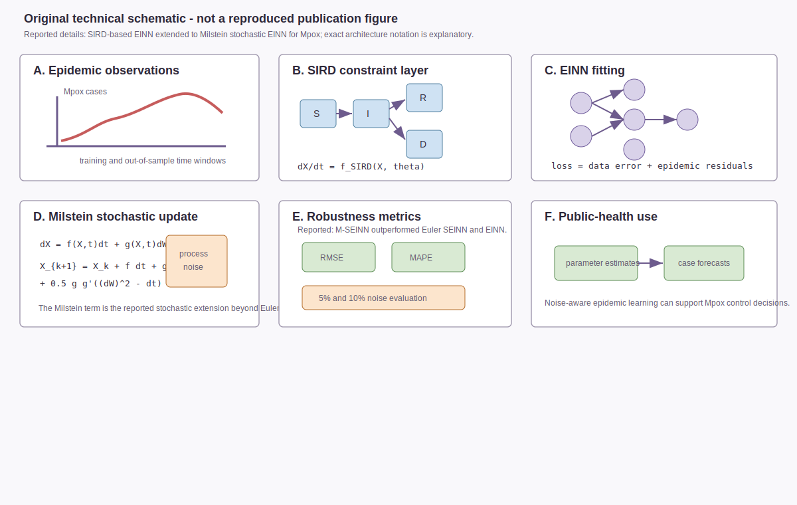
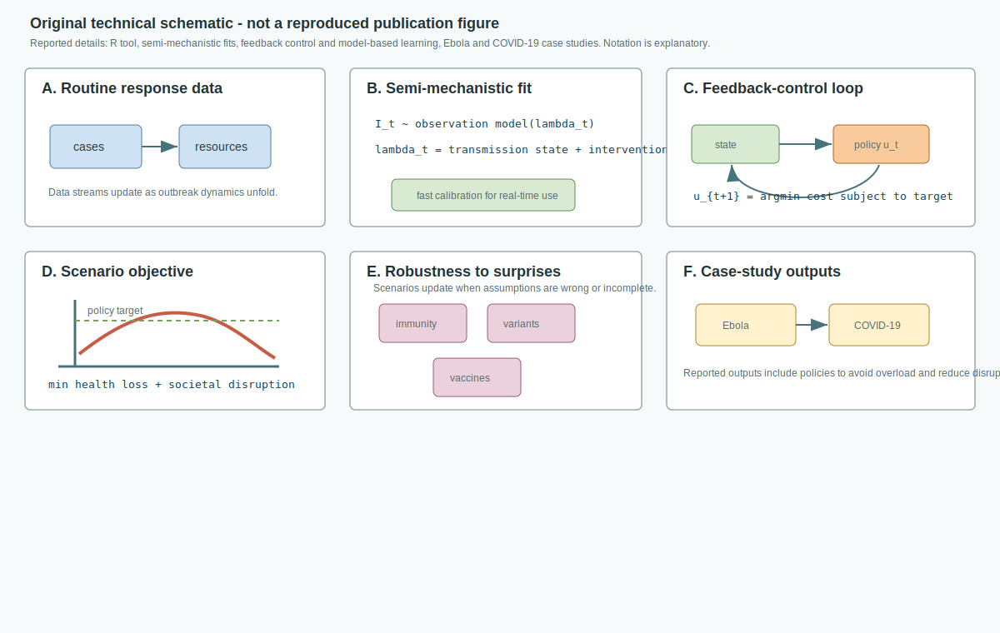
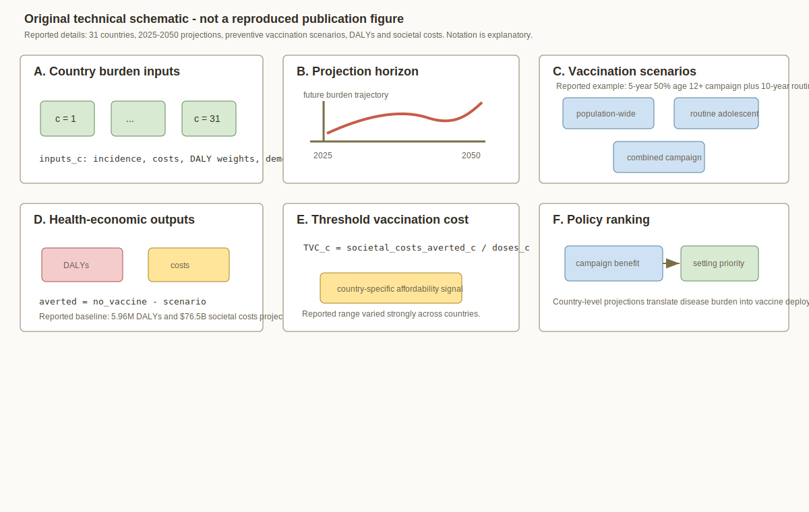

# Spatial Epidemiology Research Update

**Update date:** July 4, 2026  
**Search window:** Since the previous automation run on July 3, 2026 at
12:01:03 UTC

## Search Result

Six newly published, newly indexed, or newly versioned items passed the
inclusion screen for this run. Four are peer-reviewed journal articles entered
in PubMed after the previous run cutoff, and two are medRxiv version-2 preprints
posted on July 3, 2026. The most relevant post-cutoff items centered on
arboviral genomic surveillance, vector dispersal, spatial surveillance
capacity, stochastic epidemic learning, real-time intervention optimization,
and country-level chikungunya vaccination economics.

Figures below are original technical schematics created for this report. They
are not reproduced from the cited publications. Equation notation is
explanatory where abstracts or metadata do not expose the exact
parameterization; notation may differ from the paper or preprint.

## Genomic investigation of dengue persistence and regional circulation in Kenya

**Authors:** Solomon K. Langat, Sheila Kageha, Victor Jeza, Genay Pilarowski,
Albert Nyunja, Paul E. Oluniyi, Juliana Gil, Nelly Ogada, Lewis Gande, Jane
Thiiru, et al.  
**Publication date:** Published July 3, 2026 in *Scientific Reports*; entered
PubMed July 3, 2026 at 23:18 UTC.  
**Source:** [doi:10.1038/s41598-026-59068-8](https://doi.org/10.1038/s41598-026-59068-8);
[PubMed PMID: 42399298](https://pubmed.ncbi.nlm.nih.gov/42399298/).

**Modeling approach:** The study generated whole-genome dengue virus sequences
from the 2023 Mombasa outbreak and earlier Kenyan cases from 2020-2025, then
used phylogenetic analysis to compare DENV-1, DENV-2, and DENV-3 outbreak
viruses with recent regional epidemics.

**Key finding:** DENV-2 showed patterns consistent with longer-term local
circulation in Kenya, whereas DENV-1 and DENV-3 appeared more broadly connected
to recent Eastern and Western Africa outbreaks.

**Why it matters:** The paper separates local persistence from regional
introduction risk, which is exactly the distinction spatial genomic
surveillance needs when deciding whether to prioritize local transmission
interruption, border/regional surveillance, or both.

**Alt text:** Six-panel SVG schematic showing Mombasa dengue outbreak samples,
whole-genome sequencing of DENV-1, DENV-2, and DENV-3, phylogenetic comparison,
local persistence versus regional circulation, origin-inference notation, and
control estimands for local interruption and importation detection.

**Caption:** Original technical schematic. Panel A shows the case and sample
frame. Panel B maps genomes to serotypes and lineages. Panel C represents
phylogenetic comparison. Panel D distinguishes the reported DENV-2 local
persistence signal from wider DENV-1 and DENV-3 regional circulation. Panel E
uses generic phylogeographic notation because the abstract does not expose the
exact parameterization. Panel F connects genomic outputs to surveillance and
control estimands.

## Spatial dispersal of *Lutzomyia longipalpis* under deltamethrin dog-collar intervention

**Authors:** Rosanna Lorrane Francisco Dos Reis Matos, Thallyta Maria Vieira,
Thainara da Silva Goncalves, Rebeca Mendes Rocha, Marilia Fonseca Rocha,
Guilherme Loureiro Werneck, Fredy Galvis-Ovallos.  
**Publication date:** Published July 3, 2026 in *Acta Tropica*; entered PubMed
July 3, 2026 at 19:37 UTC.  
**Source:** [doi:10.1016/j.actatropica.2026.108217](https://doi.org/10.1016/j.actatropica.2026.108217);
[PubMed PMID: 42398813](https://pubmed.ncbi.nlm.nih.gov/42398813/).

**Modeling approach:** The authors conducted three mark-release-recapture
experiments after deltamethrin-impregnated dog-collar intervention in Montes
Claros, Minas Gerais, Brazil. Marked sand flies were released from selected
households, automatic light traps were placed up to 500 m away, and recaptures
were summarized by distance and day after release.

**Key finding:** Of 752 marked and released *Lu. longipalpis*, the average
recapture rate was 9%. Recaptures were concentrated close to the release point:
78.2% occurred within 100 m, and the mean traveled distance was 63 m.

**Why it matters:** Visceral leishmaniasis control depends on how dog-reservoir
interventions alter vector-reservoir contact. The observed low dispersal
supports spatially local evaluation of collar coverage, residual vector risk,
and household-scale ecological conditions.

**Alt text:** Six-panel SVG schematic showing deltamethrin-collared dogs,
mark-release-recapture sand fly release, a 500 m trap perimeter, a dispersal
kernel with 78.2% recaptured within 100 m and mean distance of 63 m, recapture
timing, and visceral leishmaniasis vector-control interpretation.

**Caption:** Original technical schematic. Panel A places the experiment in a
dog-collar intervention setting. Panel B shows mark-release-recapture sampling.
Panel C diagrams the household release point and trap perimeter. Panel D
summarizes the reported dispersal kernel. Panel E shows recapture timing.
Panel F translates low spatial dispersal into vector-control estimands.

## Spatial surveillance capacity for arboviral diseases in Rio Grande do Sul, Brazil

**Authors:** Lucas Felipe Kist, Jonas Michel Wolf, Maike Luan Gomes Rocha,
Amauri Duarte da Silva, Renan Baiocco Pereira, Ana Beatriz Gorini da Veiga.  
**Publication date:** Published July 3, 2026 in *BMC Public Health*; entered
PubMed July 3, 2026 at 23:55 UTC.  
**Source:** [doi:10.1186/s12889-026-28238-8](https://doi.org/10.1186/s12889-026-28238-8);
[PubMed PMID: 42399836](https://pubmed.ncbi.nlm.nih.gov/42399836/).

**Modeling approach:** This retrospective ecological study linked SINAN
arboviral notification data from January 2020 to June 2024 with CNES health
facility records. The authors compared notification and hospitalization rates
by facility administrative class, population, and institution count, performed
spatial analysis by intermediate geographic regions, and examined case
seasonality with temperature, humidity, and precipitation.

**Key finding:** Public administration facilities represented 14.66% of health
facilities but accounted for 80.35% of arboviral notifications and 82.19% of
confirmed cases. Philanthropic organizations contributed disproportionately
relative to their number of facilities and showed high notification rates per
facility.

**Why it matters:** Spatial arboviral surveillance is not only a vector and
climate problem. The paper makes institutional reporting capacity a spatially
structured component of surveillance bias and outbreak readiness.

**Alt text:** Six-panel SVG schematic showing SINAN arboviral case inputs,
CNES facility categories, regional spatial mapping units, seasonal
meteorological covariates, facility contribution outputs, and surveillance
capacity estimands.

**Caption:** Original technical schematic. Panel A shows event and
hospitalization data. Panel B shows CNES facility denominators. Panel C
represents intermediate geographic-region mapping. Panel D links seasonality to
meteorological covariates. Panel E highlights reported institutional
contributions to notifications. Panel F frames regional surveillance capacity
as a planning estimand.

## Milstein stochastic epidemiologically informed neural network for Mpox dynamics

**Authors:** Abdelkarim Khouna, El Houssaine Hssayni, Nour-Eddine Joudar.  
**Publication date:** Published July 1, 2026 in *Computer Methods and Programs
in Biomedicine*; entered PubMed July 3, 2026 at 18:07 UTC.  
**Source:** [doi:10.1016/j.cmpb.2026.109535](https://doi.org/10.1016/j.cmpb.2026.109535);
[PubMed PMID: 42398350](https://pubmed.ncbi.nlm.nih.gov/42398350/).

**Modeling approach:** The paper introduces an epidemiologically informed
neural network using a classical SIRD structure for human-to-human Mpox
transmission, then extends it to a Milstein stochastic epidemiologically
informed neural network that incorporates stochastic differential equation
dynamics. The method is evaluated against Euler SEINN and non-stochastic EINN
under noise and out-of-sample settings.

**Key finding:** M-SEINN outperformed the Euler SEINN and EINN baselines. In
the abstract-reported 5% out-of-sample noise setting, it achieved cumulative
case RMSE of 3.9569 and MAPE of 14.92%; at 10% in-sample noise, daily-case
RMSE was 11.29 compared with 12.98 and 14.25 for comparator methods.

**Why it matters:** Epidemic neural networks are often hard to interpret or
unstable under noise. This paper is a reproducible-methods contribution that
keeps compartmental epidemic structure while explicitly modeling stochastic
uncertainty for parameter estimation and control decisions.

**Alt text:** Six-panel SVG schematic showing Mpox time-series observations,
SIRD compartmental constraints, neural-network residual fitting, a Milstein
stochastic differential update, noise-robust RMSE and MAPE evaluation, and
public-health decision outputs.

**Caption:** Original technical schematic. Panel A shows time-series case
inputs. Panel B shows the SIRD constraint layer. Panel C represents the EINN
loss structure. Panel D gives generic Milstein SDE notation; the exact
implementation may differ from the paper. Panel E summarizes robustness
metrics. Panel F links stochastic epidemic learning to parameter estimates and
case forecasts.

## EpiControl real-time epidemic intervention optimization

**Authors:** Szilvia Beregi, Sangeeta Bhatia, Anne Cori, Kris V. Parag.  
**Publication date:** Version 2 posted July 3, 2026 on medRxiv.  
**Source:** [doi:10.1101/2025.11.17.25340271](https://doi.org/10.1101/2025.11.17.25340271);
[medRxiv record](https://www.medrxiv.org/content/10.1101/2025.11.17.25340271v2).

**Modeling approach:** EpiControl is an R tool that fits semi-mechanistic
models to routine outbreak data and combines feedback control with model-based
learning. It automatically updates intervention scenarios as dynamics unfold,
minimizes user-defined costs, targets policy goals such as peak suppression,
and tests robustness to uncertain immunity, vaccination, and pathogen variant
dynamics.

**Key finding:** In Ebola virus and COVID-19 case studies, the tool rapidly
identified intervention policies intended to prevent hospital overload, reduce
societal disruption, and retain control under unanticipated changes.

**Why it matters:** This is a practical bridge between real-time outbreak
forecasting and action selection. It is especially relevant for spatial
epidemiology teams that need fast, scenario-based decision support while
handling noisy routine surveillance data.

**Alt text:** Six-panel SVG schematic showing routine case and resource data,
semi-mechanistic model fitting, a feedback-control policy loop, scenario
objective functions, robustness to immunity, variants, and vaccination
uncertainty, and Ebola/COVID-19 case-study outputs.

**Caption:** Original technical schematic. Panel A shows routine response data.
Panel B represents semi-mechanistic fitting. Panel C diagrams the feedback
control loop. Panel D defines generic policy objectives. Panel E shows
uncertainty dimensions. Panel F summarizes the reported Ebola and COVID-19
case-study outputs. This is a preprint schematic, not peer-reviewed evidence.

## Chikungunya burden and preventive vaccination cost-effectiveness across 31 countries

**Authors:** Junwen Zhou, Natalie Salant, Hristina-Selena Radoykova, Jane
Messina, William Wint, Jack Longbottom, Katie M. Holohan, Katherine A. Dinkel,
Maaike L. T. Sytsma, Abigail A. Torkelson, Luiz Pamplona de Goes Cavalcanti,
T. Deirdre Hollingsworth, Joanne Lord, David R. M. Smith, Koen B. Pouwels.  
**Publication date:** Version 2 posted July 3, 2026 on medRxiv.  
**Source:** [doi:10.1101/2025.09.26.25336724](https://doi.org/10.1101/2025.09.26.25336724);
[medRxiv record](https://www.medrxiv.org/content/10.1101/2025.09.26.25336724v2).

**Modeling approach:** The authors developed a modeling framework to project
the health-economic burden of chikungunya across 31 countries from 2025 to
2050. They simulated preventive vaccination campaigns and estimated threshold
vaccination costs as cumulative societal costs averted per vaccine dose.

**Key finding:** The model projected 5.96 million DALYs and $76.5 billion in
societal costs from 2025 to 2050. A five-year population-wide campaign
targeting 50% of people aged 12 years or older, followed by a ten-year annual
routine adolescent program, was projected to avert 681,000 DALYs and $11.8
billion in societal costs.

**Why it matters:** Chikungunya vaccination decisions will be made across
heterogeneous endemic settings. The paper turns spatially stratified country
burden into policy-relevant vaccine cost thresholds and campaign designs.

**Alt text:** Six-panel SVG schematic showing 31 country-level burden inputs,
2025-2050 projection horizon, population-wide and routine adolescent
vaccination scenarios, DALY and societal cost outputs, threshold vaccination
cost calculation, and country-priority policy ranking.

**Caption:** Original technical schematic. Panel A shows country-level burden
inputs. Panel B shows the projection horizon. Panel C represents vaccination
campaign scenarios. Panel D shows DALY and cost outputs. Panel E gives generic
threshold vaccination cost notation. Panel F links country-specific model
outputs to vaccine deployment priorities. This is a preprint schematic, not
peer-reviewed evidence.

## Sources Checked

- PubMed E-utilities searches using `edat` for July 3-4, 2026, with candidate
  records filtered to those first entered after July 3, 2026 at 12:01:03 UTC.
- PubMed XML records for selected peer-reviewed items, including DOI, author
  metadata, abstracts, journal metadata, and entry timestamps.
- medRxiv and bioRxiv API records for July 3-4, 2026, screened for spatial,
  spatiotemporal, Bayesian, mobility, transmission, forecasting, outbreak,
  environmental exposure, and reproducible-methods terms.
- Existing repository updates were searched for DOI and title duplicates before
  selection.

## Duplicate And Exclusion Notes

- No selected DOI or title appeared in prior repository updates.
- Several PubMed records were relevant to spatial epidemiology but entered
  PubMed before the July 3, 2026 12:01:03 UTC cutoff and were excluded from
  this run, including the spatiotemporal SEIQR optimal-control paper in
  *Journal of Mathematical Biology*, the Peru sheep fascioliasis spatial
  analysis, and the Born in Bradford environmental inequality analysis.
- Several July 4 indexed records used "spatial" for tissue imaging,
  transcriptomics, radiology, neuroanatomy, or ecology without population-level
  disease, exposure, or outbreak modeling and were excluded.

## Repository Delivery Note

This report and six SVG figure assets were written into the local repository
checkout. Pre-existing local changes to `README.md` and older untracked
2026-06-26/2026-06-27 update assets were left untouched.
