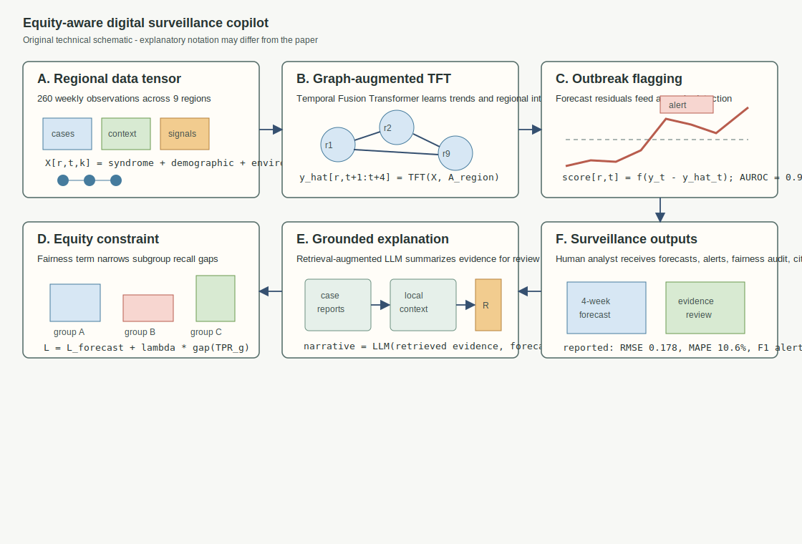
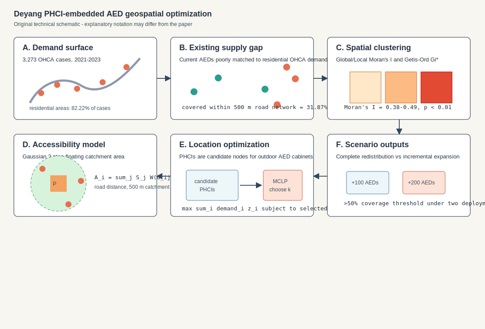
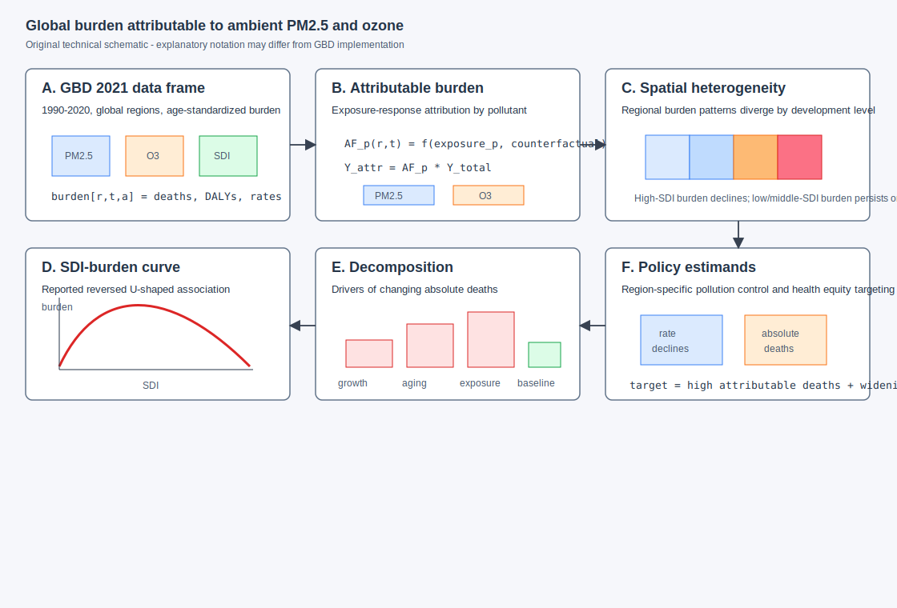
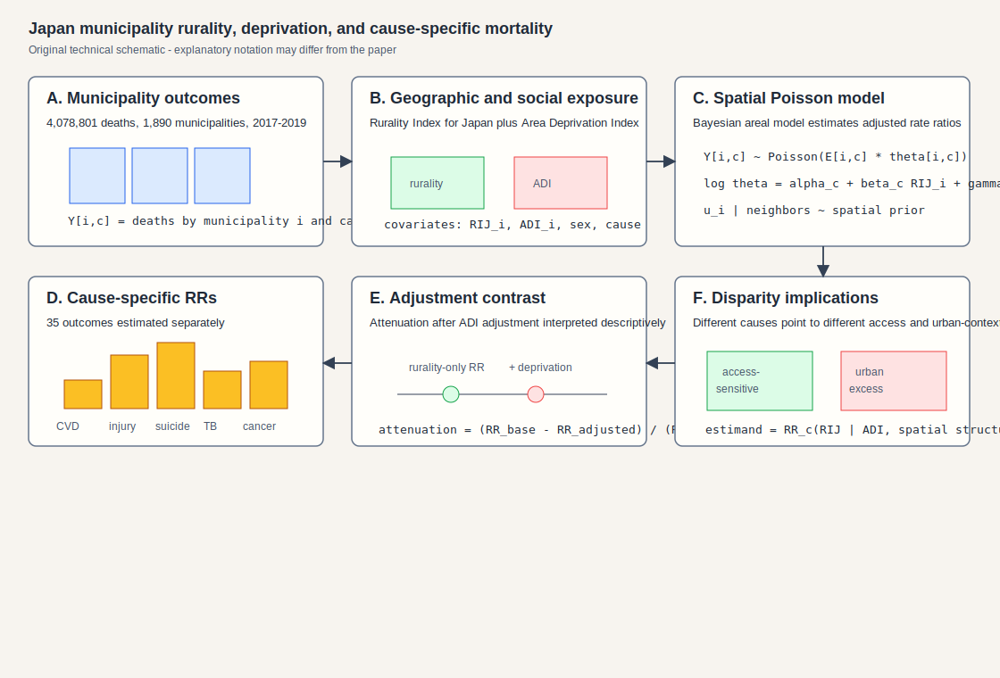
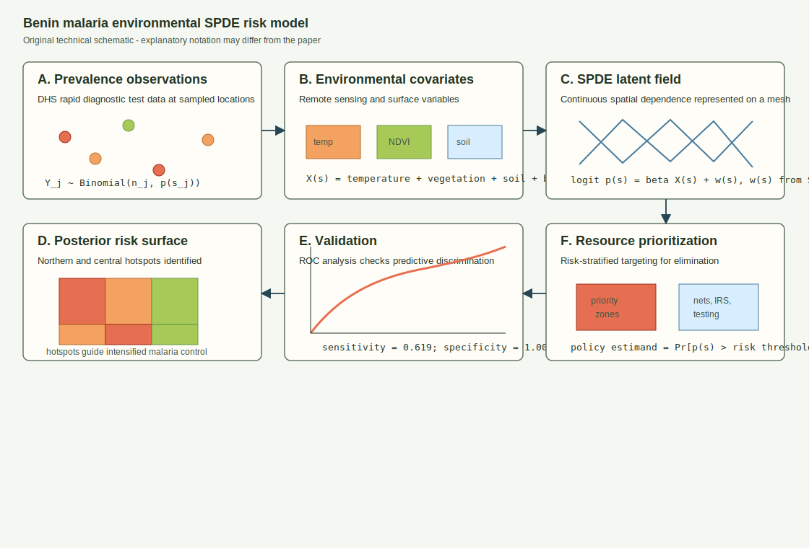
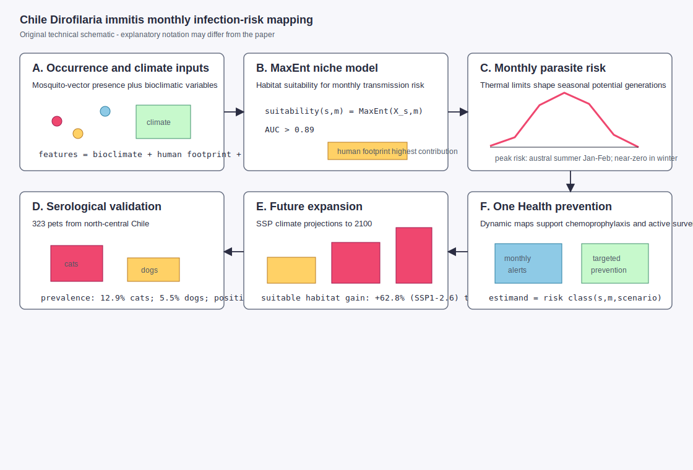

# Spatial Epidemiology Research Update

**Update date:** July 6, 2026  
**Search window:** Since the previous automation run on July 5, 2026 at
12:00:46 UTC

## Search Result

Six newly published or newly indexed peer-reviewed items passed the inclusion
screen for this run. All selected records were entered in PubMed after the
previous run cutoff. They cover spatial public-health surveillance, geospatial
emergency-response optimization, environmental exposure burden modeling,
Bayesian spatial mortality analysis, malaria geostatistical risk mapping, and
vector-borne zoonotic risk projection.

Figures below are original technical schematics created for this report. They
are not reproduced from the cited publications. Equation notation is
explanatory where abstracts do not expose the exact parameterization; notation
may differ from the paper.

## Equity-aware generative AI copilot for digital public health surveillance

**Authors:** Saleh Albahli.  
**Publication date:** Published in 2026 in *Frontiers in Public Health*;
entered PubMed July 6, 2026 at 05:40 UTC.  
**Source:** [doi:10.3389/fpubh.2026.1827709](https://doi.org/10.3389/fpubh.2026.1827709);
[PubMed PMID: 42404929](https://pubmed.ncbi.nlm.nih.gov/42404929/).

**Modeling approach:** The paper develops an analyst-facing digital
surveillance framework that integrates a graph-augmented Temporal Fusion
Transformer, anomaly detection, subgroup fairness regularization, and
retrieval-augmented large-language-model support. The evaluation uses 260 weeks
of surveillance data from 9 Saudi Arabian administrative regions, combining
weekly syndrome counts with demographic context, environmental variables, and
selected digital signals.

**Key finding:** The held-out evaluation reported four-week-ahead forecasting
performance of RMSE 0.178 and MAPE 10.6%, outbreak-detection AUROC 0.936 and F1
0.832, narrowed subgroup recall gaps under the fairness-aware configuration,
and entity-level F1 0.89 for the retrieval-augmented copilot.

**Why it matters:** Spatial surveillance tools increasingly need to combine
regional forecasts, outbreak flags, fairness audits, and transparent narrative
support. This paper is a reproducible-methods contribution for operational
public-health analysts working with heterogeneous regional data streams.

**Alt text:** Six-panel SVG schematic showing multimodal regional surveillance
inputs, a graph-augmented Temporal Fusion Transformer for nine administrative
regions, anomaly detection, subgroup fairness regularization, retrieval-
augmented explanation, and analyst-facing forecast, alert, fairness, and
citation outputs.

**Caption:** Original technical schematic. Panel A shows the regional weekly
data tensor. Panel B diagrams the graph-augmented Temporal Fusion Transformer.
Panel C represents anomaly scoring for outbreak flags. Panel D shows the
fairness penalty on subgroup true-positive-rate gaps. Panel E represents the
retrieval-augmented explanation layer. Panel F summarizes reported predictive,
alerting, and evidence-grounding outputs.

## Geospatial optimization of AED placement in Deyang, China

**Authors:** Sheng Liu, Chunyan Liao, Yi Yang, Yong Yang, Wei Jiang, Dingxiu
He, Kaisen Huang.  
**Publication date:** Published July 2026 in *Resuscitation Plus*; entered
PubMed July 6, 2026 at 05:33 UTC.  
**Source:** [doi:10.1016/j.resplu.2026.101369](https://doi.org/10.1016/j.resplu.2026.101369);
[PubMed PMID: 42404315](https://pubmed.ncbi.nlm.nih.gov/42404315/).

**Modeling approach:** The authors combined out-of-hospital cardiac arrest
(OHCA) cases, existing AED locations, primary healthcare institutions (PHCIs),
demographics, and road-network distances. Spatial heterogeneity was assessed
with Global and Local Moran's I and Getis-Ord Gi* statistics. AED access was
modeled with a Gaussian Two-Step Floating Catchment Area method and a Maximal
Covering Location Problem using PHCIs as candidate nodes.

**Key finding:** The study included 3,273 OHCA cases. Spatial clustering
intensified from 2021 to 2023, with Moran's I ranging from 0.38 to 0.49.
Residential areas accounted for 82.22% of cases but only 6.29% of AED
deployments. Existing AEDs covered only 31.87% of historical OHCAs within
500 m of road-network distance. Achieving more than 50% coverage required 100
additional AEDs under complete redistribution versus 200 under incremental
expansion.

**Why it matters:** This is a concrete geospatial optimization template for
matching emergency infrastructure to health-event demand. The PHCI-embedded
strategy is relevant to spatial epidemiology teams translating hotspot maps
into coverage decisions under resource constraints.

**Alt text:** Six-panel SVG schematic showing OHCA case demand, existing AED
supply mismatch, Moran's I and Getis-Ord hotspot mapping, Gaussian Two-Step
Floating Catchment Area accessibility, maximal covering location optimization
over PHCI candidate nodes, and complete-redistribution versus incremental-
expansion coverage scenarios.

**Caption:** Original technical schematic. Panel A shows OHCA demand. Panel B
shows the existing AED coverage gap. Panel C represents spatial clustering and
hotspot statistics. Panel D shows the road-network accessibility model. Panel E
diagrams the PHCI candidate-node optimization. Panel F compares deployment
scenarios for reaching the coverage threshold.

## Global ambient air pollution disease burden disparities

**Authors:** Yixuan Jiang, Su Shi, Xia Meng, Haidong Kan.  
**Publication date:** Published in 2026 in *Health Data Science*; entered
PubMed July 6, 2026 at 05:32 UTC.  
**Source:** [doi:10.34133/hds.0447](https://doi.org/10.34133/hds.0447);
[PubMed PMID: 42404168](https://pubmed.ncbi.nlm.nih.gov/42404168/).

**Modeling approach:** Using Global Burden of Disease Study 2021 data, the
authors assessed temporal trends and spatial heterogeneity in disease burden
attributable to ambient fine particulate matter and ozone from 1990 to 2020.
They examined associations with sociodemographic index and used decomposition
analysis to quantify drivers of temporal change.

**Key finding:** Age-standardized death rates attributable to ambient PM2.5 and
ozone declined globally, but the absolute number of attributable deaths
increased. The paper reports substantial regional heterogeneity, persistent or
increasing burden in low- and middle-SDI regions, and a reversed U-shaped
association between SDI and pollutant-attributable burden.

**Why it matters:** Environmental exposure modeling is a core part of spatial
epidemiology. This paper links global exposure-attributable burden estimates to
regional inequality, population aging, population growth, and exposure changes,
which are the drivers policymakers need to separate when prioritizing air
pollution control.

**Alt text:** Six-panel SVG schematic showing GBD 2021 pollutant and burden
inputs, PM2.5 and ozone exposure-attributable burden equations, regional
spatial heterogeneity, a reversed U-shaped SDI association, decomposition into
population growth, aging, exposure, and baseline mortality components, and
region-specific policy outputs.

**Caption:** Original technical schematic. Panel A shows the GBD data frame.
Panel B represents exposure-attributable burden estimation. Panel C shows
regional heterogeneity. Panel D diagrams the reported SDI-burden relationship.
Panel E shows decomposition of absolute mortality changes. Panel F connects
model outputs to region-specific control priorities.

## Bayesian spatial analysis of rurality, deprivation, and mortality in Japan

**Authors:** Masahide Koda, Nahoko Harada, Shuhei Nomura, Yusuke Tsugawa.  
**Publication date:** Published in 2026 in *BMJ Public Health*; entered PubMed
July 6, 2026 at 05:27 UTC.  
**Source:** [doi:10.1136/bmjph-2026-004913](https://doi.org/10.1136/bmjph-2026-004913);
[PubMed PMID: 42403674](https://pubmed.ncbi.nlm.nih.gov/42403674/).

**Modeling approach:** This nationwide municipality-level ecological study
analyzed 4,078,801 deaths during 2017-2019 across 1,890 municipalities. The
authors used the Rurality Index for Japan and Area Deprivation Index as
exposures and estimated all-cause plus 34 cause-specific mortality outcomes
with Bayesian spatial Poisson models, comparing estimates with and without
deprivation adjustment.

**Key finding:** After deprivation adjustment, rural excess persisted for
all-cause mortality overall and for selected cardiovascular, cerebrovascular,
senility, unintentional injury, traffic accident, and suicide outcomes. Several
infectious, respiratory, liver, and site-specific cancer outcomes showed urban
excess, with tuberculosis notably lower in rural municipalities.

**Why it matters:** The paper demonstrates how Bayesian areal disease-mapping
models can separate geographic remoteness from area deprivation across many
cause-specific outcomes. That distinction matters for choosing between access-
oriented interventions, socioeconomic policies, and urban-context risk
reduction.

**Alt text:** Six-panel SVG schematic showing municipality death counts, the
Rurality Index for Japan and Area Deprivation Index, a Bayesian spatial Poisson
model with municipality random effects, cause-specific rate ratios, attenuation
after deprivation adjustment, and disparity-policy outputs.

**Caption:** Original technical schematic. Panel A shows municipality-level
cause-specific death counts. Panel B identifies rurality and deprivation
covariates. Panel C gives generic Bayesian spatial Poisson notation. Panel D
represents the 35 cause-specific outcomes. Panel E shows the adjustment
contrast. Panel F links cause-specific spatial associations to intervention
planning.

## Benin malaria elimination intervention prioritization with an SPDE model

**Authors:** Gouvidé Jean Gbaguidi, Nikita Topanou, Rock Aikpon, Anges
Yadouleton, Gabriel Hoinsoudé Segniagbeto, Guillaume K. Ketoh.  
**Publication date:** Published July 5, 2026 in *Malaria Journal*; entered
PubMed July 5, 2026 at 23:18 UTC.  
**Source:** [doi:10.1186/s12936-026-06033-5](https://doi.org/10.1186/s12936-026-06033-5);
[PubMed PMID: 42402592](https://pubmed.ncbi.nlm.nih.gov/42402592/).

**Modeling approach:** The study integrates rapid diagnostic test data from
national Demographic and Health Surveys with high-resolution environmental
covariates, including temperature, vegetation indices, soil, built-up areas,
and bare surfaces. A Stochastic Partial Differential Equation model estimates
the spatial distribution of malaria prevalence across Benin, with performance
assessed by receiver operating characteristic analysis.

**Key finding:** Malaria prevalence showed pronounced spatial dependence and
was strongly associated with temperature and vegetation cover. Distinct
hotspots were identified in northern and central Benin. Reported predictive
performance included sensitivity 0.619 and specificity 1.000.

**Why it matters:** The paper converts remote-sensing covariates and survey
diagnostics into a country-scale geostatistical risk surface. That directly
supports resource optimization for elimination programs by identifying where
intensified intervention should be prioritized.

**Alt text:** Six-panel SVG schematic showing DHS rapid diagnostic test
prevalence observations, environmental covariates from remote sensing, an SPDE
latent geostatistical field, posterior malaria hotspot mapping, ROC validation
with sensitivity and specificity, and risk-threshold intervention
prioritization.

**Caption:** Original technical schematic. Panel A shows prevalence
observations. Panel B lists environmental covariates. Panel C represents the
SPDE latent spatial field. Panel D shows posterior hotspot mapping. Panel E
summarizes validation. Panel F links posterior risk probabilities to malaria
control prioritization.

## Monthly *Dirofilaria immitis* infection-risk mapping in Chile

**Authors:** Rodrigo Morchón, Alberto Gil-Abad, Elena Infante González-Mohino,
Manuel Collado-Cuadrado, Alfonso Balmori-de la Puente, Susana
Castro-Seriche, José Alberto Montoya-Alonso, Elena Carretón, Iván
Rodríguez-Escolar.  
**Publication date:** Published in 2026 in *Current Research in Parasitology &
Vector-Borne Diseases*; entered PubMed July 6, 2026 at 05:37 UTC.  
**Source:** [doi:10.1016/j.crpvbd.2026.100403](https://doi.org/10.1016/j.crpvbd.2026.100403);
[PubMed PMID: 42404638](https://pubmed.ncbi.nlm.nih.gov/42404638/).

**Modeling approach:** The paper analyzes monthly infection risk for
*Dirofilaria immitis* in Chile using ecological niche models. Mosquito-vector
presence data and bioclimatic variables were used to model habitat suitability
with MaxEnt, integrate potential parasite generations, and validate risk maps
against a seroepidemiological study of 323 cats and dogs from north-central
Chile.

**Key finding:** The ecological niche models had AUC greater than 0.89, with
human footprint reported as the highest-contributing variable. Risk peaked in
the austral summer, especially January-February, and fell to near-zero levels
in winter. Seroprevalence was 12.9% in cats and 5.5% in dogs, and all positive
animals were geolocated in high or very high-risk areas. Projections to 2100
estimated suitable-habitat gains from 62.8% under SSP1-2.6 to 103.5% under
SSP5-8.5.

**Why it matters:** This is a spatially explicit One Health risk model for a
vector-borne zoonosis, combining climate suitability, monthly seasonality,
animal surveillance, and climate-change projection. The dynamic risk maps can
inform chemoprophylaxis timing and active surveillance.

**Alt text:** Six-panel SVG schematic showing mosquito-vector and climate
inputs, MaxEnt ecological niche modeling, monthly parasite-generation risk with
summer peaks and winter constraints, cat and dog serological validation,
future SSP habitat expansion, and One Health prevention outputs.

**Caption:** Original technical schematic. Panel A shows occurrence and
climate inputs. Panel B represents MaxEnt habitat-suitability modeling. Panel C
shows monthly parasite-risk seasonality. Panel D summarizes serological
validation. Panel E shows climate-projection expansion. Panel F connects
dynamic monthly risk maps to prevention and surveillance.

## Sources Checked

- PubMed E-utilities searches using `edat` for July 5-6, 2026, with selected
  records filtered to those first entered after July 5, 2026 at 12:00:46 UTC.
- PubMed XML records for selected peer-reviewed items, including DOI, author
  metadata, abstracts, journal metadata, and entry timestamps.
- medRxiv and bioRxiv API records for July 5-6, 2026, screened for spatial,
  spatiotemporal, Bayesian, mobility, transmission, forecasting, outbreak,
  environmental exposure, and reproducible-methods terms.
- Crossref indexed-date searches for July 5-6, 2026, screened for newly indexed
  spatial epidemiology records not already represented in PubMed.
- Existing repository updates were searched for DOI and title duplicates before
  selection.

## Duplicate And Exclusion Notes

- No selected DOI or title appeared in prior repository updates.
- The July 5 medRxiv set contained no spatial epidemiology modeling item strong
  enough for inclusion; a general mpox serology algorithm was excluded because
  it did not model spatial, spatiotemporal, exposure, or transmission dynamics.
- Several relevant PubMed records entered before the July 5, 2026 12:00:46 UTC
  cutoff were excluded despite being absent from the local repository index,
  including Saudi COVID-19 spatial autocorrelation, Peru *Anopheles benarrochi*
  future climate suitability, and Finland testicular-cancer Bayesian regional
  incidence mapping.
- Many records used "spatial" for imaging, spatial transcriptomics,
  neuroanatomy, molecular structure, or clinical measurement rather than
  population-level disease, exposure, or vector-risk modeling and were excluded.

## Repository Delivery Note

This report and six SVG figure assets were written into the local repository
checkout. The repository already had unstaged changes to `README.md` and
untracked June 26-27 update assets before this run; those pre-existing changes
were left untouched.
