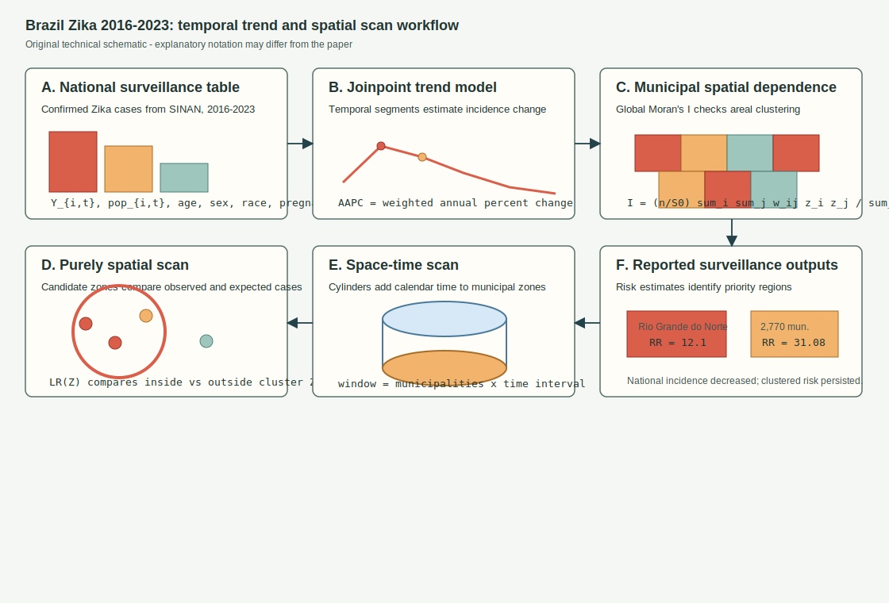
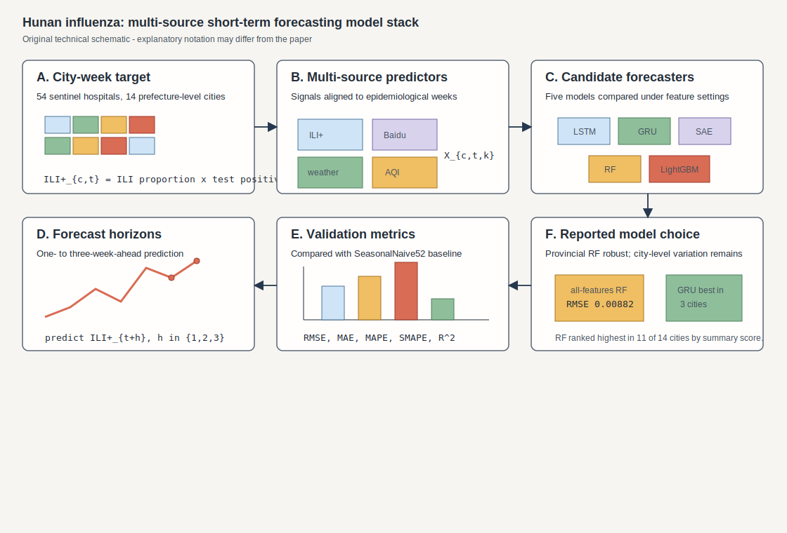
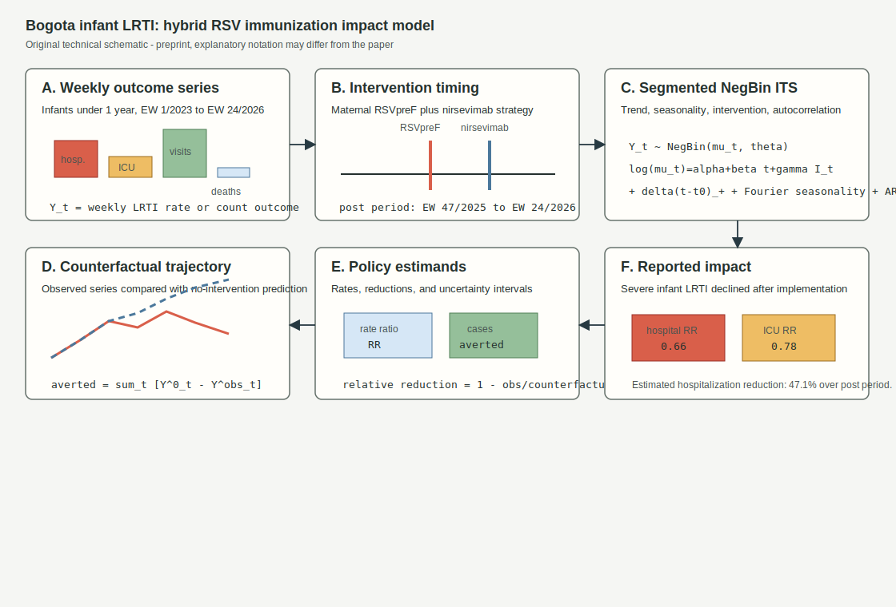

# Spatial Epidemiology Research Update

**Update date:** July 9, 2026  
**Search window:** Since the previous automation run on July 8, 2026 at
12:51:38 UTC

## Search Result

Three newly published or newly indexed items passed the inclusion screen for
this run. Two are peer-reviewed articles that entered PubMed after the previous
run cutoff, and one is a same-window medRxiv preprint with an epidemic-impact
counterfactual model. The strongest spatial epidemiology items cover Zika
spatiotemporal cluster detection in Brazil and multi-source city-level
influenza forecasting in Hunan, China; the preprint is included as a related
intervention-impact modeling item because it uses ecological interrupted
time-series and counterfactual estimation for respiratory-disease outcomes.

Figures below are original technical schematics created for this report. They
are not reproduced from the cited publications. Equation notation is
explanatory where abstracts do not expose the exact parameterization; notation
may differ from the paper.

## Spatiotemporal dynamics of Zika in Brazil, 2016-2023

**Authors:** Marcos Cesar de Souza Santos, Paula Esbaltar de Oliveira, Phoebe
Silva van Emmerik, Rafael Pedro de Souza Nascimento, Vanessa Cardoso Pereira,
Savio Luiz Pereira Nunes, Havandecio Rodrigues de Matos Junior, Chirles Araujo
de Franca, Adeilton Goncalves da Silva Junior, Thais Silva Matos, Marcio
Bezerra Santos, Carla Pacheco Teixeira, Diana Paola Gutierrez Diaz de Azevedo,
Daniel Elias Cuartas Arroyave, Jose Valter Joaquim Silva Junior, Rodrigo
Feliciano Carmo, Carlos Dornels Freire de Souza.  
**Publication date:** Published online July 8, 2026 in *Virology Journal*;
entered PubMed July 9, 2026 at 00:24 UTC.  
**Source:** [doi:10.1186/s12985-026-03233-y](https://doi.org/10.1186/s12985-026-03233-y);
[PubMed PMID: 42421045](https://pubmed.ncbi.nlm.nih.gov/42421045/).

**Modeling approach:** The authors analyzed confirmed Zika cases in Brazil
from 2016 to 2023 using a three-part ecological workflow: epidemiological
profiling, Joinpoint regression for temporal trends and Average Annual Percent
Change, and spatial analysis using Global Moran's I followed by purely spatial
and spatiotemporal spatial scan statistics at municipal scale.

**Key finding:** The study reported 176,122 confirmed cases. National incidence
declined overall (AAPC -36.55%; p < 0.001), but state patterns varied. Rio
Grande do Norte was the only state with increasing incidence and had the
highest purely spatial relative risk (RR 12.1; p < 0.001). The highest
spatiotemporal-risk cluster included 2,770 municipalities across the North,
Northeast, Southeast, and Central-West regions (RR 31.08; p < 0.001).

**Why it matters:** The paper updates Brazil-wide Zika risk geography through
2023 and combines trend segmentation with areal dependence and scan-statistic
cluster detection. That is directly useful for arbovirus surveillance programs
trying to distinguish declining national averages from persistent localized
transmission risk.

**Alt text:** Six-panel SVG schematic showing SINAN Zika case inputs,
Joinpoint trend estimation, municipal Global Moran's I spatial dependence,
purely spatial scan likelihoods, spatiotemporal scan cylinders, and reported
relative-risk outputs for Rio Grande do Norte and the largest spatiotemporal
cluster.

**Caption:** Original technical schematic. Panel A shows the municipal
case-population data structure. Panel B diagrams temporal Joinpoint trend
segmentation and AAPC. Panel C represents Global Moran's I on municipal
incidence. Panel D shows the purely spatial scan-statistic search over
candidate zones. Panel E adds calendar time through space-time scan cylinders.
Panel F summarizes reported high-risk outputs.

## Multi-source machine learning for short-term influenza forecasting in Hunan Province, China

**Authors:** Qianlai Sun, Jiangshaya Bahati, Hongfeng Zhao, Zixin Hu, Yanhua
Su, Xiaolei Wang, Zhihong Deng, Zhifei Zhan, Jia Rui, Zeyu Zhao, Tianmu Chen,
Kaiwei Luo.  
**Publication date:** Published online July 8, 2026 in *BMC Infectious
Diseases*; entered PubMed July 9, 2026 at 00:16 UTC.  
**Source:** [doi:10.1186/s12879-026-13811-8](https://doi.org/10.1186/s12879-026-13811-8);
[PubMed PMID: 42420878](https://pubmed.ncbi.nlm.nih.gov/42420878/).

**Modeling approach:** Weekly influenza-like illness plus (ILI+) data from 54
sentinel hospitals across 14 prefecture-level cities were modeled for
2015-2024. For 2020-2024 forecasts, ILI+ was combined with Baidu Search Index,
meteorological, and air-quality predictors. Five models were compared for
1-3-week-ahead forecasting under four feature settings: LSTM, GRU, stacked
autoencoder, random forest, and LightGBM. SeasonalNaive52 was used as a
baseline, and RMSE, MAE, MAPE, SMAPE, and out-of-sample R-squared were used for
evaluation.

**Key finding:** Influenza activity showed strong winter-spring seasonality
and city-level heterogeneity. At the provincial level, the all-feature random
forest model had the lowest absolute errors among machine-learning models
(RMSE 0.00882, MAE 0.00389) and out-of-sample R-squared 0.723. Machine
learning improved over SeasonalNaive52, and random forest ranked highest in 11
of 14 cities, while GRU ranked highest in Yueyang, Zhangjiajie, and Hengyang.

**Why it matters:** The study is a pragmatic spatiotemporal forecasting
benchmark for operational influenza early warning: it uses city-week
surveillance units, explicitly tests non-surveillance covariates, keeps a
seasonal naive comparator, and shows that local validation can change the best
model choice.

**Alt text:** Six-panel SVG schematic showing 14-city weekly ILI+ targets,
surveillance, Baidu, weather, and air-quality predictors, five candidate
machine-learning forecasters, one- to three-week forecast horizons, validation
metrics against SeasonalNaive52, and reported provincial and city-specific
model-selection results.

**Caption:** Original technical schematic. Panel A shows the city-week target
series. Panel B lists the aligned multi-source feature blocks. Panel C shows
the five compared forecasters. Panel D represents forecast horizons. Panel E
summarizes the validation metrics and baseline comparison. Panel F highlights
the reported random-forest and city-specific model-choice findings.

## Hybrid maternal RSV vaccination and nirsevimab immunization impact in Bogota

**Authors:** Julian Alfredo Fernandez Nino, Andres Arturo Marin Rodriguez,
Laura Alejandra Gutierrez Rodriguez, Maria Fernanda Tovar Romero, Diana Maria
Ayala Moreno, Maria Lucia Gomez Mayorga, Maria Belen Jaimes Sanabria, Martinez
Contreras, Paula Estefania Molano Builes, Daniel Santiago Rios Oliveros,
Walteros Acero, Guillermo Bermont Galavis.  
**Publication date:** Posted July 8, 2026 as a medRxiv preprint, version 1.  
**Source:** [doi:10.64898/2026.07.05.26357339](https://doi.org/10.64898/2026.07.05.26357339);
[medRxiv record](https://www.medrxiv.org/content/early/2026/07/08/2026.07.05.26357339).

**Modeling approach:** This preprint used an ecological interrupted
time-series design with weekly surveillance data from Bogota, epidemiological
week 1 of 2023 through week 24 of 2026. Outcomes were weekly rates of viral
lower respiratory tract infection hospitalizations, pediatric ICU admissions,
outpatient visits, and deaths among infants under 1 year. Segmented negative
binomial regression adjusted for secular trends, Fourier seasonality, and
autocorrelation; counterfactual analyses estimated cases averted and relative
risk reductions after maternal RSVpreF vaccination and nirsevimab
implementation.

**Key finding:** Compared with the same period in 2025, 2026 hospitalization,
ICU admission, and outpatient-visit rates declined (RR 0.66, 0.78, and 0.78,
respectively). Interrupted time-series estimates found a significant weekly
decline in hospitalization trends after maternal RSVpreF introduction
(-3.9% per week; p = 0.023) and a smaller decline in ICU admissions (-2.8% per
week; p = 0.039). The cumulative hospitalization reduction over EW 47/2025-EW
24/2026 was estimated at 47.1% (95% CI 13.9-70.4).

**Why it matters:** Although not spatially resolved beyond Bogota, the paper is
relevant to outbreak and respiratory-disease modeling because it estimates a
population-level intervention effect with counterfactual epidemic-impact
methods. It is especially useful for analysts designing post-introduction RSV
evaluations where randomized trials are unavailable.

**Alt text:** Six-panel SVG schematic showing weekly infant LRTI outcome
series, maternal RSVpreF and nirsevimab intervention timing, segmented
negative-binomial interrupted time-series notation, counterfactual trajectory
comparison, rate-ratio and cases-averted estimands, and reported
hospitalization and ICU rate-ratio outputs.

**Caption:** Original technical schematic. Panel A shows the weekly outcome
data. Panel B marks the hybrid RSV immunization implementation period. Panel C
gives generic segmented negative-binomial interrupted time-series notation.
Panel D contrasts observed and no-intervention counterfactual trajectories.
Panel E defines policy estimands. Panel F summarizes reported reductions in
severe infant LRTI outcomes.

## Sources Checked

- PubMed E-utilities searches using publication dates and entry timestamps for
  July 8-9, 2026, filtered to records entered after July 8, 2026 at 12:51:38
  UTC.
- PubMed XML records for selected peer-reviewed items, including abstracts,
  DOI, journal metadata, author metadata, and entry timestamps.
- Crossref records for DOI verification and first-online metadata for the
  selected BMC/Springer articles.
- medRxiv and bioRxiv API records for July 8-9, 2026, screened for spatial,
  spatiotemporal, Bayesian, forecasting, outbreak, surveillance, environmental
  exposure, intervention-impact, and reproducible-methods terms.
- arXiv API and web searches for newly submitted epidemic forecasting,
  spatiotemporal disease, disease mapping, and spatial epidemiology methods
  records.
- Existing repository updates were searched for DOI and title duplicates before
  selection.

## Duplicate And Exclusion Notes

- No selected DOI or title appeared in prior repository updates.
- The July 8-9 PubMed search also surfaced an IS481-based pertussis digital
  platform surveillance study in four Chinese megacities. It was excluded from
  the main set because the abstract reported spatiotemporal heterogeneity but
  did not describe a spatial, spatiotemporal, transmission, forecasting, or
  exposure model beyond descriptive surveillance and genomic subset analysis.
- medRxiv items on Lewy body disease atrophy progression, climate-sensitive
  foodborne-disease evidence screening, and place-based mental health after
  extreme weather were excluded because they were either neuroanatomical,
  evidence-classification, or qualitative place studies rather than
  population-level spatial epidemiology modeling.
- Many records used "spatial" for imaging, tissue mapping, molecular
  organization, neuroanatomy, or remote-sensing drought assessment outside
  human/animal disease modeling and were excluded.

## Repository Delivery Note

This report and three SVG figure assets were prepared for the repository under
the existing dated update structure.
