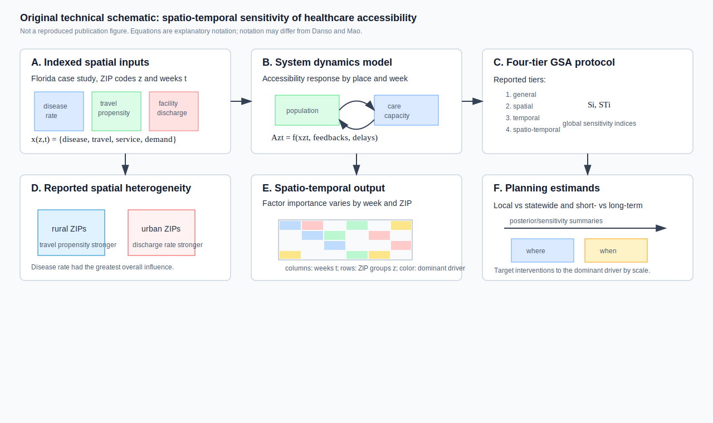
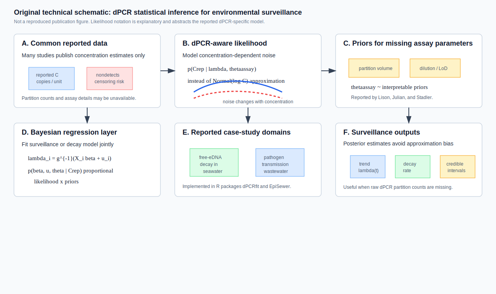
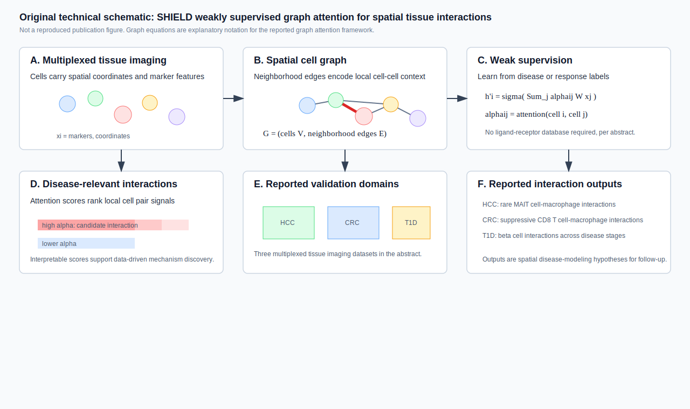

# Spatial Epidemiology Research Update

**Update date:** July 15, 2026  
**Search window:** Newly indexed after the previous automation timestamp,
July 15, 2026 at 01:51 UTC. PubMed records below were screened by Entrez
entry time. medRxiv, bioRxiv, and arXiv July 15 postings were also checked.

## Search Result

Three newly indexed peer-reviewed methods papers passed the post-cutoff screen.
This is a narrower update than the earlier July 15 report because the prior run
already covered the main July 14-15 infectious-disease and spatial
epidemiology items available before 01:51 UTC.

Figures below are original technical schematics created for this report. They
are not reproduced from the cited publications. Equation and algorithm notation
is explanatory where the abstract or metadata do not expose the exact
parameterization; notation may differ from the paper.

## Spatio-Temporal Sensitivity of Healthcare Accessibility: Insights from a System Dynamics Model

**Authors:** Patrick Danso, Liang Mao.  
**Publication date:** Published online/in issue metadata as October 2026 in
*Computers, Environment and Urban Systems*; entered PubMed July 15, 2026 at
04:53 UTC.  
**Source:** [doi:10.1016/j.compenvurbsys.2026.102491](https://doi.org/10.1016/j.compenvurbsys.2026.102491);
[PubMed PMID: 42453897](https://pubmed.ncbi.nlm.nih.gov/42453897/).

**Modeling approach:** The paper proposes an analytic protocol for global
sensitivity analysis of a spatiotemporal healthcare-accessibility system
dynamics model. The reported tiers are general, spatial, temporal, and
spatio-temporal GSA, demonstrated in a Florida case study with accessibility
variation indexed by geographic units and weeks.

**Key finding:** Disease rate had the greatest overall influence on modeled
accessibility variation. Spatial GSA showed different dominant drivers by
context: travel propensity mattered more in rural areas, while facility
discharge rates mattered more in urban settings. Spatio-temporal GSA showed
that factor influence varied by both week and ZIP code.

**Why it matters:** This is adjacent to spatial epidemiology rather than a
disease-transmission model, but it is directly useful for health-service access
modeling under changing disease burden. The four-tier sensitivity workflow
helps distinguish statewide versus local and short-term versus long-term
intervention levers.

**Alt text:** Six-panel SVG schematic showing Florida ZIP-week inputs for
disease rate, travel propensity, service availability, and demand; a system
dynamics accessibility model; four tiers of global sensitivity analysis;
reported spatial heterogeneity where travel propensity is stronger in rural
areas and facility discharge rates are stronger in urban areas; week-by-ZIP
factor importance; and planning estimands for local versus statewide and
short- versus long-term intervention choices.

**Caption:** Original technical schematic. Panel A defines the spatial and
temporal indexing used for the explanatory notation. Panel B represents the
reported system dynamics accessibility model. Panel C shows the four reported
GSA tiers. Panel D summarizes the reported spatial heterogeneity in factor
importance. Panel E shows how spatio-temporal sensitivity can vary by week and
ZIP code. Panel F links the sensitivity outputs to planning decisions. Notation
is explanatory and may differ from the article.

## Improving Inference from Reported Concentrations in Environmental Surveillance by Modeling the Statistical Features of Digital PCR

**Authors:** Adrian Lison, Timothy R. Julian, Tanja Stadler.  
**Publication date:** Published July 10, 2026 in *ACS ES&T Water*; entered
PubMed July 15, 2026 at 04:58 UTC.  
**Source:** [doi:10.1021/acsestwater.5c01051](https://doi.org/10.1021/acsestwater.5c01051);
[PubMed PMID: 42454338](https://pubmed.ncbi.nlm.nih.gov/42454338/).

**Modeling approach:** The paper introduces a Bayesian model with a
dPCR-specific likelihood that can be fit directly to reported concentration
estimates, while representing uncertainty in assay parameters through
interpretable priors. The abstract contrasts this with common normal or
log-normal approximations and reports R implementations in `dPCRfit` and
`EpiSewer`.

**Key finding:** Across real-world case studies of free-eDNA decay in seawater
and pathogen transmission from wastewater, the approach produced estimates
similar to a fully informed model using partition counts and avoided biases
from normal or log-normal concentration approximations.

**Why it matters:** Environmental and wastewater surveillance often enters
epidemiological models as reported concentrations rather than raw dPCR
partition counts. A likelihood that preserves concentration-dependent
measurement noise and nondetect behavior can improve downstream trend,
transmission, and exposure inference when archived or published surveillance
data are incomplete.

**Alt text:** Six-panel SVG schematic showing reported concentration estimates
and nondetects, a dPCR-aware likelihood that replaces normal or log-normal
approximations, priors for missing assay parameters, a Bayesian regression
layer for surveillance or decay models, the reported free-eDNA seawater and
wastewater pathogen-transmission case studies, and posterior trend, decay, and
uncertainty outputs.

**Caption:** Original technical schematic. Panel A shows the reduced data often
available from environmental surveillance publications. Panel B shows the
dPCR-specific likelihood concept. Panel C represents priors on missing assay
parameters. Panel D places the likelihood inside a Bayesian regression or
surveillance model. Panel E identifies the two reported case-study domains and
software packages. Panel F summarizes posterior outputs relevant to
epidemiological surveillance. The likelihood notation is explanatory.

## SHIELD: A weakly supervised graph attention neural network for decoding disease-relevant cell-cell interactions

**Authors:** Vivek Sehra, Benjamin Ruf, Gabriel Duval, Sepideh Babaei, Manfred
Claassen.  
**Publication date:** Published July 10, 2026 in *Patterns*; entered PubMed
July 15, 2026 at 04:51 UTC.  
**Source:** [doi:10.1016/j.patter.2026.101562](https://doi.org/10.1016/j.patter.2026.101562);
[PubMed PMID: 42453692](https://pubmed.ncbi.nlm.nih.gov/42453692/).

**Modeling approach:** SHIELD, short for spatially enhanced immune landscape
decoding, is a weakly supervised graph attention network for multiplexed tissue
imaging. It represents cells and local neighborhoods as a graph and quantifies
disease-relevant cell-cell interactions through learned attention scores
without relying on prior ligand-receptor databases.

**Key finding:** The framework was validated across three multiplexed tissue
imaging datasets: hepatocellular carcinoma, colorectal cancer, and type 1
diabetes. The abstract reports identification of rare MAIT cell-macrophage
interactions in HCC, suppressive CD8 T cell-macrophage interactions enriched
in CRC non-responders, and beta cell interactions with cytotoxic and helper T
cells across T1D disease stages.

**Why it matters:** This is tissue-scale spatial disease modeling rather than
population spatial epidemiology, so it is included as a related spatial
reproducible-methods item. It adds an interpretable graph-learning workflow
for extracting disease-relevant local interaction structure from spatial
imaging data, a pattern increasingly relevant to spatial host-pathogen and
immune-pathology studies.

**Alt text:** Six-panel SVG schematic showing multiplexed tissue imaging cells
with spatial coordinates and marker features, construction of a neighborhood
cell graph, weakly supervised graph attention learning, attention scores used
to rank disease-relevant cell-pair interactions, validation in hepatocellular
carcinoma, colorectal cancer, and type 1 diabetes datasets, and reported
interaction outputs including MAIT cell-macrophage, CD8 T cell-macrophage, and
beta cell-T cell relationships.

**Caption:** Original technical schematic. Panel A shows the multiplexed tissue
imaging input. Panel B converts cells to a spatial neighborhood graph. Panel C
shows the graph attention update in explanatory notation. Panel D visualizes
attention scores as candidate disease-relevant interactions. Panel E lists the
reported validation domains. Panel F summarizes the reported interaction
classes. The graph notation is explanatory and may differ from the article.

## Sources Checked

- PubMed E-utilities entry-date searches for July 15, 2026 using spatial,
  spatiotemporal, geospatial, Bayesian, disease-mapping, hotspot,
  geostatistical, forecasting, environmental surveillance, wastewater,
  outbreak, transmission, exposure, and software terms. Candidate records were
  filtered to Entrez entry times after July 15, 2026 at 01:51 UTC.
- PubMed XML records for the selected peer-reviewed items, including DOI,
  author list, journal, publication-date metadata, abstracts, and entry-time
  checks.
- medRxiv and bioRxiv API records for July 15, 2026. The July 15 medRxiv set
  contained two records and neither was a stronger spatial epidemiology
  modeling item than the selected PubMed records. The July 15 bioRxiv set was
  screened and did not contain a population spatial epidemiology, outbreak,
  disease-mapping, or surveillance modeling item stronger than the selected
  PubMed records.
- arXiv API searches sorted by submitted date for spatial epidemiology, disease
  mapping, spatiotemporal epidemic modeling, outbreak forecasting, Bayesian
  spatial epidemiology, and wastewater epidemiology modeling. No matching July
  15 post-cutoff arXiv item was found.
- Crossref index-date searches for July 15, 2026 were checked as a supplement,
  but the top hits were mostly older articles re-indexed by Crossref or
  off-scope records; no stronger newly published item was added from that
  source.

## Duplicate And Exclusion Notes

- No selected DOI or title appears in the earlier local July 15 update.
- The July 15 PubMed paper "Spatial-temporal epidemiological characteristics
  of influenza and its correlation with meteorological factors in Gansu
  province based on 24 solar terms" (PMID 42449322) was not included because
  its Entrez entry time, July 15, 2026 at 00:09 UTC, was before the previous
  automation timestamp.
- Several post-cutoff PubMed records using "spatial" or "spatiotemporal" for
  imaging, neuroscience, clinical omics, or non-modeling reviews were screened
  out. SHIELD was retained because it is a spatial graph-learning method for
  disease-relevant tissue interactions and the previous report had already
  included comparable tissue-scale spatial disease-modeling methods.
