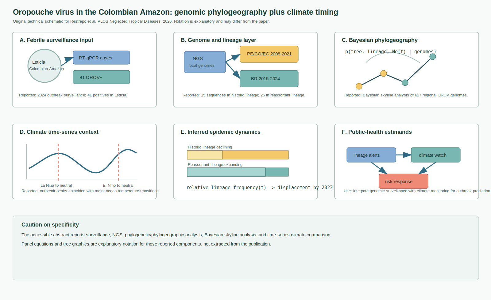
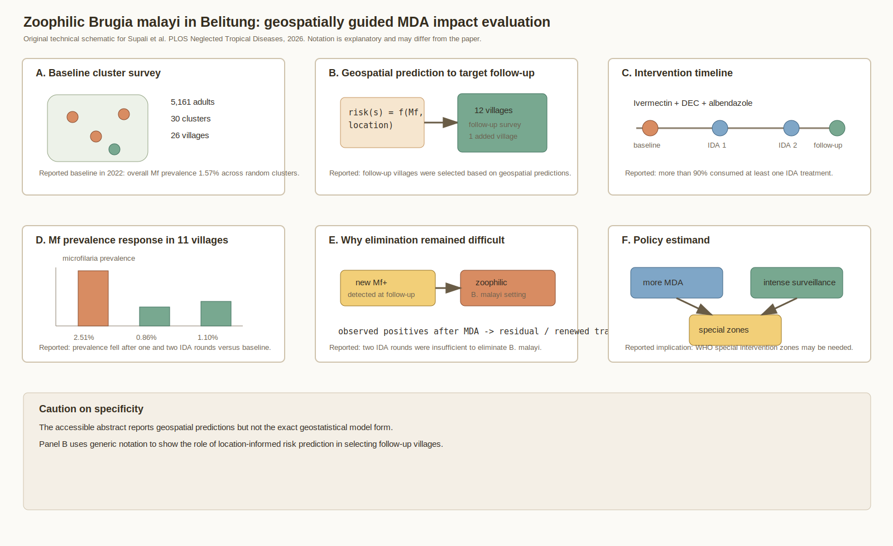
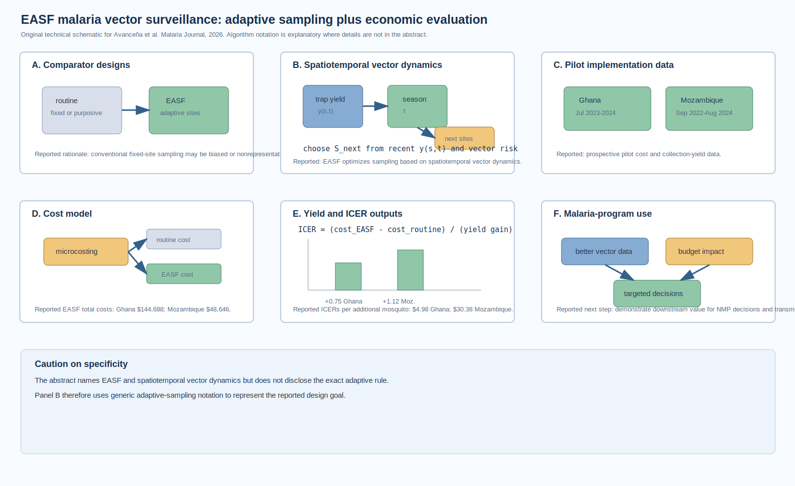
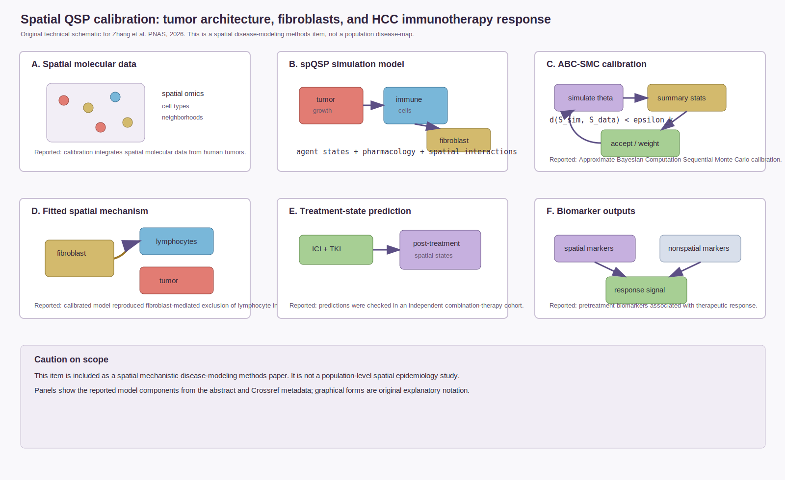
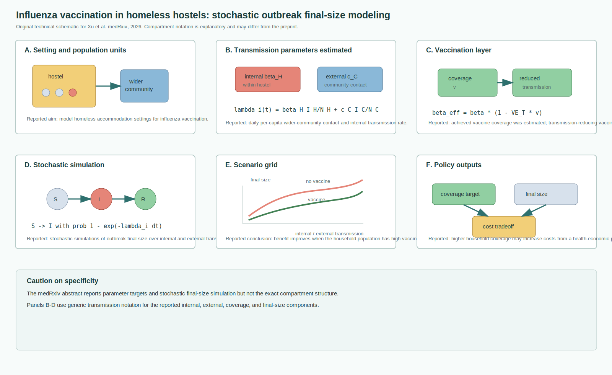

# Spatial Epidemiology Research Update

**Update date:** July 15, 2026  
**Search window:** Since the previous automation timestamp on July 14, 2026 at
00:02 UTC. PubMed entries were screened by entry-date metadata; medRxiv and
bioRxiv were screened for July 14-15 postings.

## Search Result

Five newly published or newly indexed items passed the inclusion screen for
this run. Three are peer-reviewed infectious-disease or vector-surveillance
papers, one is a peer-reviewed spatial mechanistic disease-modeling methods
paper, and one is a medRxiv infectious-disease transmission-modeling preprint.

Figures below are original technical schematics created for this report. They
are not reproduced from the cited publications. Equation and algorithm
notation is explanatory where abstracts or metadata do not expose the exact
parameterization; notation may differ from the paper.

## Phylogeographic dynamics of Oropouche virus in the Colombian Amazon

**Authors:** Laura S. P. Restrepo, Jonathan Usuga, Andres Vasquez, Laura
Yepes, Danilo Limonta, Christian Knuese, Ivan Moreno, Valentina Vargas,
Mariana Gonzalez-Ramirez, Matthew G. Berg, Michael Rodgers, Gavin A. Cloherty,
Juan P. Hernandez-Ortiz, Jorge E. Osorio.  
**Publication date:** Published July 14, 2026 in *PLOS Neglected Tropical
Diseases*; entered PubMed July 14, 2026 at 13:45.  
**Source:** [doi:10.1371/journal.pntd.0013810](https://doi.org/10.1371/journal.pntd.0013810);
[PubMed PMID: 42447154](https://pubmed.ncbi.nlm.nih.gov/42447154/).

**Modeling approach:** The study combined large-scale febrile surveillance in
Leticia, Colombia, RT-qPCR, next-generation sequencing, phylogenetic and
phylogeographic analyses, Bayesian skyline analysis of 627 Oropouche virus
genomes from Colombia and neighboring countries, and climate time-series
comparison around ocean-temperature phase transitions.

**Key finding:** Forty-one OROV-positive cases were detected in Leticia in
2024. Fifteen sequences clustered with the PE/CO/EC-2008-2021 lineage and 26
with the BR-2015-2024 reassortant lineage. The Bayesian skyline analysis
supported decline of the historic lineage and rapid expansion of BR-2015-2024
beginning in 2022, with displacement by 2023. Outbreak peaks coincided with
major ocean-temperature transitions from La Niña or El Niño to neutral
conditions.

**Why it matters:** This is a current example of integrated genomic
surveillance, phylogeography, and environmental context for an emerging
arbovirus in the Amazon Basin. It gives outbreak teams a concrete model for
linking lineage replacement, climate monitoring, and public-health response.

**Alt text:** Six-panel SVG schematic showing Leticia febrile surveillance
and 41 Oropouche-positive cases, sequencing into two reported lineages,
Bayesian phylogeographic and skyline analysis of regional genomes, ocean
temperature phase transitions, inferred lineage displacement, and public
health outputs linking genomic alerts with climate watch.

**Caption:** Original technical schematic. Panel A shows the surveillance
case input. Panel B shows the reported lineage split among local sequences.
Panel C represents Bayesian phylogeography and skyline inference over the 627
regional genomes. Panel D aligns outbreak timing with ocean-temperature phase
transitions. Panel E summarizes lineage replacement. Panel F translates the
model outputs into surveillance and response estimands.

## Can mass drug administration alone eliminate lymphatic filariasis in areas of Indonesia with zoophilic Brugia malayi?

**Authors:** Taniawati Supali, Yenny Djuardi, Erliyani Iskandar, Nina
Sugianto, Yuni Destani, Emanuele Giorgi, Gary J. Weil, Peter U. Fischer.  
**Publication date:** Published July 14, 2026 in *PLOS Neglected Tropical
Diseases*; entered PubMed July 14, 2026 at 13:44.  
**Source:** [doi:10.1371/journal.pntd.0014501](https://doi.org/10.1371/journal.pntd.0014501);
[PubMed PMID: 42447141](https://pubmed.ncbi.nlm.nih.gov/42447141/).

**Modeling approach:** The study evaluated lymphatic filariasis control in
Belitung district after earlier MDA, renewed surveillance, and two rounds of
ivermectin, diethylcarbamazine, and albendazole. It used a modified IDA Impact
Survey design, cluster sampling, and geospatial predictions to choose follow-up
villages. The abstract reports geospatial prediction but not the exact spatial
model form.

**Key finding:** At baseline in 2022, 5,161 adults in 30 clusters from 26
villages were tested, with overall microfilariae prevalence of 1.57%. In the
11 villages surveyed three times, adult prevalence was 2.51% at baseline and
fell to 0.86% and 1.10% after one and two MDA rounds. Despite high reported
consumption of at least one IDA treatment, new microfilariae-positive
individuals appeared at each follow-up, and two rounds were insufficient for
elimination.

**Why it matters:** The paper highlights a spatial-surveillance problem in
zoophilic filariasis settings: even high-coverage MDA may not remove local
transmission risk. Geospatially targeted follow-up and special intervention
zones may be needed where reservoir or renewed transmission dynamics keep
generating new positives.

**Alt text:** Six-panel SVG schematic showing Belitung cluster survey inputs,
geospatial prediction used to select follow-up villages, two IDA MDA rounds,
microfilariae prevalence declining from baseline through follow-up, persistent
new positives in a zoophilic Brugia malayi setting, and policy outputs for
additional MDA and intense surveillance.

**Caption:** Original technical schematic. Panel A shows the baseline cluster
survey. Panel B represents the reported geospatial prediction step that guided
follow-up village selection. Panel C places IDA rounds on the intervention
timeline. Panel D visualizes the reported prevalence changes. Panel E shows
why elimination remained difficult. Panel F summarizes the special
intervention-zone implication. The spatial notation is explanatory because the
abstract does not disclose the exact geospatial model.

## Entomological Adaptive Sampling Framework for malaria vector surveillance

**Authors:** Anton L. V. Avanceña, Nicholas W. Daniel, Mercy Opiyo, Steven
Gowelo, Allison Tatarsky, Luis Jamu, Dulcisária Marrenjo, Samuel K. Oppong,
Ernest Boampong, Christian Atta-Obeng, Otubea Owusu-Akrofi, Keziah Laurencia
Malm, Neil Lobo, Edward Thomsen.  
**Publication date:** Published July 13, 2026 in *Malaria Journal*; entered
PubMed July 14, 2026 at 00:03, just after the automation cutoff.  
**Source:** [doi:10.1186/s12936-026-06020-w](https://doi.org/10.1186/s12936-026-06020-w);
[PubMed PMID: 42443913](https://pubmed.ncbi.nlm.nih.gov/42443913/).

**Modeling approach:** The paper evaluates the Entomological Adaptive Sampling
Framework, which was developed to optimize malaria-vector sampling based on
spatiotemporal vector dynamics. It compares EASF with routine entomological
surveillance using prospective pilot data from Ghana and Mozambique,
microcosting from a payer perspective, mosquito collection yields, and
incremental cost-effectiveness ratios.

**Key finding:** EASF cost more in total than routine surveillance but
collected mosquitoes at lower unit cost. Reported total EASF costs were
$144,688 in Ghana and $48,646 in Mozambique. EASF yielded 0.75 and 1.12 more
mosquitoes per collection in Ghana and Mozambique, respectively. Unit costs
per mosquito were lower under EASF ($11.10 vs. $43.65 in Ghana; $54.23 vs.
$743.69 in Mozambique), and ICERs were $4.98 and $30.38 per additional
mosquito collected.

**Why it matters:** Vector surveillance is often spatially biased by fixed or
purposive sites. This paper adds an economic evaluation to adaptive,
spatiotemporal sampling, which is important for national malaria programs that
must justify whether smarter sampling produces enough information gain for the
budget impact.

**Alt text:** Six-panel SVG schematic comparing routine fixed-site sampling
with EASF adaptive sampling, showing recent trap yields and seasonal dynamics
feeding a generic next-site rule, Ghana and Mozambique pilot periods,
microcosting, mosquito yield and ICER calculations, and malaria program
decision outputs.

**Caption:** Original technical schematic. Panel A contrasts routine and
adaptive surveillance. Panel B shows generic adaptive sampling notation for
spatiotemporal vector dynamics. Panel C identifies the Ghana and Mozambique
pilot data streams. Panel D shows the microcosting comparison. Panel E
visualizes yield gains and ICERs. Panel F links improved vector data to
program decisions and budget assessment.

## Quantitative calibration of a spatial QSP model identifies fibroblast impact on HCC immunotherapy

**Authors:** Shuo Zhang, Hengrui Wang, Yoona Cho, Heber L. Rocha, Wilson
Wong, Mark Yarchoan, Elizabeth M. Jaffee, Won Jin Ho, Liana T. Kagohara,
Elana J. Fertig, Aleksander S. Popel, Aniruddha Deshpande.  
**Publication date:** Published July 14, 2026 in *Proceedings of the National
Academy of Sciences*; entered PubMed July 14, 2026 at 12:23.  
**Source:** [doi:10.1073/pnas.2525799123](https://doi.org/10.1073/pnas.2525799123);
[PubMed PMID: 42446991](https://pubmed.ncbi.nlm.nih.gov/42446991/).

**Modeling approach:** This methods paper extends a spatial quantitative
systems pharmacology model of liver cancer by adding a fibroblast module and
calibrating the spatial agent-based model with human spatial molecular data.
The calibration uses Approximate Bayesian Computation Sequential Monte Carlo
to match simulated tumor architectures to observed spatial cellular
neighborhood summaries.

**Key finding:** The calibrated model reproduced fibroblast-mediated exclusion
of lymphocyte infiltration observed in spatial transcriptomics and predicted
post-treatment spatial tumor states in an independent cohort receiving immune
checkpoint inhibitor plus tyrosine kinase inhibitor therapy. The study also
identified spatial and nonspatial pretreatment biomarkers associated with
therapeutic response.

**Why it matters:** This is not population-level spatial epidemiology, but it
is a strong reproducible spatial disease-modeling methods contribution. It
shows how spatial omics can calibrate mechanistic, cell-resolved disease
models, a workflow that may translate to infection, immunopathology, and
spatial exposure-response systems where tissue architecture matters.

**Alt text:** Six-panel SVG schematic showing spatial molecular tumor data,
cell-neighborhood summaries, tumor, immune-cell, and fibroblast components in
a spatial QSP simulation, Approximate Bayesian Computation Sequential Monte
Carlo calibration, fibroblast-mediated lymphocyte exclusion, post-treatment
spatial-state prediction, and biomarker outputs.

**Caption:** Original technical schematic. Panel A shows the spatial molecular
data input. Panel B shows the spatial QSP simulation components. Panel C
diagrams ABC-SMC calibration against spatial summary statistics. Panel D
shows the fitted fibroblast exclusion mechanism. Panel E links the calibrated
model to ICI plus TKI response prediction. Panel F summarizes biomarker
outputs. Graphical notation is explanatory and not reproduced from the paper.

## Mathematical models for influenza vaccination in homeless hostels

**Authors:** Jingsi Xu, Natalie Hutchinson, Thomas House, Lorenzo Pellis,
Andrew Hayward, Ian Hall.  
**Publication date:** Posted July 14, 2026 as a medRxiv preprint, version 1.  
**Source:** [doi:10.64898/2026.07.10.26357528](https://doi.org/10.64898/2026.07.10.26357528);
[medRxiv record](https://www.medrxiv.org/content/10.64898/2026.07.10.26357528v1).

**Modeling approach:** The preprint models influenza outbreaks in homeless
accommodation settings. The abstract reports estimation of the daily
per-capita contact rate with the wider community, internal transmission rate,
and achieved vaccine coverage, followed by stochastic simulation of outbreak
final size across internal and external transmission choices.

**Key finding:** The authors conclude that a vaccine that reduces transmission
can mitigate outbreaks in homeless hostels, with stronger results when the
household population has high vaccination coverage. They also note that higher
coverage may increase health-economic cost.

**Why it matters:** Although this is not a spatial areal model, it is a
new same-window infectious-disease transmission modeling preprint focused on a
high-risk congregate setting. It is relevant to spatial epidemiology practice
because hostel-community contact structure determines importation and
within-setting amplification risk.

**Alt text:** Six-panel SVG schematic showing a hostel population connected
to the wider community, internal and external transmission parameters,
vaccination coverage and transmission reduction, generic stochastic SIR-style
simulation, final-size scenario curves, and policy outputs for coverage,
outbreak size, and cost tradeoffs.

**Caption:** Original technical schematic. Panel A shows the accommodation and
community contact structure. Panel B shows the reported internal and external
transmission parameter targets. Panel C adds vaccination coverage and
transmission reduction. Panel D uses generic stochastic transition notation.
Panel E shows final-size scenario comparison. Panel F links outputs to
coverage and cost decisions. The exact model equations were not available in
the abstract, so notation is explanatory.

## Sources Checked

- PubMed E-utilities entry-date searches for July 14-15, 2026 using spatial,
  spatiotemporal, geospatial, geostatistical, disease-mapping, hotspot,
  Bayesian, forecasting, environmental exposure, outbreak, surveillance, and
  infection terms.
- PubMed XML records and Crossref metadata for selected peer-reviewed items,
  including DOI, author, journal, publication-date, abstract, and entry-time
  checks.
- medRxiv and bioRxiv API records for July 14-15, 2026, screened for spatial,
  spatiotemporal, Bayesian, disease, outbreak, transmission, surveillance,
  environmental exposure, and forecasting terms.
- arXiv API searches sorted by submitted date for spatial epidemiology,
  disease mapping, epidemic forecasting, spatiotemporal epidemic modeling,
  spatial outbreak models, and Bayesian spatial malaria terms.
- Existing repository updates and untracked local reports were searched for
  title, DOI, and keyword duplicates before selection.

## Duplicate And Exclusion Notes

- No selected DOI or title appeared in prior repository updates.
- The strong *Journal of Preventive Medicine and Public Health* dengue paper
  "Spatio-temporal Distribution and Relative Risk of Dengue Fever in
  Peninsular Malaysia" (PMID 42442750) was not selected for the main set
  because its PubMed entry time was July 13, 2026 at 19:56, before the July
  14 00:02 UTC automation cutoff. It remains a good candidate if the next
  report intentionally backfills pre-cutoff items absent from delivered
  updates.
- The BMC Infectious Diseases paper "Spatiotemporal epidemiology of influenza
  in Fujian Province: an 18-year observational study" (PMID 42443781) and the
  BMC scoping review on machine learning and Bayesian modeling for tropical
  disease prediction (PMID 42443778) were also just before the cutoff at July
  13, 2026 23:55 and were excluded from the main set for the same reason.
- Same-window PubMed hits using "spatial" for imaging, spatial omics without
  disease-model calibration, neuroanatomy, dental imaging, hospital workflow,
  and plant disease image classification were screened out unless they had a
  direct spatial disease-modeling method contribution.
- The July 14-15 bioRxiv API set contained no population spatial epidemiology,
  outbreak, disease-mapping, or vector-transmission modeling item stronger
  than the included medRxiv and PubMed records.
