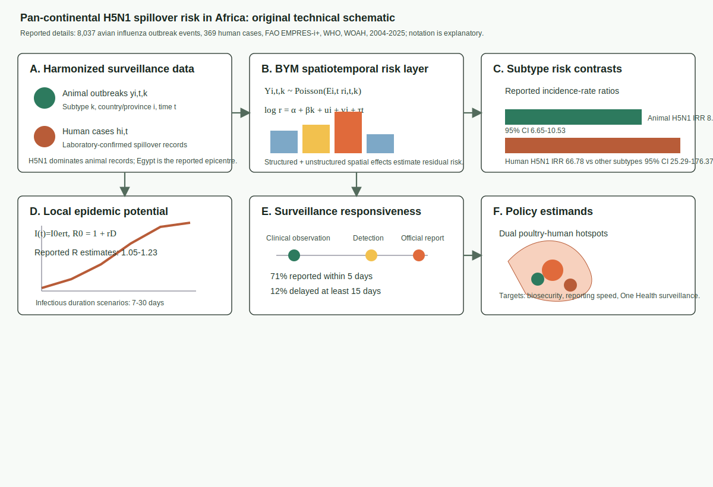
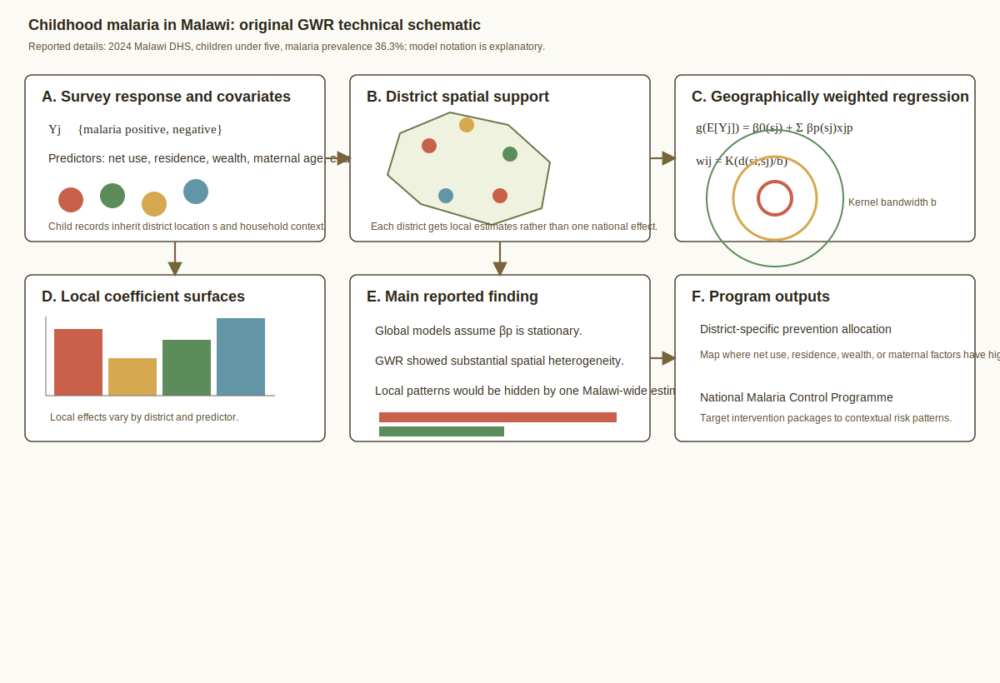
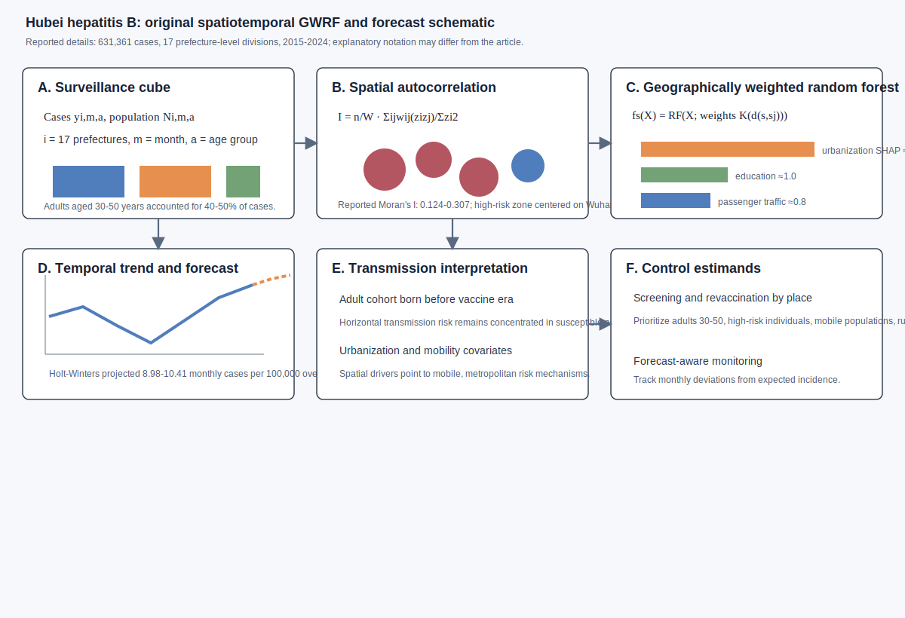
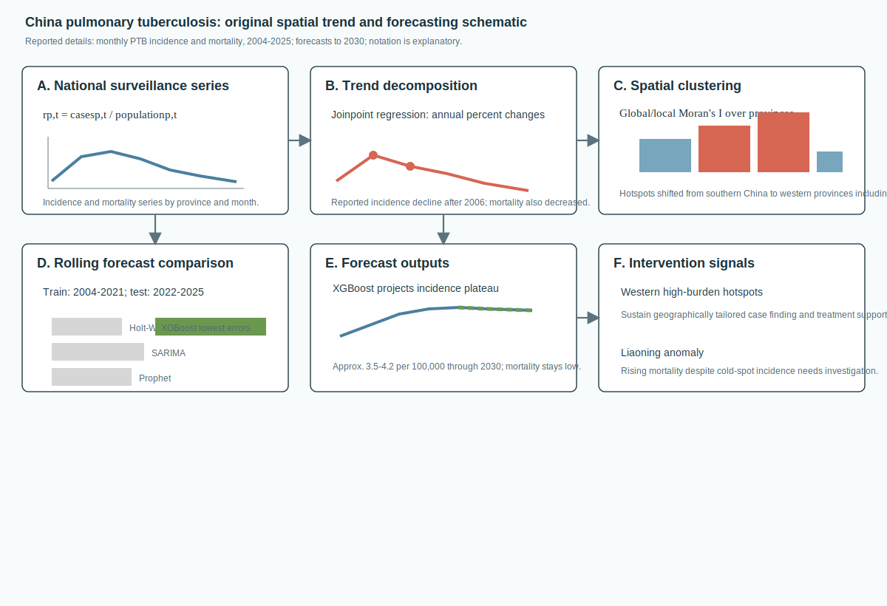
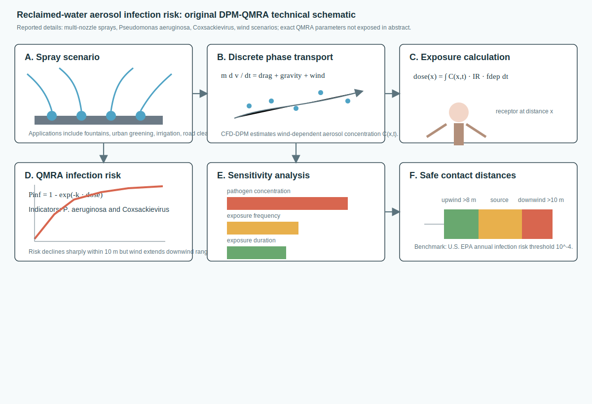

# Spatial Epidemiology Research Update

**Update date:** July 16, 2026  
**Search window:** Newly indexed after the previous automation timestamp,
July 15, 2026 at 14:10 UTC. PubMed records were screened by exact Entrez entry
time. arXiv searches were checked for same-window spatial epidemiology or
disease-mapping preprints. medRxiv and bioRxiv API calls were attempted but
were unavailable from this shell session, so this update relies on peer-reviewed
PubMed-indexed items.

## Search Result

Five newly indexed peer-reviewed items passed the inclusion screen. The set is
weighted toward population spatial or spatiotemporal epidemiology models and
one environmental exposure/infection-risk modeling paper.

Figures below are original technical schematics created for this report. They
are not reproduced from the cited publications. Equation and algorithm notation
is explanatory where the abstract or metadata do not expose the exact
parameterization; notation may differ from the paper.

## Pan-continental spillover risk: integrated spatiotemporal, transmissibility and surveillance analysis of avian influenza A(H5N1) in Africa

**Authors:** Maladho Diaby, Alhassane Diallo, Castro G. Hounmenou, Salifou
Talassone Bangoura, Emile Faya Bongono, Kadio Jean-Jacques Olivier Kadio, Aly
Badara Toure, Abdourahamane Barry, Saidouba Cherif Camara, Haby Diallo,
Thibaut Armel Cherif Gnimadi, Sidikiba Sidibe, Alexendre Delamou, Alioune
Camara, Alpha-Kabinet Keita, Abdoulaye Toure.  
**Publication date:** Published in *Frontiers in Epidemiology* in 2026;
entered PubMed July 16, 2026 at 04:33 UTC.  
**Source:** [doi:10.3389/fepid.2026.1813211](https://doi.org/10.3389/fepid.2026.1813211);
[PubMed PMID: 42459179](https://pubmed.ncbi.nlm.nih.gov/42459179/).

**Modeling approach:** The study harmonized 8,037 avian influenza outbreak
events and 369 laboratory-confirmed human cases from FAO EMPRES-i+, WHO, and
WOAH for Africa from 2004-2025. It used a Bayesian Besag-York-Mollie
spatiotemporal model to estimate residual transmission risks and subtype
incidence-rate ratios, estimated basic reproduction numbers from exponential
growth during human outbreak phases across infectious-duration assumptions, and
quantified notification delays from clinical observation to official reporting.

**Key finding:** HPAI H5N1 accounted for 87.8% of animal cases, with Egypt
reported as the primary epidemiological epicentre. H5N1 was associated with
higher animal infection risk (IRR 8.37; 95% CI 6.65-10.53) and much higher
human case incidence than other subtypes (IRR 66.78; 95% CI 25.29-176.37).
Sensitivity analyses gave R estimates from 1.05 to 1.23, supporting localized
epidemic potential rather than sustained continent-wide human transmission.

**Why it matters:** This is a strong current example of continent-scale One
Health spatial modeling that combines animal outbreak risk, human spillover,
transmissibility, and surveillance delay. It gives surveillance programs a
model-based way to prioritize poultry-human hotspots and reporting bottlenecks.

**Alt text:** Six-panel SVG schematic showing harmonized animal and human
avian influenza records, a Bayesian BYM spatiotemporal risk layer with
structured and unstructured spatial effects, reported animal and human H5N1
incidence-rate ratios, exponential-growth R estimation, surveillance delay
metrics, and One Health policy outputs for poultry-human hotspots.

**Caption:** Original technical schematic. Panel A shows the harmonized animal
and human surveillance inputs. Panel B gives explanatory BYM notation for the
spatiotemporal risk surface. Panel C summarizes the reported H5N1 risk
contrasts. Panel D shows the exponential-growth R-estimation concept. Panel E
shows reporting-delay metrics. Panel F links model outputs to targeted One
Health interventions.

## Modelling geographical variation in the determinants of childhood malaria in Malawi using geographically weighted regression

**Authors:** Mary Magoya, Samuel Manda, Bedilu Ejigu.  
**Publication date:** Published July 15, 2026 in *Malaria Journal*; entered
PubMed July 15, 2026 at 23:59 UTC.  
**Source:** [doi:10.1186/s12936-026-06036-2](https://doi.org/10.1186/s12936-026-06036-2);
[PubMed PMID: 42458435](https://pubmed.ncbi.nlm.nih.gov/42458435/).

**Modeling approach:** The paper used 2024 Malawi Demographic and Health Survey
data for children aged five or under and applied geographically weighted
regression to estimate district-specific associations between childhood malaria
and mosquito-net use, residence, household wealth, maternal age, and maternal
education.

**Key finding:** Overall malaria prevalence among children aged five or under
was 36.3%. The geographically weighted regression revealed substantial spatial
heterogeneity in predictor associations across Malawi, implying that a
conventional global regression would hide locally varying risk-factor effects.

**Why it matters:** The study is directly useful for geographically targeted
malaria control because it shifts the question from "which predictors matter
nationally?" to "where does each predictor matter most?" That is the operational
scale at which bed-net, treatment-access, and social-risk interventions are
often deployed.

**Alt text:** Six-panel SVG schematic showing 2024 Malawi DHS child malaria
responses and covariates, district spatial support, geographically weighted
regression with kernel weights and local coefficients, spatially varying
predictor effects, the finding that local heterogeneity would be hidden by a
global model, and district-targeted malaria-program outputs.

**Caption:** Original technical schematic. Panel A shows the child-level survey
response and reported predictors. Panel B identifies districts as the spatial
support. Panel C gives generic GWR notation. Panel D represents local
coefficient surfaces. Panel E summarizes the reported non-stationarity finding.
Panel F translates the result into district-specific intervention allocation.

## Spatiotemporal epidemiology of hepatitis B in Central China: urbanization drivers and implications for adult-targeted control strategies

**Authors:** Yanquan Mo, Shanhui Li, Ziqian Zhao, Huiqun Jia, Jingya Zhao,
Feng Liu, Caixia Dang, Liyang Guo, Yuanyong Xu, Yeqing Tong, Hui Chen.  
**Publication date:** Published July 15, 2026 in *BMC Public Health*; entered
PubMed July 15, 2026 at 23:55 UTC.  
**Source:** [doi:10.1186/s12889-026-28412-y](https://doi.org/10.1186/s12889-026-28412-y);
[PubMed PMID: 42458322](https://pubmed.ncbi.nlm.nih.gov/42458322/).

**Modeling approach:** The authors analyzed 631,361 hepatitis B cases from
Hubei Province across 17 prefecture-level divisions from January 2015 to
December 2024. They used Global Moran's I to quantify spatial clustering,
geographically weighted random forest models with SHAP interpretation to
identify urbanization-related spatial drivers, and Holt-Winters forecasting for
future incidence.

**Key finding:** Incidence followed a U-shaped trajectory, falling from 111.75
per 100,000 in 2015 to 83.58 in 2020 and rising to 125.86 in 2024. Spatial
clustering was significant (Moran's I 0.124-0.307), with persistent high-risk
zones in the Wuhan metropolitan area. The geographically weighted random forest
identified urbanization rate as the leading spatial driver, followed by higher
education enrollment and passenger traffic. Adults aged 30-50 consistently
accounted for 40-50% of cases.

**Why it matters:** The paper links spatial risk to demographic and mobility
mechanisms in an adult cohort that largely predates universal vaccination. The
model outputs support targeted screening and revaccination strategies rather
than province-wide uniform control.

**Alt text:** Six-panel SVG schematic showing Hubei hepatitis B surveillance
cases by prefecture, month, and age group; Moran spatial clustering; a
geographically weighted random forest with SHAP scores for urbanization,
education, and passenger traffic; Holt-Winters forecasting; adult cohort
interpretation; and control outputs for screening, revaccination, and
forecast-aware monitoring.

**Caption:** Original technical schematic. Panel A shows the surveillance data
cube. Panel B represents the reported Moran clustering step. Panel C shows the
geographically weighted random forest and the reported SHAP driver ranking.
Panel D shows the forecast layer. Panel E summarizes the adult and mobility
interpretation. Panel F maps the model outputs to targeted HBV control.

## Trends and spatial distribution of pulmonary tuberculosis in China: a surveillance study

**Authors:** Mengdi Chen, Tao Ding, Wenping Li, Yonghao Li, Siqi Xiong, Lulu
Zhang.  
**Publication date:** Published in *Frontiers in Public Health* in 2026;
entered PubMed July 16, 2026 at 04:36 UTC.  
**Source:** [doi:10.3389/fpubh.2026.1866155](https://doi.org/10.3389/fpubh.2026.1866155);
[PubMed PMID: 42459479](https://pubmed.ncbi.nlm.nih.gov/42459479/).

**Modeling approach:** The study used monthly pulmonary tuberculosis incidence
and mortality records from mainland China's National Notifiable Disease
Reporting System for 2004-2025. It applied Joinpoint regression to 2004-2023
trends, Global and Local Moran's I for spatial clustering, and a rolling-window
forecast comparison of Holt-Winters, SARIMA, Prophet, and XGBoost models
trained on 2004-2021 and tested on 2022-2025.

**Key finding:** PTB incidence and mortality declined substantially, but
geographic disparities persisted. Hotspots shifted from southern China in
2004-2008 toward western provinces such as Tibet and Xinjiang after 2008.
XGBoost had the lowest forecast errors and projected incidence plateauing
around 3.5-4.2 per 100,000 through 2030, while Liaoning showed a rising
mortality anomaly despite being an incidence cold spot.

**Why it matters:** The paper combines spatial cluster surveillance with
formal forecast benchmarking, which is useful for TB elimination planning. The
forecast plateau and regional anomalies indicate where routine declines may no
longer be enough to meet 2030 targets.

**Alt text:** Six-panel SVG schematic showing monthly PTB incidence and
mortality surveillance, Joinpoint trend decomposition, Global and Local Moran's
I spatial clustering, rolling-window comparison of Holt-Winters, SARIMA,
Prophet, and XGBoost, XGBoost forecast outputs through 2030, and intervention
signals for western hotspots and the Liaoning mortality anomaly.

**Caption:** Original technical schematic. Panel A shows province-month
surveillance rates. Panel B shows the Joinpoint trend layer. Panel C shows
spatial clustering and hotspot shifts. Panel D shows the rolling model
comparison. Panel E visualizes the XGBoost plateau forecast. Panel F turns the
spatial and forecast signals into intervention priorities.

## Infection risk assessment and safe contact distance determination for multi-nozzle water spray aerosols using a DPM-QMRA approach

**Authors:** Peng-Cheng Xu, Shu-Qing Yao, Chong-Miao Zhang, Xiaochang C. Wang.  
**Publication date:** Published in *Water Science and Technology* in July
2026; entered PubMed July 16, 2026 at 05:53 UTC.  
**Source:** [doi:10.2166/wst.2026.312](https://doi.org/10.2166/wst.2026.312);
[PubMed PMID: 42460560](https://pubmed.ncbi.nlm.nih.gov/42460560/).

**Modeling approach:** The study coupled a computational-fluid-dynamics
discrete phase model for aerosol transport and spatial distribution with
quantitative microbial risk assessment for inhalation exposure. Multi-nozzle
reclaimed-water spray scenarios were evaluated under varying wind conditions
using *Pseudomonas aeruginosa* and Coxsackievirus as bacterial and viral
indicators.

**Key finding:** Aerosol concentrations and infection risks declined sharply
within 10 m of the spray source, but higher wind speeds extended downwind
transport and exposure range. Sensitivity analysis identified pathogen
concentration in reclaimed water as the dominant factor, followed by exposure
frequency and exposure duration. Using the U.S. EPA annual infection-risk
benchmark of 10^-4, the authors recommended safe contact distances of more
than 8 m upwind and more than 10 m downwind.

**Why it matters:** This is an environmental exposure modeling paper with an
explicit spatial risk surface and policy estimand. It translates CFD aerosol
dispersion into infection-risk distances that can be used in design and
operation of reclaimed-water spray systems.

**Alt text:** Six-panel SVG schematic showing a multi-nozzle reclaimed-water
spray source, CFD discrete phase model aerosol transport under wind,
distance-specific inhalation exposure, QMRA infection probability for
Pseudomonas aeruginosa and Coxsackievirus indicators, sensitivity ranking for
pathogen concentration, exposure frequency, and duration, and safe contact
distance outputs of greater than 8 m upwind and greater than 10 m downwind.

**Caption:** Original technical schematic. Panel A defines the spray source
scenario. Panel B shows the DPM transport layer. Panel C converts aerosol
concentration into inhalation dose. Panel D shows generic dose-response QMRA
notation. Panel E summarizes the reported sensitivity ranking. Panel F shows
the risk-threshold-based safe contact distances.

## Sources Checked

- PubMed E-utilities entry-date searches for July 15-16, 2026 using spatial,
  spatiotemporal, geospatial, geostatistical, Bayesian, hotspot, forecast,
  wastewater, epidemiology, disease, infection, outbreak, malaria, dengue,
  COVID, influenza, and surveillance terms. Candidate records were filtered to
  Entrez entry times after July 15, 2026 at 14:10 UTC.
- PubMed XML records for selected peer-reviewed items, including DOI, author
  list, journal, publication-date metadata, abstracts, and exact entry-time
  checks.
- arXiv API searches sorted by submitted date for spatial epidemiology, disease
  mapping, spatiotemporal epidemic modeling, outbreak forecasting, Bayesian
  spatial epidemiology, and related terms. No same-window arXiv item stronger
  than the selected PubMed-indexed items was found.
- medRxiv and bioRxiv API calls for July 15-16, 2026 were attempted from the
  shell but failed with remote-server connection errors; no preprint item was
  added from those sources.
- Existing repository updates and local uncommitted reports were searched for
  selected titles and DOI fragments before inclusion.

## Duplicate And Exclusion Notes

- No selected DOI or title appeared in prior repository updates.
- The newly indexed *Parasites & Vectors* Lyme disease environmental-hazard
  study (PMID 42458597) was screened as relevant, but it was not selected for
  the main set because the final five already include stronger explicit
  modeling papers and the Lyme abstract mainly reports site-level DIN
  quantification rather than a formal spatial predictive model.
- The newly indexed Guangdong mpox PMA-qPCR surveillance paper (PMID 42458618)
  was screened as an environmental surveillance methods item, but the abstract
  emphasizes infectious-virus assay validation and decay kinetics more than
  spatial epidemiological modeling.
- Same-window PubMed hits using "spatial" for clinical imaging, tumor
  microenvironment structure, neuroimaging, karyotype geometry, or broad GBD
  trend analysis were excluded unless they had a clearer population spatial
  epidemiology or environmental infection-risk modeling contribution than the
  selected papers.
