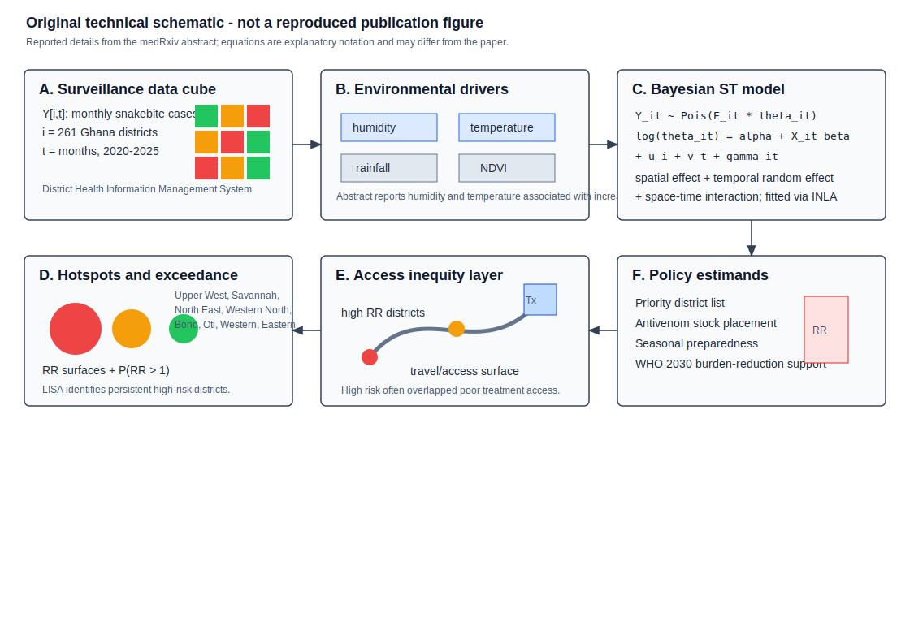
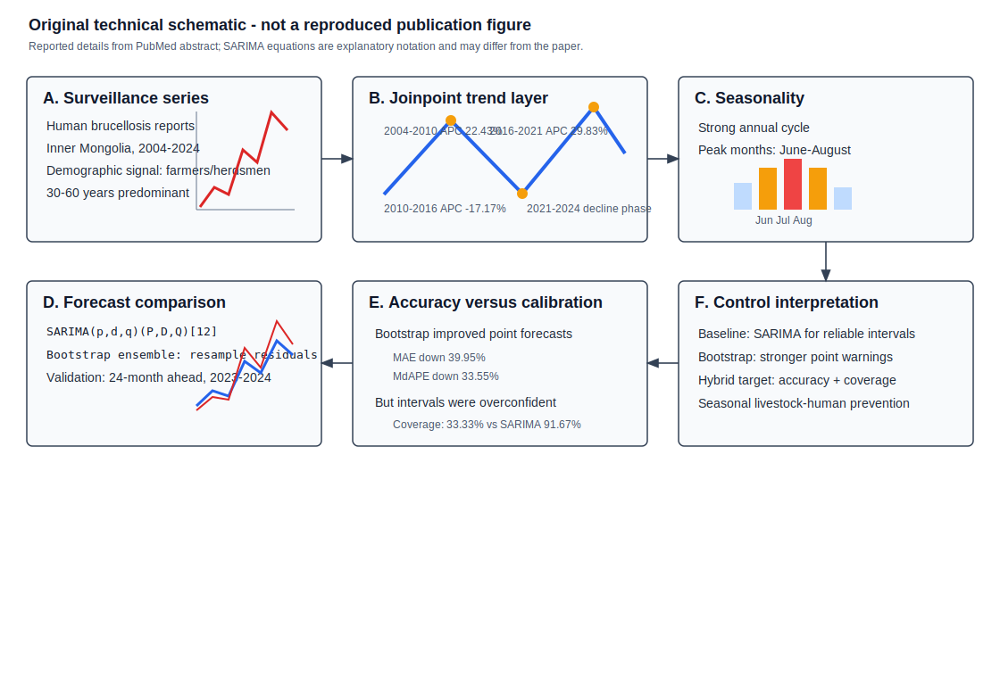
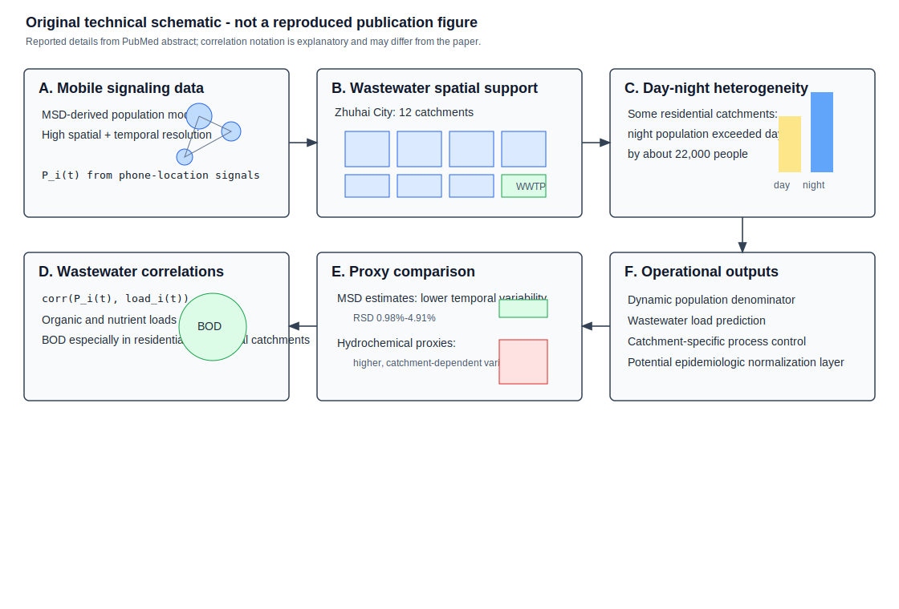
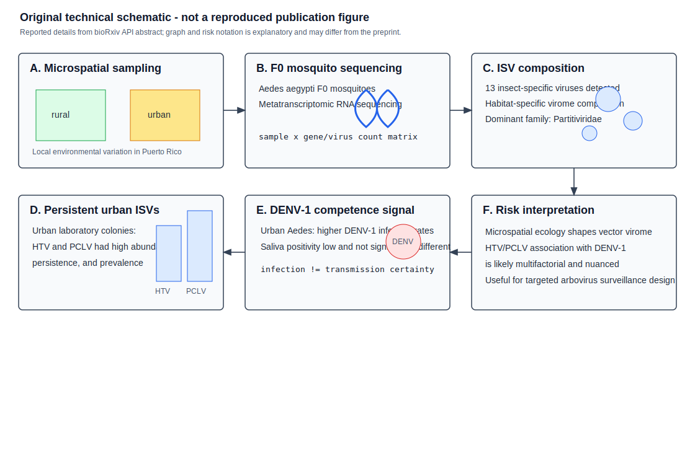

# Spatial Epidemiology Research Update

**Update date:** July 17, 2026  
**Search window:** Newly published or newly indexed after the previous
automation timestamp, July 16, 2026 at 12:10:47 UTC. PubMed records were
screened by exact Entrez entry time where available. medRxiv and bioRxiv API
records were screened for July 16-17 postings; those APIs expose posting date
but not a precise posting time, so same-day preprints are marked as newly found
in this run rather than exact post-cutoff timestamps.

## Search Result

Four items passed the inclusion screen. Two are peer-reviewed PubMed-indexed
papers entered after the cutoff, and two are newly posted preprints with
explicit spatial or microspatial disease-risk modeling content. The set is
small because the after-cutoff PubMed screen was dominated by clinical,
molecular, imaging, review, or non-spatial surveillance records.

Figures below are original technical schematics created for this report. They
are not reproduced from the cited publications. Equation and algorithm notation
is explanatory where the abstract or API metadata do not expose the exact
parameterization; notation may differ from the paper.

## Temporal and Spatial Patterns of Snakebite Envenoming in Ghana, 2020-2025: A Nationwide Surveillance Analysis

**Authors:** E. Nyarko, P. Antwi, E. B. Amponsah, L. Ofori-Boadu, E.
Oduro-Mensah, J. A. Oliver-Commey, M. Haruna, C. Serwaa, G. Dadzie.  
**Publication date:** Posted July 16, 2026 as a medRxiv preprint, version 1.  
**Source:** [doi:10.64898/2026.07.12.26357875](https://doi.org/10.64898/2026.07.12.26357875);
[medRxiv record](https://www.medrxiv.org/content/10.64898/2026.07.12.26357875v1).

**Modeling approach:** The study analyzed monthly district-level snakebite
cases from Ghana's District Health Information Management System for 2020-2025
across all 261 districts. It used a Bayesian spatiotemporal model with spatial
effects, a temporal random effect, and a space-time interaction, fitted via
Integrated Nested Laplace Approximation. The model incorporated rainfall,
temperature, humidity, and NDVI, and the outputs included relative risks,
exceedance probabilities, Local Indicators of Spatial Association, and
geographic accessibility to treatment.

**Key finding:** Snakebite risk showed strong spatial clustering and temporal
variation. Persistent high-risk districts were reported in Upper West,
Savannah, North East, Western North, Bono, Oti, Western, and Eastern regions,
with Fanteakwa North emerging as the highest-risk district nationally in 2025.
Humidity and temperature were associated with increased risk, while rainfall
and NDVI were not significant in the abstracted results. High-risk districts
often also had poor treatment access.

**Why it matters:** This is a directly relevant nationwide Bayesian
spatiotemporal disease-burden model for a neglected tropical condition. It
connects risk surfaces, exceedance probabilities, environmental drivers, and
access-to-care inequities to concrete antivenom distribution and surveillance
decisions.

**Alt text:** Six-panel SVG schematic showing monthly district snakebite
counts from Ghana, environmental covariates, a Bayesian spatiotemporal model
with spatial, temporal, and space-time interaction terms fitted by INLA,
relative-risk and exceedance outputs with LISA hotspots, geographic treatment
access inequity, and policy estimands for antivenom placement and seasonal
preparedness.

**Caption:** Original technical schematic. Panel A shows the district-month
surveillance data cube. Panel B lists environmental predictors and identifies
the two reported positive associations. Panel C gives explanatory Bayesian
spatiotemporal notation. Panel D shows relative-risk and exceedance mapping
with hotspot detection. Panel E adds the treatment-access layer. Panel F links
model outputs to antivenom allocation and WHO 2030 snakebite goals.

## Epidemiological trends and comparative forecasting models of human brucellosis in Inner Mongolia Autonomous Region, mainland China, 2004-2024

**Authors:** Na Zhang, Qiuju Yang, Chuizhao Xue, Zhiguo Liu, Na Ta, Zhenjun Li.  
**Publication date:** Published July 2026 in *PLOS Neglected Tropical Diseases*;
entered PubMed July 16, 2026 at 13:47 UTC.  
**Source:** [doi:10.1371/journal.pntd.0014439](https://doi.org/10.1371/journal.pntd.0014439);
[PubMed PMID: 42461909](https://pubmed.ncbi.nlm.nih.gov/42461909/).

**Modeling approach:** The paper used reported human brucellosis surveillance
data from Inner Mongolia for 2004-2024. It combined joinpoint regression for
epidemiological trend phases with seasonal forecasting model comparison,
benchmarking standard SARIMA against a bootstrap-enhanced SARIMA approach for
24-month-ahead prediction over a 2023-2024 validation period.

**Key finding:** Long-term incidence increased but fluctuated, with an AAPC of
5.13% and epidemic surges in 2004-2010 and 2016-2021, followed by decline
phases in 2010-2016 and 2021-2024. Cases peaked seasonally in June-August and
were concentrated among farmers and herdsmen aged 30-60 years. Bootstrap
SARIMA improved point accuracy, reducing MAE by 39.95% and median absolute
percentage error by 33.55% versus SARIMA, but its interval coverage was poor
(33.33%) compared with SARIMA (91.67%).

**Why it matters:** The paper is a useful cautionary example for operational
outbreak forecasting: better point forecasts can come at the cost of badly
calibrated uncertainty. That tradeoff is central for zoonotic early warning
when decisions require both expected burden and credible interval coverage.

**Alt text:** Six-panel SVG schematic showing human brucellosis surveillance
in Inner Mongolia, joinpoint trend phases, June-August seasonality, SARIMA and
bootstrap-enhanced SARIMA forecast comparison, point-accuracy versus interval
coverage tradeoffs, and seasonal livestock-human prevention outputs.

**Caption:** Original technical schematic. Panel A identifies the surveillance
series and affected occupational-age group. Panel B shows the reported
joinpoint phases. Panel C shows the seasonal peak. Panel D compares standard
SARIMA and bootstrap-enhanced SARIMA in explanatory notation. Panel E
summarizes the reported accuracy and coverage tradeoff. Panel F translates
the model comparison into control interpretation.

## Spatiotemporal Dynamics of Urban Population Based on Mobile Signaling Data and Its Correlation With Wastewater Quantity and Quality

**Authors:** Chenguang Fan, Kai He, Penghui Li, Aimin Hao, Yingchao Lin,
Qidong Yin, Sheng Huang.  
**Publication date:** Published July 2026 in *Water Environment Research*;
entered PubMed July 17, 2026 at 00:03 UTC.  
**Source:** [doi:10.1002/wer.70440](https://doi.org/10.1002/wer.70440);
[PubMed PMID: 42464003](https://pubmed.ncbi.nlm.nih.gov/42464003/).

**Modeling approach:** The study used mobile signaling data to construct a
high-resolution spatiotemporal population model for Zhuhai City and linked
dynamic population patterns to wastewater quantity and quality across 12
catchments. It evaluated correlations between mobile-signaling-derived
population estimates and wastewater parameters such as organic and nutrient
loads, while comparing the temporal stability of mobile-signaling estimates
against hydrochemical proxy estimates.

**Key finding:** The mobile-signaling model showed marked spatial
heterogeneity and day-night shifts; some residential catchments had nighttime
populations exceeding daytime levels by about 22,000 individuals.
Mobile-signaling-derived populations were significantly associated with
organic and nutrient loads, especially BOD in predominantly residential and
commercial catchments. Mobile-signaling estimates had lower temporal
variability (RSD 0.98%-4.91%) than more context-sensitive hydrochemical proxy
estimates.

**Why it matters:** This is not a pathogen-outbreak paper, but it is highly
relevant to wastewater epidemiology and environmental surveillance. Dynamic
catchment denominators are a recurring weakness in wastewater-based disease
models; mobile signaling provides a potentially stronger denominator and
normalization layer for interpreting spatial wastewater signals.

**Alt text:** Six-panel SVG schematic showing mobile signaling data converted
to high-resolution population estimates, 12 wastewater catchments in Zhuhai,
day-night population heterogeneity, correlations with wastewater BOD and
nutrient loads, comparison of mobile signaling and hydrochemical proxy
variability, and operational wastewater control outputs.

**Caption:** Original technical schematic. Panel A represents mobile signaling
data as a dynamic population source. Panel B defines the wastewater catchment
spatial support. Panel C shows the reported day-night population shifts. Panel
D gives explanatory correlation notation for wastewater load association.
Panel E contrasts mobile-signaling and hydrochemical proxy variability. Panel F
shows how the output can support wastewater infrastructure control and future
wastewater epidemiology normalization.

## Microspatial partitioning of insect-specific viromes and dengue virus transmission risk by *Aedes aegypti* in Puerto Rico

**Authors:** B. Agbodzi, L. Alonso-Palomares, H. J. Barton,
L. Nazario-Maldonado, J. M. Quintana, N. Borrero-Segarra, J. F. Williams,
V. Rivera-Amill, R. Rodriguez-Gonzalez, G. Brown, R. R. Dinglasan.  
**Publication date:** Posted July 16, 2026 as a bioRxiv preprint, version 1.  
**Source:** [doi:10.64898/2026.07.15.738651](https://doi.org/10.64898/2026.07.15.738651);
[bioRxiv record](https://www.biorxiv.org/content/10.64898/2026.07.15.738651v1).

**Modeling approach:** The preprint sampled rural and urban *Aedes aegypti*
populations in Puerto Rico and used metatranscriptomic RNA sequencing of F0
mosquitoes to characterize insect-specific virus profiles at microspatial
scales. It compared habitat-specific virome composition and evaluated DENV-1
infection and saliva positivity patterns in relation to urban versus rural
mosquito populations.

**Key finding:** Thirteen insect-specific viruses were detected, with
habitat-specific virome composition. Partitiviridae was the dominant viral
family, and Humaita-Tubiacanga virus and Phasi Charoen-like phasivirus had the
highest abundance, persistence, and prevalence in urban laboratory colonies.
Urban *Aedes aegypti* showed significantly higher DENV-1 infection rates than
rural populations, but saliva positivity was low and did not differ
significantly between groups.

**Why it matters:** This is a vector-focused spatial epidemiology preprint at
microspatial scale. It links local ecology, vector virome composition, and
dengue infection competence while appropriately cautioning that HTV/PCLV
associations with transmission risk are multifactorial rather than a simple
causal signal.

**Alt text:** Six-panel SVG schematic showing rural and urban Aedes aegypti
sampling in Puerto Rico, F0 mosquito metatranscriptomic RNA sequencing,
habitat-specific insect-specific virus composition, urban HTV and PCLV
persistence, DENV-1 infection and saliva positivity results, and cautious
interpretation for dengue surveillance.

**Caption:** Original technical schematic. Panel A shows the rural-urban
microspatial sampling contrast. Panel B shows the sequencing input. Panel C
summarizes the reported insect-specific virome results. Panel D highlights
HTV/PCLV persistence in urban colonies. Panel E distinguishes infection-rate
signals from saliva positivity. Panel F states the cautious transmission-risk
interpretation and surveillance relevance.

## Sources Checked

- PubMed E-utilities entry-date searches for July 16-17, 2026 using spatial,
  spatiotemporal, geospatial, geostatistical, Bayesian, hotspot, forecast,
  mobility, outbreak, wastewater, epidemiology, disease, infection,
  surveillance, malaria, dengue, influenza, tuberculosis, and COVID terms.
  Candidate records were filtered to exact Entrez entry times after July 16,
  2026 at 12:10:47 UTC.
- PubMed XML records for selected peer-reviewed items, including DOI, author
  list, journal, abstract, publication metadata, and exact Entrez entry time.
- medRxiv and bioRxiv API details for July 16-17, 2026, screened by title and
  abstract for spatial disease modeling, spatiotemporal burden mapping,
  vector-borne disease spatial risk, environmental surveillance, outbreak
  forecasting, and reproducible methods.
- arXiv API searches sorted by submitted date for spatial epidemiology,
  spatiotemporal epidemic forecasting, Bayesian disease mapping,
  geostatistical epidemiology, and outbreak forecasting with mobility terms.
  No stronger same-window arXiv item was found.
- Existing repository updates and local uncommitted reports were searched for
  selected title and DOI fragments before inclusion.

## Duplicate And Exclusion Notes

- No selected DOI or title appeared in prior repository updates.
- The July 16 PubMed record on contextual drivers of HIV vulnerability and
  retention in care in the Central African Republic (PMID 42461481) was
  relevant but entered PubMed at 11:17 UTC, before the July 16 12:10:47 UTC
  cutoff, so it was excluded from the main set.
- The newly indexed PLOS Neglected Tropical Diseases Perspective on Nipah
  early warning in Bangladesh (PMID 42461815) entered after the cutoff and is
  relevant to anticipatory surveillance, but it is a conceptual perspective
  rather than a paper with a reported spatial or spatiotemporal model, so it
  was not selected over the four included modeling items.
- Same-window PubMed hits using spatial or spatiotemporal language for
  clinical imaging, tumor spatial transcriptomics, cell biology, non-disease
  environmental remediation, bibliometrics, or broad review articles were
  excluded unless they had a clearer population spatial epidemiology,
  environmental surveillance, outbreak forecasting, or vector-risk modeling
  contribution than the selected papers.
