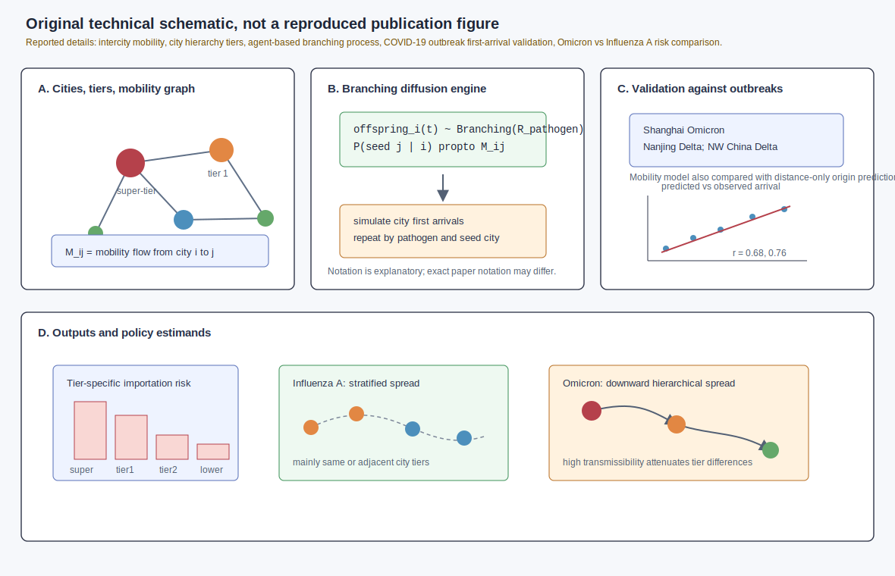
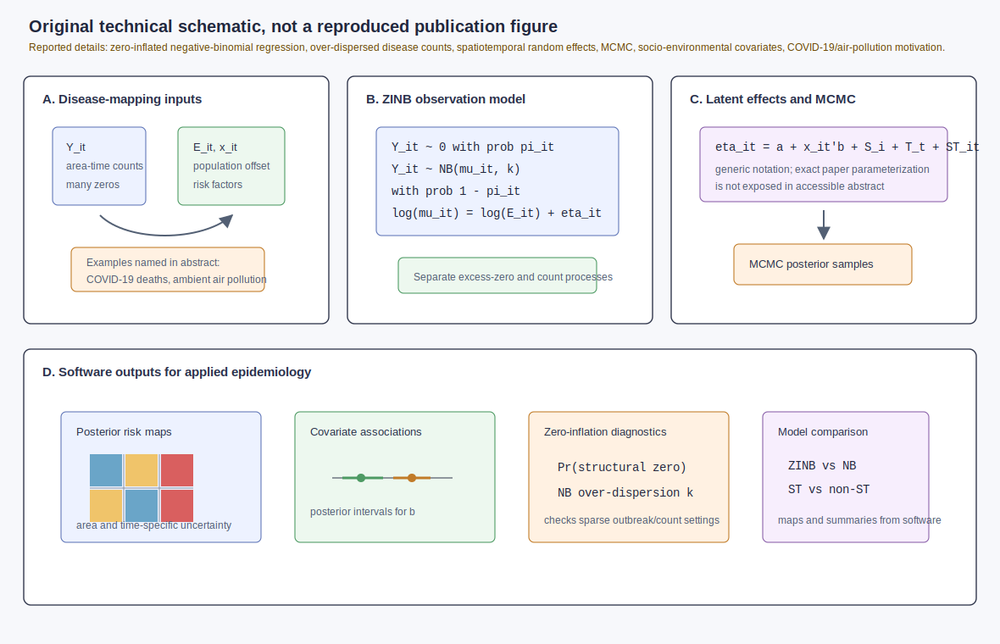
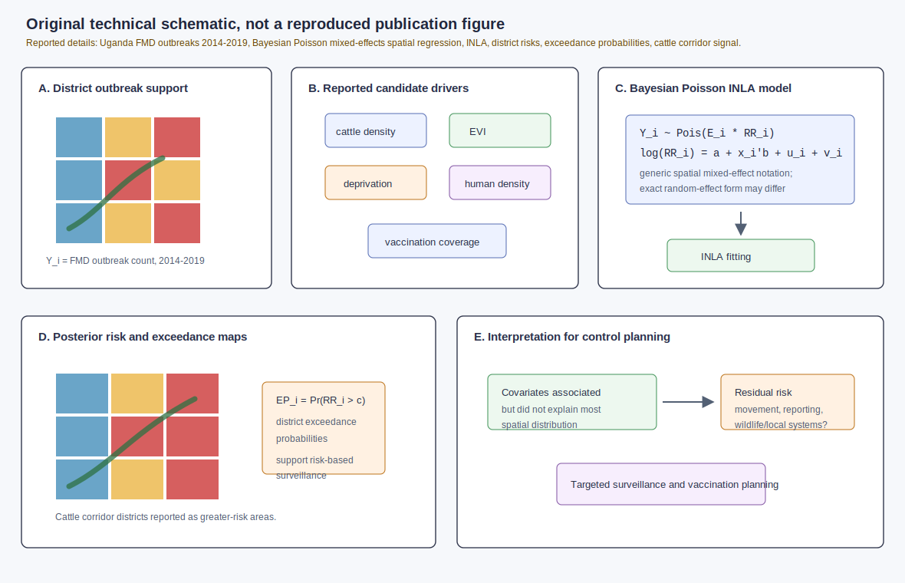
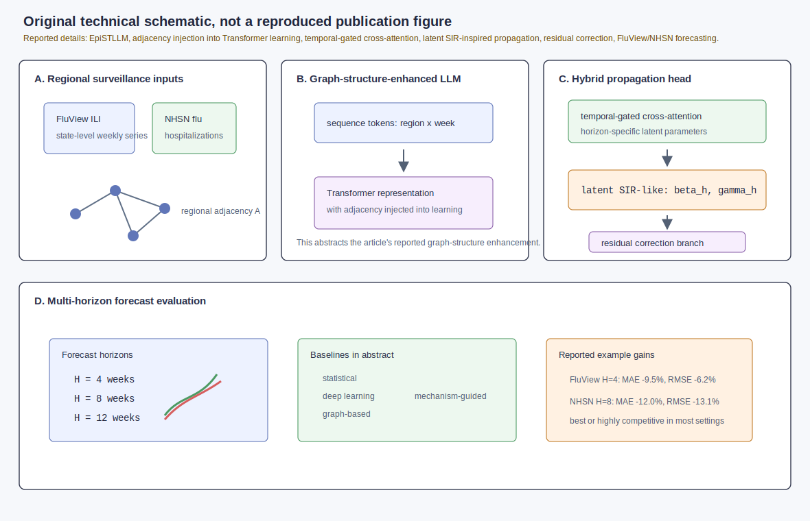

# Spatial epidemiology research update - 2026-07-21

Search window: records newly published, newly visible, or newly indexed after the previous automation run on 2026-07-20T12:04:45Z.

Primary sources checked: Crossref REST API with post-run `from-index-date` filters, PubMed E-utilities entry-date and publication-date searches, medRxiv/bioRxiv API records for 2026-07-20 to 2026-07-21, arXiv API keyword searches sorted by submitted date, and publisher/DOI landing pages surfaced by exact title and DOI searches. The automation memory file was missing at the start of this run, so duplicate screening used local reports through 2026-07-20; none of the selected DOIs or exact titles appeared in the local archive.

## 1. Mobility-informed spatial transmission risk across Chinese city tiers

**Paper:** Wenjie Li, Wei Yang, Yang Liu, and Ye Yao. "Assessing spatial transmission risk of respiratory infectious diseases across cities of different socioeconomic tiers in China: A modelling study." *PLOS Medicine*.

**Publication date:** 2026-07-20; PubMed entry visible in the 2026-07-20/21 window and Crossref indexed 2026-07-20T18:03:15Z.

**Source:** [doi:10.1371/journal.pmed.1005172](https://doi.org/10.1371/journal.pmed.1005172); [PubMed PMID:42475324](https://pubmed.ncbi.nlm.nih.gov/42475324/).

**Modeling approach:** The authors integrate large-scale intercity mobility data into an agent-based branching-process model to simulate respiratory pathogen diffusion across mainland China. Cities are grouped into socioeconomic/transport hierarchy tiers, from super-tier metropolises to lower-tier cities. The model is validated against first-arrival times from three COVID-19 outbreaks: Omicron in Shanghai, Delta in Nanjing, and a multi-provincial Delta outbreak in northwestern China. It is then used to compare SARS-CoV-2 Omicron and Influenza A tier-specific transmission risks. The figure uses explanatory branching-process notation; notation may differ from the paper.

**Key finding:** Predicted first-arrival times agreed with observations with reported correlations of r = 0.68 and r = 0.76, and mobility-based predictions identified outbreak origins more accurately than distance-based approaches. Influenza A showed relatively stable, stratified spread within same or adjacent city tiers, whereas Omicron spread downward through the hierarchy quickly enough to reduce tier-level risk differences.

**Why it matters:** The paper ties spatial risk to both pathogen transmissibility and the hierarchy of the urban mobility network. That is useful for early-warning systems because controls calibrated for slower respiratory pathogens may not hold for highly transmissible variants or future emerging respiratory threats.

**Figure alt text:** Four-panel SVG. Panel A shows mainland China cities indexed by city tier and connected by intercity mobility weights. Panel B shows an explanatory agent-based branching process with pathogen-specific transmissibility and mobility-weighted destination probabilities. Panel C shows validation against first-arrival times from Shanghai Omicron, Nanjing Delta, and northwestern China Delta outbreaks, with the reported correlations r equals 0.68 and 0.76 and a comparison to distance-only prediction. Panel D shows outputs: tier-specific importation risk, different diffusion patterns for Influenza A and Omicron, and early-warning estimands for targeted surveillance.

**Caption:** Original technical schematic, not a reproduced publication figure. Panel A summarizes the reported spatial units, hierarchy, and mobility inputs. Panel B gives generic branching-process notation to explain how infections can seed cities through mobility-weighted edges; exact notation may differ from the paper. Panel C records the reported first-arrival validation design. Panel D links the reported pathogen-specific tier patterns to surveillance and response decisions.

## 2. Bayesian zero-inflated negative-binomial disease mapping software

**Paper:** Suman Majumder, Yoonbae Jun, Sounak Chakraborty, Chae Young Lim, and Tanujit Dey. "BSTZINB: A Bayesian Framework for Negative-Binomial Modeling of Spatio-Temporal Zero-Inflated Count Data in Epidemiology." *Stats*.

**Publication date:** 2026-07-20; Crossref indexed 2026-07-21T12:02:05Z.

**Source:** [doi:10.3390/stats9040076](https://doi.org/10.3390/stats9040076); Crossref metadata identifies the journal article and abstract.

**Modeling approach:** The paper presents a unified and publicly available Bayesian framework/software for disease mapping with over-dispersed count outcomes and excess zeros. The abstract specifies zero-inflated negative-binomial regression, spatiotemporal random effects, social and environmental risk factors, and Markov chain Monte Carlo inference, motivated by COVID-19 death counts and ambient air-pollution exposure applications. The figure uses generic ZINB and latent-effect notation because the accessible abstract does not expose the exact parameterization.

**Key finding:** The contribution is a software-oriented Bayesian disease-mapping framework intended to make zero-inflated, over-dispersed spatiotemporal count models easier to apply for epidemiologic mapping and health-effect estimation.

**Why it matters:** Excess zeros and over-dispersion are routine in small-area infectious-disease counts, especially when transmission is sparse or reporting is uneven. A reusable MCMC implementation lowers the barrier to fitting models that jointly estimate covariate effects, latent space-time structure, and uncertainty-aware maps.

**Figure alt text:** Four-panel SVG. Panel A shows area-time disease counts, population offsets, and socio-environmental covariates including air pollution. Panel B shows an explanatory zero-inflated negative-binomial mixture likelihood with a structural-zero probability and count mean. Panel C shows latent spatial, temporal, and space-time random effects sampled by MCMC, with notation labelled as generic because the abstract does not expose exact priors. Panel D shows posterior outputs: risk maps, covariate associations, zero-inflation diagnostics, uncertainty intervals, and model-comparison summaries.

**Caption:** Original technical schematic, not a reproduced publication figure. Panel A captures the reported disease-mapping inputs. Panel B visualizes the model class: a separate process for excess zeros and an over-dispersed count process. Panel C shows the reported spatiotemporal random-effect and MCMC elements using cautious explanatory notation. Panel D shows the analysis products that make the software useful for applied epidemiology.

## 3. Bayesian INLA disease mapping of foot-and-mouth disease outbreaks in Uganda

**Paper:** Lina Gonzalez Gordon, Dennis Muhanguzi, Adrian Muwonge, Sylvester Ochwo, Noelina Nantima, Rose Ademun, Lisa Boden, Norbert Frank Mwiine, Claire E. Colenutt, and colleagues. "Spatial Patterns and Epidemiological Drivers of Foot-and-Mouth Disease Outbreaks in Uganda." *Transboundary and Emerging Diseases*.

**Publication date:** 2026 issue metadata; Crossref indexed 2026-07-21T08:02:50Z and PubMed record visible in the 2026-07-20/21 entry-date screen.

**Source:** [doi:10.1155/tbed/4994209](https://doi.org/10.1155/tbed/4994209); [PubMed PMID:42478189](https://pubmed.ncbi.nlm.nih.gov/42478189/).

**Modeling approach:** The authors analyze Ugandan FMD outbreak data from 2014 to 2019 using a Bayesian Poisson mixed-effects spatial regression model fitted with Integrated Nested Laplace Approximation (INLA). The reported covariates include cattle density, Enhanced Vegetation Index, deprivation score, human density, and mean vaccination coverage. Outputs include adjusted district-specific risk estimates and exceedance probabilities.

**Key finding:** The covariates were associated with outbreak risk but did not explain most of the spatial distribution, implying unmeasured epidemiologic drivers. Higher-risk districts were highlighted across the cattle corridor. Mean vaccination coverage was associated with increased outbreak risk, consistent with reactive vaccination during outbreaks rather than purely preventive coverage.

**Why it matters:** The study demonstrates a practical Bayesian disease-mapping workflow for transboundary animal disease control. District-level risk and exceedance probabilities can support targeted surveillance and control, while the unexplained spatial structure flags where additional movement, reporting, wildlife, or local production-system data may be needed.

**Figure alt text:** Five-panel SVG. Panel A shows Ugandan district outbreak counts from 2014 to 2019 with expected counts or population at risk. Panel B lists reported covariates: cattle density, Enhanced Vegetation Index, deprivation, human density, and vaccination coverage. Panel C shows an explanatory Bayesian Poisson spatial mixed model fitted with INLA, including fixed effects and latent district spatial effects; notation may differ from the paper. Panel D shows posterior district relative risks and exceedance probabilities, with the cattle corridor highlighted as higher risk. Panel E shows interpretation: covariates explain only part of the spatial pattern and residual structure motivates better surveillance and additional drivers.

**Caption:** Original technical schematic, not a reproduced publication figure. Panel A gives the disease-mapping support. Panel B records the reported drivers considered. Panel C translates the reported Bayesian Poisson INLA model into generic notation for a district-level relative-risk map. Panel D shows the reported output types. Panel E connects the residual spatial structure to surveillance and model-improvement needs.

## 4. Graph-structure-enhanced LLM for multi-regional infectious-disease forecasting

**Paper:** Siru Chen, Xuhao Guo, Zige Liu, Zhijie Lin, and Junying Chen. "Multi-Regional Infectious Disease Transmission Forecasting Based on Graph-Structure-Enhanced Large Language Model." *Mathematics*.

**Publication date:** 2026-07-20; Crossref indexed 2026-07-21T12:01:45Z.

**Source:** [doi:10.3390/math14142642](https://doi.org/10.3390/math14142642); Crossref metadata identifies the article and abstract.

**Modeling approach:** The paper proposes EpiSTLLM, a graph-structure-enhanced large language model for multi-region infectious-disease forecasting. The accessible abstract reports regional adjacency injection into Transformer-based representation learning, temporal-gated cross-attention for horizon-specific latent transmission and recovery parameters, a latent-space SIR-inspired propagation mechanism, and a residual correction branch. Experiments use the FluView state-level influenza-like illness dataset and NHSN state-level influenza hospitalization dataset across 4-, 8-, and 12-week horizons.

**Key finding:** EpiSTLLM is reported to be best or highly competitive across most settings against statistical, deep-learning, graph-based, and mechanism-guided baselines. The abstract gives examples: 9.5% MAE and 6.2% RMSE reductions at H = 4 on FluView, and 12.0% MAE and 13.1% RMSE reductions at H = 8 on NHSN compared with the strongest baselines.

**Why it matters:** The work is part of the current shift toward hybrid epidemic forecasters that combine graph structure, learned long-range temporal representations, and mechanistic constraints. The state-level FluView/NHSN use case makes it relevant to operational outbreak forecasting and resource planning.

**Figure alt text:** Four-panel SVG. Panel A shows state-level ILI and influenza hospitalization time series plus a regional adjacency graph. Panel B shows graph-structure injection into a Transformer or LLM representation layer. Panel C shows temporal-gated cross-attention producing horizon-specific latent transmission and recovery parameters, feeding a latent-space SIR-inspired propagation step and a residual correction branch. Panel D shows 4-, 8-, and 12-week forecasts, baseline comparisons, and the reported MAE and RMSE improvements for FluView and NHSN.

**Caption:** Original technical schematic, not a reproduced publication figure. Panel A identifies the reported datasets and graph input. Panel B visualizes how regional adjacency is injected into learned representations. Panel C shows the reported hybrid mechanism in abstract-level form; symbols are explanatory and may differ from the article. Panel D records the forecast horizons, evaluation setting, and reported example performance gains.

## Search notes and exclusions

- Crossref post-run index-date searches found a relevant *Spatial and Spatio-temporal Epidemiology* dengue paper, "Seasonal climate synchronizes dengue timing but not spatial risk in subtropical Brazil" ([doi:10.1016/j.sste.2026.100831](https://doi.org/10.1016/j.sste.2026.100831)), but Crossref metadata shows it was indexed on 2026-07-11, before this run's cutoff, so it was excluded.
- PubMed entry-date searches also surfaced non-spatial biomedical imaging, molecular, and review papers that matched broad "spatial" text but were not population spatial epidemiology or disease modeling.
- A 2026-07-20 PLOS Neglected Tropical Diseases rapid review on climate, urbanization, and dengue was relevant background, but it was not selected because the automation prioritizes original models, model software, datasets, or methods papers when sufficient candidates exist.
- medRxiv 2026-07-20 included public-health projections and small-area fertility estimation preprints; these were screened but not selected because the selected infectious-disease and disease-mapping papers matched the spatial epidemiology modeling scope more directly.
- No stronger post-cutoff arXiv or bioRxiv item was identified in the screened queries.
