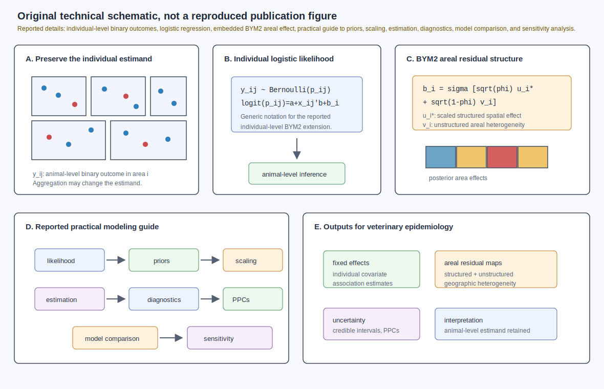
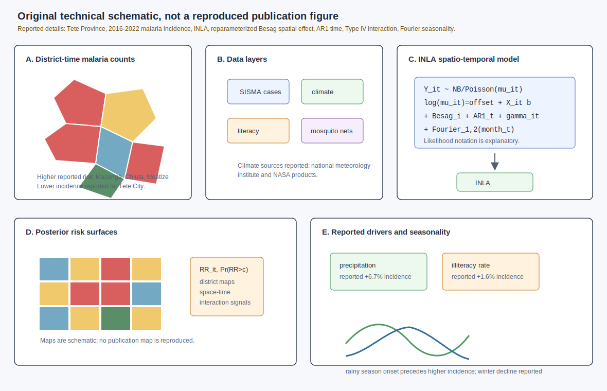
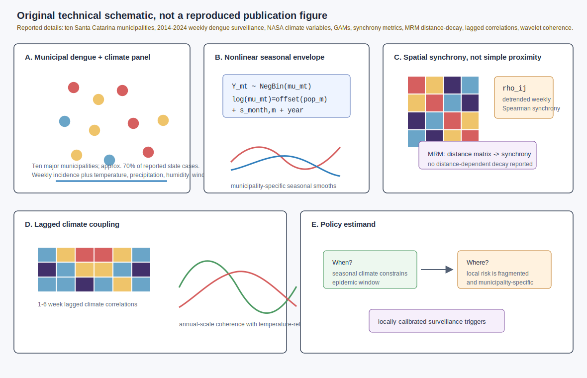
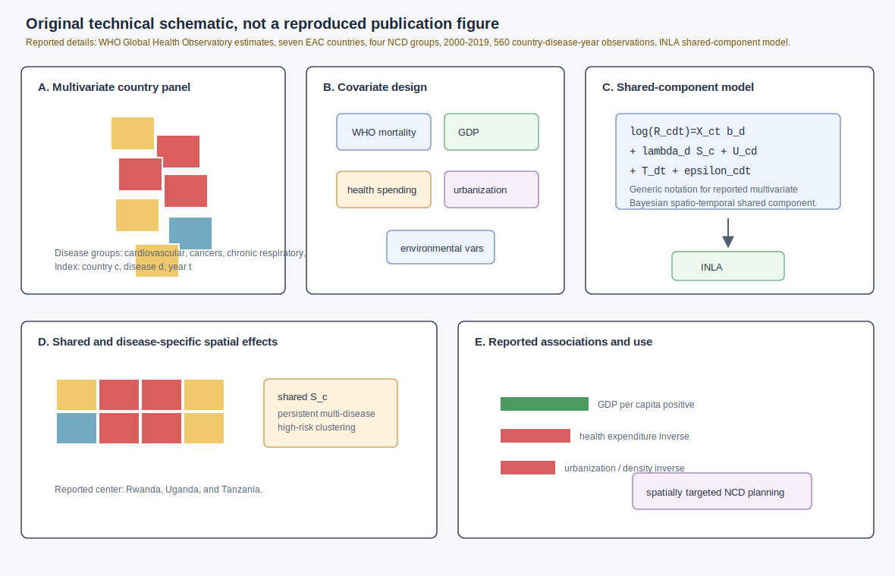
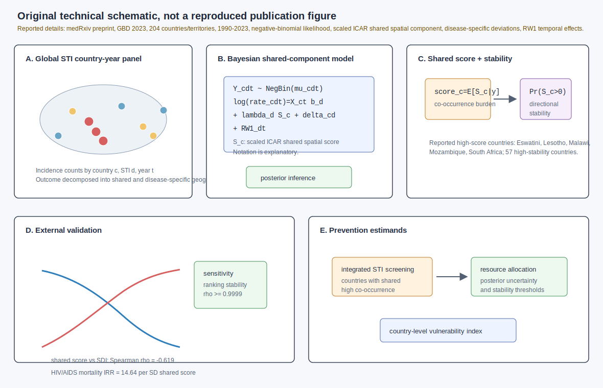

# Spatial epidemiology research update - 2026-07-22

Search window: records newly published, newly posted, or newly indexed after the previous automation run on 2026-07-21T12:01:21Z.

Primary sources checked: Crossref REST API filtered by post-run index timestamps, PubMed/PubMed search pages and publisher records surfaced from DOI/title searches, medRxiv/bioRxiv API records for 2026-07-21 to 2026-07-22, ScienceDirect article pages, Frontiers article metadata, and local archive text search across prior reports and figure names. PubMed E-utilities briefly rate-limited summary retrieval during this run, so publisher pages, Crossref metadata, and medRxiv API records were used for the final source details where needed.

## 1. Individual-level BYM2 disease mapping for veterinary binary outcomes

**Paper:** Chengwei Zhang, Hui Yan, Zihao Jia, and Danchen Aaron Yang. "Bayesian Disease Mapping Beyond Aggregated Counts: A BYM2 Framework for Individual-Level Inference." *Mathematics*.

**Publication date:** 2026-07-21; Crossref indexed 2026-07-21T12:01:46Z, approximately 25 seconds after the previous automation cutoff.

**Source:** [doi:10.3390/math14142649](https://doi.org/10.3390/math14142649).

**Modeling approach:** The paper extends the Besag-York-Mollie 2 (BYM2) disease-mapping framework from aggregated areal counts to individual-level binary outcomes, motivated by veterinary epidemiology where animals are observed within geographic units. It embeds a BYM2 areal random effect in a logistic regression model so individual animals remain the unit of analysis while residual structured and unstructured areal variation is modeled. The abstract reports a practical guide covering likelihood and prior specification, BYM2 scaling, estimation, diagnostics, posterior predictive checks, model comparison, sensitivity analysis, and interpretation. The figure uses generic BYM2 notation; exact notation may differ from the paper.

**Key finding:** The contribution is methodological: aggregating individual animal data to areas can change the estimand, while an individual-level logistic BYM2 model can retain animal-level covariate interpretation and still produce uncertainty-aware areal residual risk estimates.

**Why it matters:** This is directly useful for field epidemiology studies that collect individual-level infection, vaccination, or diagnostic data but still need spatial disease-mapping outputs. It helps avoid overinterpreting aggregate BYM2 effects as individual-level effects.

**Figure alt text:** Five-panel SVG. Panel A contrasts individual animal binary outcomes nested in areas with aggregated areal counts. Panel B shows a logistic regression likelihood with a BYM2 areal random effect. Panel C decomposes the BYM2 effect into scaled structured and unstructured area effects. Panel D lists the practical workflow reported by the paper: priors, scaling, estimation, diagnostics, posterior predictive checks, model comparison, sensitivity analysis, and interpretation. Panel E shows posterior outputs for individual covariate associations, areal residual risk, uncertainty, and estimand preservation.

**Caption:** Original technical schematic, not a reproduced publication figure. Panel A shows the estimand problem the paper addresses. Panels B and C translate the reported individual-level BYM2 extension into cautious explanatory notation. Panel D summarizes the reported practical modeling workflow. Panel E links the model to interpretable individual and areal epidemiologic outputs.

## 2. Bayesian spatio-temporal malaria determinants in Tete Province, Mozambique

**Paper:** Abrantes Joao Afonso Mussafo, Renato Ferreira da Cruz, Liciana Vaz de Arruda Silveira, and Jose Silvio Govone. "Climatic and social health determinants of malaria incidence in Tete, Mozambique: Bayesian spatio-temporal modeling of routine data (2016-2022)." *Spatial and Spatio-temporal Epidemiology*.

**Publication date:** 2026-06 issue; PubMed lists Epub 2026-03-12, while Crossref re-indexed the article after this automation cutoff on 2026-07-21T23:00:55Z.

**Source:** [doi:10.1016/j.sste.2026.100802](https://doi.org/10.1016/j.sste.2026.100802); [PubMed PMID:42285623](https://pubmed.ncbi.nlm.nih.gov/42285623/).

**Modeling approach:** The study models malaria incidence in Tete Province from 2016 to 2022 using a hierarchical Bayesian model fitted by INLA. PubMed reports a reparameterized Besag spatial structure, AR1 temporal process, Type IV space-time interactions, and first- and second-order Fourier terms for seasonality. Inputs include malaria cases from SISMA, climate data from Mozambique's national meteorology institute and NASA, literacy-rate data from the national statistics institute, and mosquito-net distribution data from social services. The figure uses generic count-model notation; exact likelihood parameterization may differ.

**Key finding:** Precipitation and illiteracy rate were significant predictors, associated with estimated increases of 6.7% and 1.6% in malaria incidence, respectively. Incidence rose after rainy-season onset and declined in winter. Macanga, Chiuta, and Moatize had higher reported risk, while Tete City had lower incidence.

**Why it matters:** This is a policy-facing INLA disease-mapping workflow for routine malaria surveillance, linking climate and social determinants to district-level relative risk and seasonal timing in a high-burden setting.

**Figure alt text:** Five-panel SVG. Panel A shows district malaria incidence in Tete Province from 2016 to 2022. Panel B lists reported surveillance, climate, literacy, and mosquito-net inputs. Panel C shows a generic INLA hierarchical count model with reparameterized Besag spatial structure, AR1 temporal effect, Type IV interaction, and Fourier seasonality. Panel D highlights reported risk outputs for Macanga, Chiuta, Moatize, and Tete City. Panel E summarizes reported covariate effects for precipitation and illiteracy plus seasonal rainy-season timing.

**Caption:** Original technical schematic, not a reproduced publication figure. Panels A and B identify the reported spatiotemporal support and data sources. Panel C summarizes the reported INLA latent structure using explanatory notation. Panels D and E connect posterior risk outputs to the reported district and determinant findings.

## 3. Climate synchrony without spatial risk synchrony in subtropical Brazilian dengue

**Paper:** Renan de Souza Rezende, Franciele Mendonca Ferreira, Cristiano Ilha, Emanuel Rampanelli Cararo, Michele Victoria Dalmutt Scarparo, Ana Luiza Caldatto, Laura Jablonski Straube, Amanda Caroline Martinelli Sehn, Adrieli Marsango de Bispo, and Cassia Alves Lima-Rezende. "Seasonal climate synchronizes dengue timing but not spatial risk in subtropical Brazil." *Spatial and Spatio-temporal Epidemiology*.

**Publication date:** Available online 2026-07-10; Crossref indexed/re-indexed the record after this automation cutoff on 2026-07-21T13:04:50Z.

**Source:** [doi:10.1016/j.sste.2026.100831](https://doi.org/10.1016/j.sste.2026.100831).

**Modeling approach:** The authors analyze weekly dengue incidence from 2014 to 2024 in ten major municipalities in Santa Catarina, Brazil, together with NASA gridded climate variables. The ScienceDirect page reports nonlinear seasonal modeling with negative-binomial generalized additive models, municipality-specific factor-smooth seasonal terms, pairwise Spearman synchrony of detrended weekly incidence, bootstrap confidence intervals, distance-decay tests using Multiple Regression on distance Matrices, lagged climate-dengue correlations over 1-6 weeks, and time-frequency coherence analyses.

**Key finding:** Temperature-related seasonality synchronized the timing of dengue epidemics into a narrow seasonal window, but epidemic trajectories were weakly synchronized, sometimes negatively correlated, and showed no distance-dependent decay. Local temperature metrics and climatic sensitivities differed by municipality.

**Why it matters:** The paper challenges regional climate-triggered dengue early-warning assumptions. In heterogeneous subtropical settings, climate can tell agencies when dengue transmission is plausible without reliably indicating which municipalities will amplify.

**Figure alt text:** Five-panel SVG. Panel A shows ten Santa Catarina municipalities with weekly dengue incidence from 2014 to 2024 and NASA climate inputs. Panel B shows negative-binomial generalized additive models with municipality-specific seasonal smooths and a population offset. Panel C shows pairwise Spearman synchrony, distance-decay testing by MRM, and weak or negative spatial synchrony. Panel D shows lagged climate-dengue correlations and wavelet coherence, emphasizing temperature-related seasonal timing. Panel E summarizes the policy estimand: climate synchronizes epidemic windows but not local spatial risk.

**Caption:** Original technical schematic, not a reproduced publication figure. Panels A and B show the reported surveillance and seasonal modeling setup. Panel C visualizes the synchrony and distance-decay tests. Panel D shows the climate-lag and coherence components. Panel E states the operational consequence: local alert thresholds are needed even under shared seasonal climate forcing.

## 4. Bayesian shared-component NCD mortality mapping in the East African Community

**Paper:** Tsikai Solomon Chinembiri, Onisimo Mutanga, and Pedzisai Kowe. "Spatial and temporal inequalities in non-communicable disease mortality across the East African community: a Bayesian spatio-temporal analysis." *Frontiers in Public Health*.

**Publication date:** 2026-04-23; Crossref indexed/re-indexed the record after this automation cutoff on 2026-07-22T01:39:58Z.

**Source:** [doi:10.3389/fpubh.2026.1831129](https://doi.org/10.3389/fpubh.2026.1831129).

**Modeling approach:** The study uses WHO Global Health Observatory estimates for cardiovascular diseases, cancers, chronic respiratory diseases, and diabetes across seven East African Community countries from 2000 to 2019. The abstract reports a balanced panel of 560 country-disease-year observations and a multivariate Bayesian spatio-temporal shared-component model fitted in INLA with environmental and socioeconomic covariates.

**Key finding:** Socioeconomic context had the strongest associations. GDP per capita was positively associated with NCD mortality, while healthcare expenditure, urbanization rate, and population density were inversely associated; environmental variables were weaker and uncertain at country scale. Spatial patterns included elevated cardiovascular and respiratory mortality risk in eastern areas, a west-to-east diabetes gradient, relatively uniform cancer mortality, and persistent shared multi-disease high-risk clustering centered on Rwanda, Uganda, and Tanzania.

**Why it matters:** Although not infectious-disease modeling, it is a strong disease-mapping methods application. Shared-component models are useful when multiple outcomes may share latent geographic vulnerability but retain disease-specific deviations relevant for planning.

**Figure alt text:** Five-panel SVG. Panel A shows seven East African Community countries, four NCD groups, and 2000 to 2019 country-disease-year observations. Panel B shows WHO mortality data plus socioeconomic and environmental covariates. Panel C shows a generic multivariate Bayesian spatio-temporal shared-component model fitted in INLA. Panel D shows disease-specific and shared spatial effects, with reported high-risk clustering centered on Rwanda, Uganda, and Tanzania. Panel E shows reported covariate associations and planning outputs.

**Caption:** Original technical schematic, not a reproduced publication figure. Panels A and B summarize the multivariate panel and covariates. Panel C uses generic notation for the reported shared-component model. Panel D separates shared and disease-specific spatial effects. Panel E links reported associations to geographically targeted NCD prevention and health-system planning.

## 5. Global STI co-occurrence vulnerability with Bayesian shared-component spatiotemporal modeling

**Preprint:** Q. Ma, T. Zhang, D. Lin, and W. Zou. "Bayesian shared-component spatiotemporal modeling of sexually transmitted infection co-occurrence: identifying geographic vulnerability across 204 countries, 1990-2023." *medRxiv*.

**Publication date:** Posted 2026-07-21; the medRxiv API does not expose an exact posting time in the screened record, and the item was not present in local prior reports.

**Source:** [doi:10.64898/2026.07.19.26358422](https://doi.org/10.64898/2026.07.19.26358422).

**Modeling approach:** The preprint analyzes Global Burden of Disease 2023 country-level STI incidence counts for 204 countries and territories from 1990 to 2023. The medRxiv API abstract reports a Bayesian shared-component spatiotemporal model with a negative-binomial likelihood, a scaled intrinsic conditional autoregressive shared spatial component, disease-specific spatial deviations, disease-specific first-order random-walk temporal effects, and five socioeconomic covariates. The posterior mean shared spatial component is used as a continuous STI co-occurrence burden score, with posterior exceedance probabilities for directional stability.

**Key finding:** The shared score was geographically heterogeneous, with the five highest-scoring countries in southern Africa: Eswatini, Lesotho, Malawi, Mozambique, and South Africa. Fifty-seven countries had posterior exceedance probability greater than 0.95, concentrated in sub-Saharan Africa and the Caribbean. The score was negatively correlated with Socio-demographic Index (Spearman rho = -0.619) and positively associated with HIV/AIDS mortality (IRR = 14.64 per standard deviation; 95% CI: 11.90-18.01). Prior sensitivity reportedly showed near-perfect ranking stability.

**Why it matters:** The preprint turns a multivariate spatiotemporal disease-mapping model into a prioritization score for integrated STI screening and prevention. The shared-component structure is especially relevant for syndemic surveillance because it separates common geographic vulnerability from disease-specific residual patterns.

**Figure alt text:** Five-panel SVG. Panel A shows 204 countries and territories, multiple STI incidence counts, and 1990 to 2023 Global Burden of Disease data. Panel B shows a negative-binomial shared-component spatiotemporal model with scaled intrinsic CAR shared spatial component, disease-specific spatial deviations, first-order random-walk temporal effects, and socioeconomic covariates. Panel C shows posterior shared spatial score and exceedance probability outputs. Panel D shows external validation against Socio-demographic Index and HIV/AIDS mortality. Panel E highlights integrated STI prevention prioritization.

**Caption:** Original technical schematic, not a reproduced publication figure. Panel A identifies the country-disease-year data structure. Panel B summarizes the reported Bayesian model using explanatory notation. Panel C shows the posterior shared score and stability threshold. Panel D records the reported external validation checks. Panel E shows how the score can support integrated STI resource allocation.

## Search notes and exclusions

- Paula Moraga and Hanan Alahmadi, "Bayesian spatial disaggregation modeling for the detection of disease clusters" ([doi:10.1016/j.spasta.2026.100982](https://doi.org/10.1016/j.spasta.2026.100982)), is highly relevant but Crossref indexed it at 2026-07-21T09:04:31Z, before the 2026-07-21T12:01:21Z cutoff, so it was excluded.
- Srijato Bhattacharyya, Huiyan Sang, and Bani Mallick, "Bayesian tele-connected spatial clustering of multivariate spatial data with applications to disease-mapping" ([doi:10.1093/biomtc/ujag128](https://doi.org/10.1093/biomtc/ujag128)), is a strong methods paper but was indexed on 2026-07-17, before the cutoff.
- "Expanding optimization ensemble model methods for forecasting seasonal influenza in the U.S." ([doi:10.1016/j.idm.2026.05.007](https://doi.org/10.1016/j.idm.2026.05.007)) was newly indexed after the cutoff, but it was not selected because the method is an adaptive FluSight ensemble forecasting contribution rather than spatial or spatiotemporal epidemiology modeling.
- A 2026-07-21 medRxiv preprint on COVID-19 mobility and state-dependent non-identifiability of the reproduction number was screened, but it was not selected because the abstract emphasizes behavioral identifiability of R0 rather than spatial disease mapping or spatiotemporal risk estimation.
