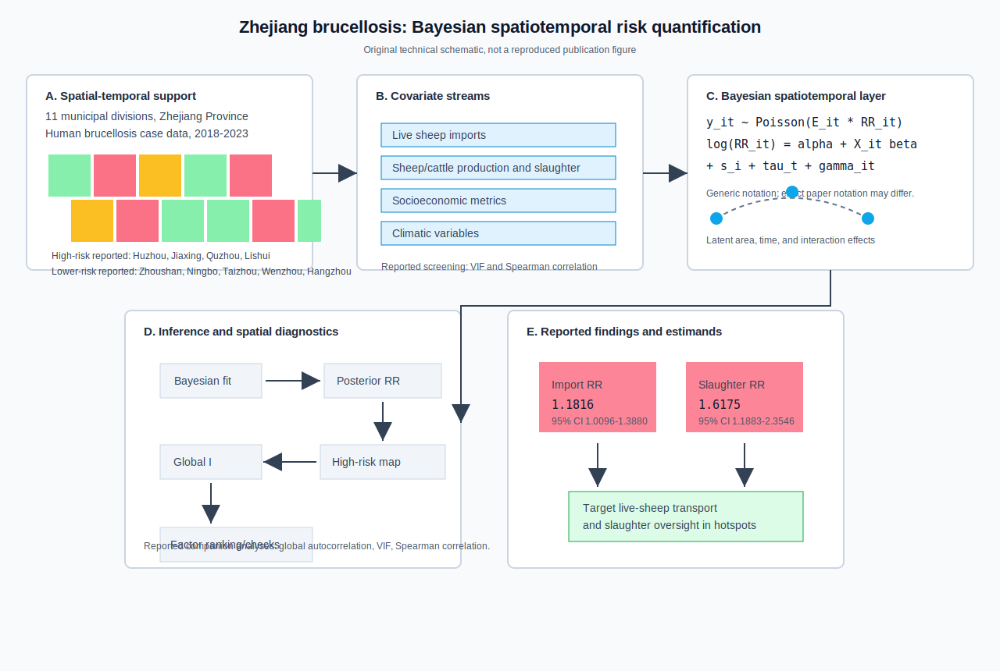
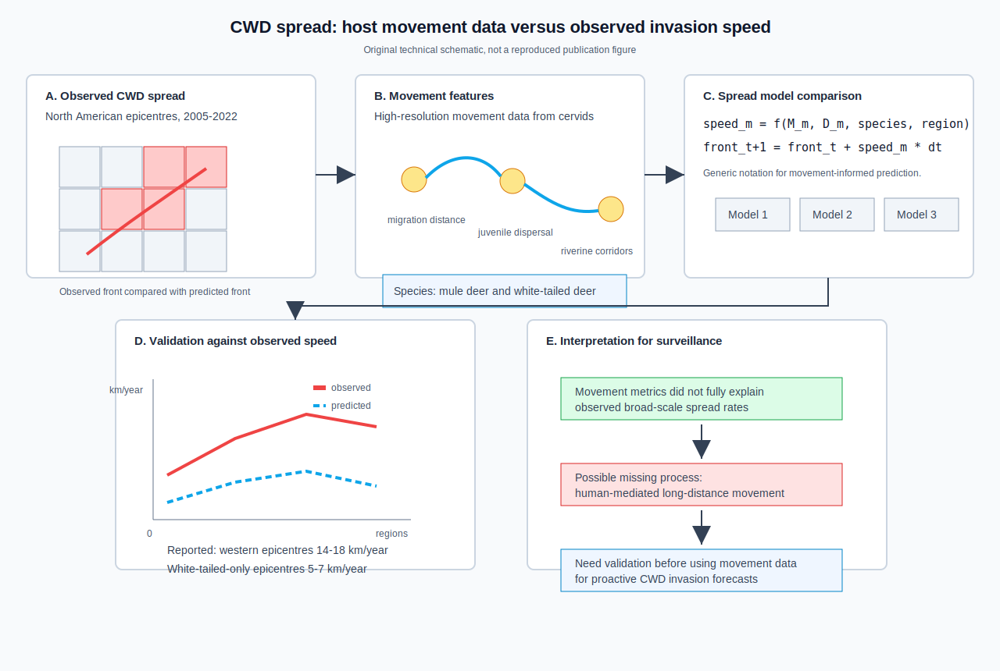
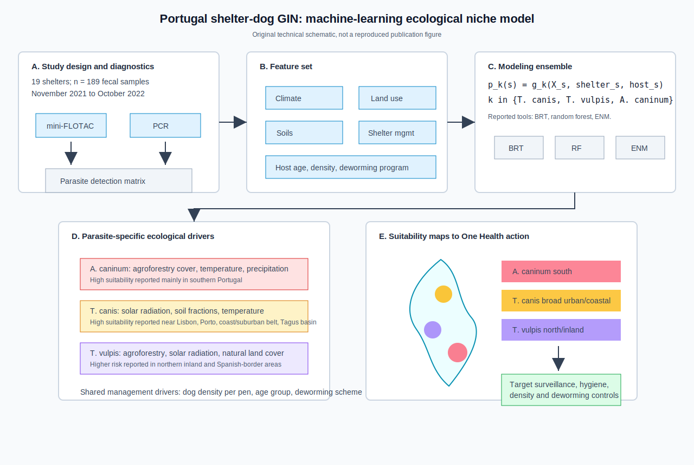
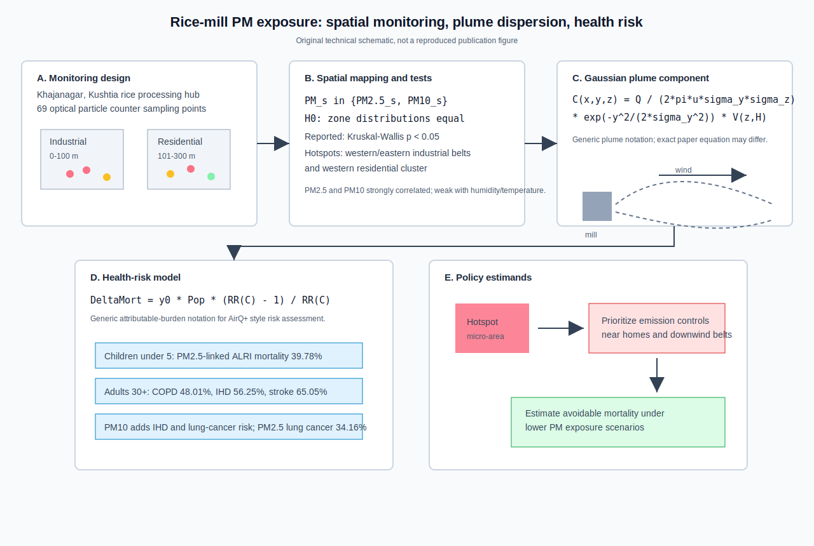

# Spatial epidemiology research update - 2026-07-23

Search window: records newly published, newly posted, or newly indexed after the previous automation run on 2026-07-22T12:00:28Z.

Primary sources checked: PubMed E-utilities using EDAT and publication-date windows for 2026-07-22 to 2026-07-23, Crossref REST metadata and index timestamps, medRxiv/bioRxiv APIs for 2026-07-22 to 2026-07-23, DOI/title searches against publisher pages and indexed scholarly snippets, and local archive search across prior reports and figure names. Crossref rate-limited broad keyword sweeps during this run, so PubMed records, DOI metadata, and targeted title searches were used for candidate confirmation.

## 1. Bayesian spatiotemporal risk quantification for human brucellosis in Zhejiang, China

**Paper:** Juan Li, Wenjing Li, Lingyan Zhao, Wei Jiang, Yongzhong Song, Jimin Sun, Hongli Zhang, and Huaiping Zhu. "Spatiotemporal Analysis of the Primary Factors and Risk Quantification of Human Brucellosis Prevention and Control in Zhejiang Province of China." *Zoonoses and Public Health*.

**Publication date:** Published online 2026-07-22; Crossref indexed 2026-07-23T05:02:38Z.

**Source:** [doi:10.1111/zph.70076](https://doi.org/10.1111/zph.70076); [PubMed PMID:42487212](https://pubmed.ncbi.nlm.nih.gov/42487212/).

**Modeling approach:** The study collected human brucellosis case data for 11 municipal divisions in Zhejiang Province from 2018 to 2023 and incorporated sheep and cattle production, socioeconomic metrics, and climatic variables. The PubMed abstract reports Bayesian spatiotemporal models, global autocorrelation analysis, variance inflation factor analysis, and Spearman correlation analysis to describe distribution, quantify risk factors, and identify high-risk areas. The figure uses generic count-risk notation; exact notation may differ from the paper.

**Key finding:** Human brucellosis showed regional variation and spatiotemporal clustering. Huzhou, Jiaxing, Quzhou, and Lishui had elevated risk, while Zhoushan, Ningbo, Taizhou, Wenzhou, and Hangzhou had lower risk. Live sheep imports and slaughter volumes were dominant positive factors, with reported relative risks of 1.1816 (95% CI: 1.0096-1.3880) and 1.6175 (95% CI: 1.1883-2.3546).

**Why it matters:** This is a strong One Health disease-mapping example for a developed region where human brucellosis is rising despite low local livestock husbandry. It connects latent municipal risk to transport and slaughter controls that can be acted on directly.

**Figure alt text:** Five-panel SVG. Panel A shows the 11 Zhejiang municipal divisions and the 2018 to 2023 case-data support, with reported high- and low-risk cities labeled. Panel B shows covariate streams for live sheep imports, sheep and cattle production and slaughter, socioeconomic metrics, and climate variables, with VIF and Spearman checks. Panel C shows a generic Bayesian spatiotemporal count-risk model with covariates plus latent spatial, temporal, and interaction terms. Panel D shows the inference and diagnostic workflow leading from model fitting to posterior relative risks, risk maps, autocorrelation, and factor ranking. Panel E shows reported relative risks for live sheep imports and slaughter volume and the resulting intervention estimand.

**Caption:** Original technical schematic, not a reproduced publication figure. Panels A and B identify the reported municipal support and covariate families. Panel C uses cautious explanatory notation for the Bayesian spatiotemporal layer. Panels D and E connect the model to reported posterior risk outputs and livestock-trade prevention decisions.

## 2. Movement-informed prediction of chronic wasting disease spread in North America

**Paper:** Paul C. Cross, Blake Lowrey, Matthew Kauffman, and Evelyn Merrill. "Predicting disease spread from host movement data: Chronic wasting disease in North America as a case study." *Journal of Animal Ecology*.

**Publication date:** Published online 2026-07-22; Crossref indexed 2026-07-22T19:13:09Z.

**Source:** [doi:10.1111/1365-2656.70310](https://doi.org/10.1111/1365-2656.70310); [PubMed PMID:42485514](https://pubmed.ncbi.nlm.nih.gov/42485514/).

**Modeling approach:** The article evaluates whether high-resolution movement metrics from mule deer and white-tailed deer can predict chronic wasting disease spread rates across North American epicentres from 2005 to 2022. The Crossref abstract reports three prediction models using movement information, comparison with observed spread rates, and evaluation of migration and dispersal hypotheses. The figure uses generic movement-front notation; exact model forms may differ from the paper.

**Key finding:** Observed spread was faster in western epicentres with more mobile mule deer than in epicentres with only white-tailed deer, about 14-18 km/year versus 5-7 km/year. However, migration distances alone did not align well with observed spread; Canadian Prairie Province spread was faster than expected despite shorter deer movements. The three movement-informed predictions were generally slower than observed rates.

**Why it matters:** The paper is a cautionary model-validation result for wildlife disease forecasting. Movement telemetry is valuable, but broad-scale pathogen invasion can be dominated by missing processes, including possible human-mediated movements or corridor structures not captured by simple movement-distance summaries.

**Figure alt text:** Five-panel SVG. Panel A shows observed chronic wasting disease spread across grid-like North American epicentre regions from 2005 to 2022. Panel B shows movement features from mule deer and white-tailed deer, including migration, dispersal, and corridor movement. Panel C shows generic equations for movement-informed spread speed and front propagation, plus three compared model boxes. Panel D plots observed spread speeds above predicted speeds and labels the reported 14-18 km/year western and 5-7 km/year white-tailed-only rates. Panel E summarizes interpretation: movement metrics underpredict broad-scale spread and possible human-mediated movement should be investigated.

**Caption:** Original technical schematic, not a reproduced publication figure. Panels A and B show the observed disease-front and telemetry inputs. Panel C abstracts the reported comparison of three movement-informed models. Panel D visualizes the validation mismatch. Panel E states the modeling implication for CWD surveillance and invasion forecasting.

## 3. Ecological niche modeling of gastrointestinal nematodes in Portuguese shelter dogs

**Paper:** Patricia Lopes, Martim A. Geraldes, Jacinto Gomes, Mariana Louro, Isabel Pereira da Fonseca, and Monica V. Cunha. "Environmental and management drivers of gastrointestinal nematodes in shelter dogs across mainland Portugal revealed by ecological niche modelling." *Preventive Veterinary Medicine*.

**Publication date:** October 2026 issue; Crossref indexed 2026-07-22T23:06:50Z and PubMed listed the record with publication date 2026-07-21.

**Source:** [doi:10.1016/j.prevetmed.2026.106962](https://doi.org/10.1016/j.prevetmed.2026.106962); [PubMed PMID:42485743](https://pubmed.ncbi.nlm.nih.gov/42485743/).

**Modeling approach:** The indexed title and available source snippets report ecological niche modeling of gastrointestinal nematode infection in shelter dogs across mainland Portugal. The study sampled 19 shelters with 189 fecal samples from November 2021 to October 2022 and used mini-FLOTAC plus targeted PCR diagnostics. Reported models included boosted regression trees, random forests, and ecological niche models integrating climate, land-use, shelter-management, and host variables. The figure uses generic suitability notation; exact notation may differ from the paper.

**Key finding:** Reported important management drivers included dog density per pen, age group, and deworming scheme, with parasite-specific ecological predictors. Available indexed detail reports solar radiation, temperature, and soil features as relevant for *Toxocara canis*; land cover and precipitation for *Trichuris vulpis* and *Ancylostoma caninum*; broad suitability for *T. canis* and *T. vulpis*; and higher *A. caninum* suitability mainly in southern Portugal.

**Why it matters:** This is a spatial veterinary epidemiology workflow that blends diagnostics, shelter management, and environmental suitability. The output is operational: shelters and regions can tailor deworming, density reduction, hygiene, and surveillance by parasite-specific risk geography.

**Figure alt text:** Five-panel SVG. Panel A shows 19 shelters, 189 fecal samples, mini-FLOTAC, PCR, and a parasite detection matrix. Panel B lists climate, land-use, soil, shelter management, and host-age-density-deworming features. Panel C shows generic suitability notation for three parasites and the reported boosted regression tree, random forest, and ecological niche modeling ensemble. Panel D separates parasite-specific ecological drivers for *A. caninum*, *T. canis*, and *T. vulpis*. Panel E shows stylized mainland Portugal suitability regions and maps them to One Health surveillance, hygiene, density, and deworming actions.

**Caption:** Original technical schematic, not a reproduced publication figure. Panels A and B show the diagnostic and covariate design. Panel C summarizes the machine-learning and ecological niche modeling layer using explanatory notation. Panels D and E translate parasite-specific suitability patterns into targeted shelter and regional prevention.

## 4. Rice-mill particulate dispersion and health-risk mapping in rural Bangladesh

**Paper:** Rubaiatul Islam Zerin, Md. Kamrul Hossain, Humaira Rashid, Sababa Tasnim, Md. Julfikar Ali, Md. Mizanur Rahman, Mohd. Maniruzzaman, and Rafiquel Islam. "Integrated spatial analysis and Gaussian dispersion modelling of airborne particulate matter from rice processing mill hubs in rural Bangladesh and associated public health risks." *Environmental Science and Pollution Research*.

**Publication date:** Published online 2026-07-22. PubMed listed the record in the 2026-07-22 EDAT search window. Crossref indexed it at 2026-07-22T10:02:39Z, about two hours before the previous automation run, so this is included as a newly published environmental exposure modeling item rather than a strictly post-cutoff Crossref-indexed item.

**Source:** [doi:10.1007/s11356-026-38036-9](https://doi.org/10.1007/s11356-026-38036-9); [PubMed PMID:42484793](https://pubmed.ncbi.nlm.nih.gov/42484793/).

**Modeling approach:** The study evaluates PM2.5 and PM10 around rice processing mill hubs in Khajanagar, Kushtia, Bangladesh, using 69 optical particle counter sampling points across industrial zones at 0-100 m and residential zones at 101-300 m, with meteorological observations. Indexed source detail reports spatial mapping, Kruskal-Wallis testing, correlation analysis, Gaussian plume modeling, and AirQ+ health-risk analysis. The figure uses generic plume and attributable-burden notation; exact equations may differ from the paper.

**Key finding:** PM2.5 exceeded Bangladesh, WHO, and U.S. EPA regulatory limits in industrial areas and both PM fractions exceeded benchmarks in residential areas. Spatial mapping identified hotspots in western and eastern industrial belts and a western residential cluster. Gaussian plume modeling indicated PM10 dispersed and deposited over greater distances than PM2.5 under prevailing winds. AirQ+ estimates linked PM2.5 exposure to 39.78% of ALRI-related mortality in children under five and, among adults at least 30 years old, to 48.01% of COPD, 56.25% of ischemic heart disease, and 65.05% of stroke deaths; PM2.5 was also linked to 34.16% of lung cancer mortality.

**Why it matters:** Although this is environmental exposure epidemiology rather than infectious disease modeling, it is highly relevant to spatial health-risk modeling. It integrates field measurements, spatial hotspots, dispersion physics, and population health burden into a workflow that can prioritize emission control near residential micro-environments.

**Figure alt text:** Five-panel SVG. Panel A shows Khajanagar rice-mill monitoring with 69 optical particle counter points in industrial 0-100 m and residential 101-300 m zones. Panel B shows PM2.5 and PM10 spatial mapping, Kruskal-Wallis interzone testing, hotspot identification, and correlation checks. Panel C shows a generic Gaussian plume equation with source, wind, and deposition pathways. Panel D shows a generic attributable-burden equation and reported AirQ+ mortality fractions for ALRI, COPD, ischemic heart disease, stroke, and lung cancer. Panel E translates hotspot and burden estimates into emission-control and avoidable-mortality policy estimands.

**Caption:** Original technical schematic, not a reproduced publication figure. Panels A and B summarize the exposure-monitoring and spatial-analysis design. Panel C represents the reported Gaussian dispersion component with cautious explanatory notation. Panel D connects modeled exposure to AirQ+ health-risk outputs. Panel E shows how residential and downwind hotspots can guide emission-control decisions.

## Search notes and exclusions

- The medRxiv and bioRxiv 2026-07-22 to 2026-07-23 feeds were screened. No newly posted spatial epidemiology modeling preprint with sufficient relevance was selected. A new version of the `serocalculator` R-package preprint appeared, but it is seroincidence methodology rather than spatial or spatiotemporal modeling.
- "Spatiotemporal Dynamics of Dengue Risk in Bangladesh: A GIS Based Approach" ([doi:10.1029/2025GH001707](https://doi.org/10.1029/2025GH001707)) is relevant but Crossref indexed it on 2026-07-21T20:06:16Z, before the previous automation run, so it was not repeated.
- "Spatiotemporal evolution characteristics and influencing factors of hepatitis B incidence rate in China" ([doi:10.1038/s41598-026-53490-8](https://doi.org/10.1038/s41598-026-53490-8)) was screened from PubMed and Crossref. It appears relevant and was indexed after the cutoff, but accessible metadata lacked enough method/result detail during this run to support a paper-specific technical schematic without guessing.
- Older brucellosis and dengue spatial-analysis papers already present in prior local updates were excluded from the selected list.
